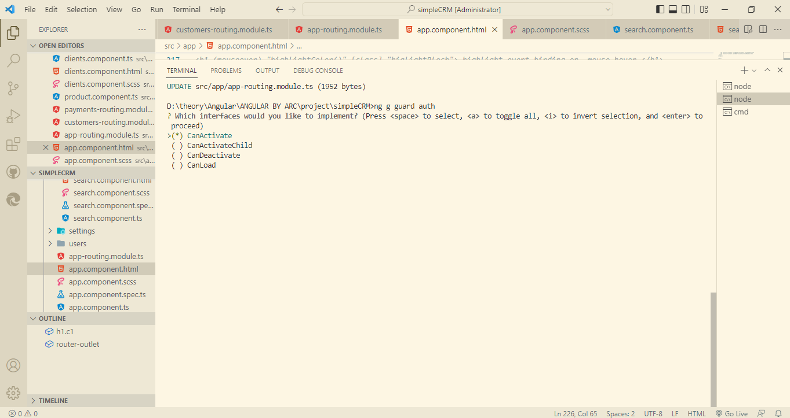
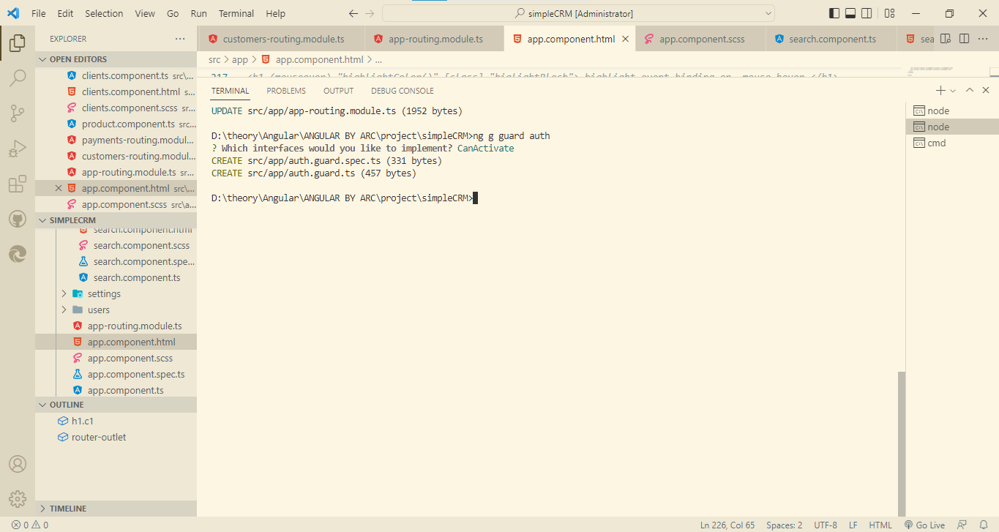
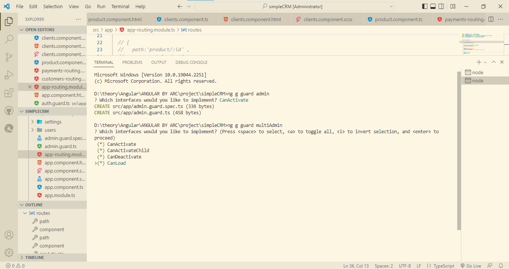
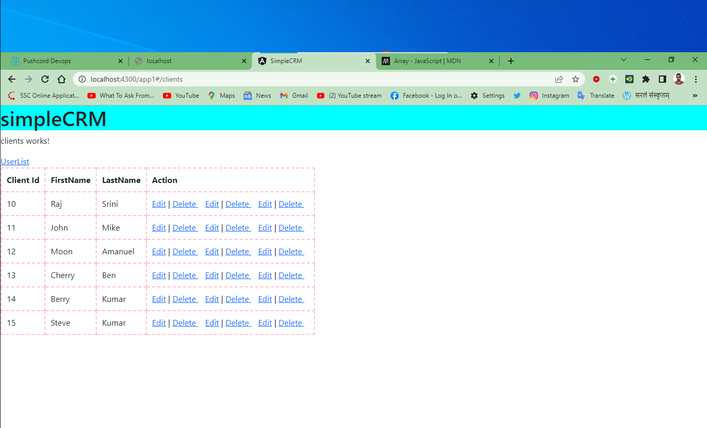
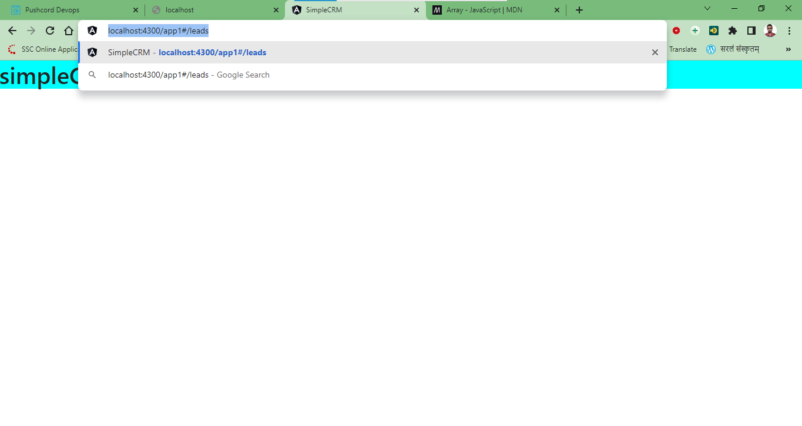

# Topic

48. Route Guards in Angular
49. Route Guards. CanActivate in Angular
50. Route Guards. CanActivateChild
51. Route Guards. CanLoad in Angular
52. Route Guards. CanDeactivate
53. Angular Applications Dark Theme Switch Tutorial | Angular Material Dark Mode Toggle Tutorial
54. Route Guards. Resolve Tutorial


# Route Guards in Angular

## Route Guards by ARC

### Routing — Route Guards

* Use route guards to prevent users from navigating to parts of an app without authorization
* Route Guards are used to secure the route paths
* In most cases, the routes and screens are protected behind a good authentication system
* The route guard resolves to `true` or `false` based on custom logic and functionality
* We can generate any number of guards based on our application requirements
* To generate the route guard we can make use of Angular CLI
  * `ng generate guard <guard-name>`
* Inject the guard in our module under providers
* There are various types of route guards available
  * `CanActivate` — Checks to see if a user can visit a route
  * `CanActivateChild` - Checks to see if a user can visit a routes children
  * `CanLoad` - Checks to see if a user can route to a module that lazy loaded
  * `CanDeactivate` - Checks to see if a user can exit a route
  * `Resolve` - Performs route data retrieval before route activation
* The route guard resolves to true or false based on custom logic and functionality

### important points :-

Episode # 48 - Route Guards 

1. Route Guards helps us secure our routes and screens 

2. E.g 
```ts

    User -> Route Guard                             ->    /Admin 
            -> Custom Logic 
                -> True                             ->    Admin
                    -> can access the route 

                -> False 
                    -> custom logic on failure condition -> home 
```
                    
3. Generate Route Guard 
    ng g guard <guard_name> 

4. Route Guards have something called "interfaces" 
    - canActivate -> can a user access a route 
    - canActivateChild -> can user access child routes of a parent route
    - canDecativate -> check if user can exit the route 
    - canLoad -> Can a lazy loaded module be loaded 
    - resolve -> route data retrival before route activating  

5. I will cover all of these in detail in coming episodes 
    - quick examples 
    - use cases 

6. We can implement more than 1 guards in our application 

### example

**generate a guard**




```js
D:\theory\Angular\ANGULAR BY ARC\project\simpleCRM>ng g guard auth
? Which interfaces would you like to implement? CanActivate   // you can hit more than one guard
CREATE src/app/auth.guard.spec.ts (331 bytes)
CREATE src/app/auth.guard.ts (457 bytes)

D:\theory\Angular\ANGULAR BY ARC\project\simpleCRM>
```

**auth.guard.ts**

```ts
import { Injectable } from '@angular/core';
import { ActivatedRouteSnapshot, CanActivate, RouterStateSnapshot, UrlTree } from '@angular/router';
import { Observable } from 'rxjs';

@Injectable({
  providedIn: 'root'
})
export class AuthGuard implements CanActivate {

  userToken = false;

  canActivate(
    route: ActivatedRouteSnapshot,
    state: RouterStateSnapshot): Observable<boolean | UrlTree> | Promise<boolean | UrlTree> | boolean | UrlTree {
    
      // call an HTTP call to Backend API and get Auth Token for user

      this.userToken = false;
      
      if(this.userToken){
        return true;    // it allows the user to  access the route
      }else{
        return false;   // it does not allow the user to  access the route
      }

      return true;
  }
  
}
```

**auth.guard.spec.ts**

```ts
import { TestBed } from '@angular/core/testing';

import { AuthGuard } from './auth.guard';

describe('AuthGuard', () => {
  let guard: AuthGuard;

  beforeEach(() => {
    TestBed.configureTestingModule({});
    guard = TestBed.inject(AuthGuard);
  });

  it('should be created', () => {
    expect(guard).toBeTruthy();
  });
});
```

**app.routing.module.ts**

```ts
import { CommonModule } from '@angular/common';
import { NgModule } from '@angular/core';
import { RouterModule, Routes } from '@angular/router';
import { AddLoansComponent } from './add-loans/add-loans.component';
import { AuthGuard } from './auth.guard';
import { ClientsComponent } from './clients/clients.component';
import { LeadsGridComponent } from './leads/leads-listing/leads-grid/leads-grid.component';
import { LoanTypesComponent } from './loan-types/loan-types.component';
import { LoansComponent } from './loans/loans.component';
import { P1Component } from './p1/p1.component';
import { P2Component } from './p2/p2.component';
import { P3Component } from './p3/p3.component';
import { P4Component } from './p4/p4.component';
import { PageNotFoundComponent } from './page-not-found/page-not-found.component';
import { ProductComponent } from './product/product.component';
import { SearchComponent } from './search/search.component';


const routes: Routes = [
 
  { 
    path:'product/:id' , 
    component:ProductComponent
  } ,
  { 
    path:'product/:productId/photos/:photoId' , 
    component:ProductComponent
  } ,
  {
    path:'clients',
    component: ClientsComponent,
    canActivate:[AuthGuard]  // it takes more than one routes -> this is authGuard
  },
  {
    path:'',
    redirectTo:'leads',
    pathMatch:'full'
  },
  {
    path:'leads',
    component:LeadsGridComponent
  },
  {
    path:'search',
    component:SearchComponent
  },
 
  { path: 'payments', loadChildren: () => import('./payments/payments.module').then(m => m.PaymentsModule) }, 
  { path: 'customers', loadChildren: () => import('./customers/customers.module').then(m => m.CustomersModule) },
  {
    path:'**',
    component:PageNotFoundComponent
  }
];


@NgModule({
  imports: [
    // CommonModule,
    RouterModule.forRoot(routes)
  ],
  exports: [RouterModule]
})
export class AppRoutingModule { }
```

## Route Guards by  Angular.io

# Route Guards. CanActivate in Angular

## Route Guards. CanActivate by ARC

### Routing — Route Guards

* Use route guards to prevent users from navigating to parts of an app without authorization
* Route Guards are used to secure the route paths
* In most cases, the routes and screens are protected behind a good authentication system
* The route guard resolves to `true` or `false` based on custom logic and functionality
* We can generate any number of guards based on our application requirements
* To generate the route guard we can make use of Angular CLI
  * `ng generate guard <guard-name>`
* Inject the guard in our module under providers
* There are various types of route guards available
  * `CanActivate` — Checks to see if a user can visit a route
  * `CanActivateChild` - Checks to see if a user can visit a routes children
  * `CanLoad` - Checks to see if a user can route to a module that lazy loaded
  * `CanDeactivate` - Checks to see if a user can exit a route
  * `Resolve` - Performs route data retrieval before route activation
* The route guard resolves to true or false based on custom logic and functionality

### important points

1. `ng g guard <guard_name>`  :-  this CLI is to create 

2. choose the option `CanActivate` 

3. In the routing module 
    * we will use option `canActivate` 
    * it will resolve to `true` or `false` 
      * **true means** 
        * user can access the route 
      * **false means** 
        * user cannot access the route 

4. We can use any number of route guards on canActivate 
    * Its an array 
    * all have to resolve to true 

5. Use cases 
    * Check if user is loggedIn 
    * Check if user can Edit the product/order/details/profile 
    * Check if the user is an Admin 

### CanActivate

* A `CanActivate` guard is useful when we want to check on something before a component gets used.

### example for generate multiguardFunction in one guard  :- CanActivate, CanActivateChild, CanDeactivate, CanLoad

**generate a guard**


```js

D:\theory\Angular\ANGULAR BY ARC\project\simpleCRM>ng g guard admin
? Which interfaces would you like to implement? CanActivate  // you can hit more than one guard
CREATE src/app/admin.guard.spec.ts (336 bytes)
CREATE src/app/admin.guard.ts (458 bytes)

D:\theory\Angular\ANGULAR BY ARC\project\simpleCRM>ng g guard multiAdmin
? Which interfaces would you like to implement? (Press <space> to select, <a> to toggle all, <i> to invert selection, and <enter> to     
proceed)
 (*) CanActivate
 (*) CanActivateChild
 (*) CanDeactivate
>(*) CanLoad

D:\theory\Angular\ANGULAR BY ARC\project\simpleCRM>ng g guard multiAdmin
? Which interfaces would you like to implement? CanActivate, CanActivateChild, CanDeactivate, CanLoad
CREATE src/app/multi-admin.guard.spec.ts (362 bytes)
CREATE src/app/multi-admin.guard.ts (1189 bytes)

D:\theory\Angular\ANGULAR BY ARC\project\simpleCRM>
/* 
Press 'space' to select, 
Press 'a' to toggle all, 
Press 'i' to invert selection,  and 
Press 'enter' to proceed
*/
```



**multi-admin.guard.ts**

```ts
import { Injectable } from '@angular/core';
import { ActivatedRouteSnapshot, CanActivate, CanActivateChild, CanDeactivate, CanLoad, Route, RouterStateSnapshot, UrlSegment, UrlTree } from '@angular/router';
import { Observable } from 'rxjs';

@Injectable({
  providedIn: 'root'
})
export class MultiAdminGuard implements CanActivate, CanActivateChild, CanDeactivate<unknown>, CanLoad {
  canActivate(
    route: ActivatedRouteSnapshot,
    state: RouterStateSnapshot): Observable<boolean | UrlTree> | Promise<boolean | UrlTree> | boolean | UrlTree {
    return true;
  }
  canActivateChild(
    childRoute: ActivatedRouteSnapshot,
    state: RouterStateSnapshot): Observable<boolean | UrlTree> | Promise<boolean | UrlTree> | boolean | UrlTree {
    return true;
  }
  canDeactivate(
    component: unknown,
    currentRoute: ActivatedRouteSnapshot,
    currentState: RouterStateSnapshot,
    nextState?: RouterStateSnapshot): Observable<boolean | UrlTree> | Promise<boolean | UrlTree> | boolean | UrlTree {
    return true;
  }
  canLoad(
    route: Route,
    segments: UrlSegment[]): Observable<boolean | UrlTree> | Promise<boolean | UrlTree> | boolean | UrlTree {
    return true;
  }
}
```

**multi-admin.guard.spec.ts**

```ts
import { TestBed } from '@angular/core/testing';

import { MultiAdminGuard } from './multi-admin.guard';

describe('MultiAdminGuard', () => {
  let guard: MultiAdminGuard;

  beforeEach(() => {
    TestBed.configureTestingModule({});
    guard = TestBed.inject(MultiAdminGuard);
  });

  it('should be created', () => {
    expect(guard).toBeTruthy();
  });
});
```

### example :-

**admin.guard.ts**

```ts
import { Injectable } from '@angular/core';
import { ActivatedRouteSnapshot, CanActivate, RouterStateSnapshot, UrlTree } from '@angular/router';
import { Observable } from 'rxjs';

@Injectable({
  providedIn: 'root'
})
export class AdminGuard implements CanActivate {
  canActivate() {
    const isAdmin = false;
    
    if(isAdmin) return true;
    else return false;
    // this.adminService.grtUserDetails().pipe(map)
  }
  
}
```

**auth.guard.ts**

```ts
import { Injectable } from '@angular/core';
import { ActivatedRouteSnapshot, CanActivate, RouterStateSnapshot, UrlTree } from '@angular/router';
import { Observable } from 'rxjs';

@Injectable({
  providedIn: 'root'
})
export class AuthGuard implements CanActivate {

  userToken = false;

  canActivate(
    route: ActivatedRouteSnapshot,
    state: RouterStateSnapshot): Observable<boolean | UrlTree> | Promise<boolean | UrlTree> | boolean | UrlTree {
    
      // call an HTTP call to Backend API and get Auth Token for user

      this.userToken = true;
      
      if(this.userToken){
        return true;
      }else{
        return false;
      }

      return true;
  }
  
}
```

**app.routing.module.ts**

```ts
import { CommonModule } from '@angular/common';
import { NgModule } from '@angular/core';
import { RouterModule, Routes } from '@angular/router';
import { AddLoansComponent } from './add-loans/add-loans.component';
import { AdminGuard } from './admin.guard';
import { AuthGuard } from './auth.guard';
import { ClientsComponent } from './clients/clients.component';
import { LeadsGridComponent } from './leads/leads-listing/leads-grid/leads-grid.component';
import { LoanTypesComponent } from './loan-types/loan-types.component';
import { LoansComponent } from './loans/loans.component';
import { P1Component } from './p1/p1.component';
import { P2Component } from './p2/p2.component';
import { P3Component } from './p3/p3.component';
import { P4Component } from './p4/p4.component';
import { PageNotFoundComponent } from './page-not-found/page-not-found.component';
import { ProductComponent } from './product/product.component';
import { SearchComponent } from './search/search.component';

const routes: Routes = [ 
  { 
    path:'product/:id' , 
    component:ProductComponent
  } ,
  { 
    path:'product/:productId/photos/:photoId' , 
    component:ProductComponent
  } ,
  {
    path:'clients',
    component: ClientsComponent,
    canActivate:[AuthGuard]  // it takes more than one routes
    // if AuthGuard will give access then ClientsComponent will see
  },
  {
    path:'',
    redirectTo:'leads',
    pathMatch:'full'
  },
  {
    path:'leads',
    component:LeadsGridComponent,
    canActivate:[AuthGuard , AdminGuard]  // it takes more than one routes // all guard should return access(means true)
    // if both AuthGuard & AdminGuard will give access then LeadsGridComponent will see
 },
  {
    path:'search',
    component:SearchComponent
  },
  { 
    path: 'payments', 
    loadChildren: () => import('./payments/payments.module').then(m => m.PaymentsModule) 
  }, 
  { 
    path: 'customers', 
    loadChildren: () => import('./customers/customers.module').then(m => m.CustomersModule) 
  },
  {
    path:'**',
    component:PageNotFoundComponent
  }
];

@NgModule({
  imports: [
    // CommonModule,
    RouterModule.forRoot(routes)
  ],
  exports: [RouterModule]
})
export class AppRoutingModule { }
```

**leads-grid.component.ts**

```ts
import { Component, OnInit } from '@angular/core';

@Component({
  selector: 'app-leads-grid',
  templateUrl: './leads-grid.component.html',
  styleUrls: ['./leads-grid.component.scss']
})
export class LeadsGridComponent implements OnInit {

  constructor() { }

  ngOnInit(): void {
  }

}
```

**leads-grid.component.html**

```html
<p>leads-grid works!</p>
```

**clients.component.ts**

```ts
import { Component, OnInit } from '@angular/core';

@Component({
  selector: 'app-clients',
  templateUrl: './clients.component.html',
  styleUrls: ['./clients.component.scss']
})
export class ClientsComponent implements OnInit {

  clientList = [
    { clientId:10 , firstName : 'Raj' , lastName : 'Srini'},
    { clientId:11 , firstName : 'John' , lastName : 'Mike'},
    { clientId:12 , firstName : 'Moon' , lastName : 'Amanuel'},
    { clientId:13 , firstName : 'Cherry' , lastName : 'Ben'},
    { clientId:14 , firstName : 'Berry' , lastName : 'Kumar'},
    { clientId:15 , firstName : 'Steve' , lastName : 'Kumar'},
  ]

  constructor() { }

  ngOnInit(): void {
  }

}
```

**clients.component.html**

```html
<p>clients works!</p>

<a [routerLink]="'/user'">UserList</a>

<table>
    <tr>
        <th>Client Id</th>
        <th>FirstName</th>
        <th>LastName</th>
        <th>Action</th>
    </tr>
    <tr *ngFor="let client of clientList">
        <td> {{ client.clientId }} </td>
        <td> {{ client.firstName }} </td>
        <td> {{ client.lastName }} </td>
        <td> 
            <!-- when you hover on link we see output -->


            <a [routerLink]="'/edit'">Edit</a>  <!-- ti si dynamic routerlink --> 
            | <a [routerLink]="'/delete'">Delete </a> &nbsp;&nbsp;
            <!-- output :- http://localhost:4300/app1#/edit         http://localhost:4300/app1#/delete -->

            <a [routerLink]="['/edit' , client.clientId]">Edit</a>  <!-- ti si dynamic routerlink --> 
            | <a [routerLink]="['/delete' , client.clientId]">Delete </a> &nbsp;&nbsp; 
            <!-- put '/' on only starting variable  , after we donot put '/' -->
            <!-- output :- http://localhost:4300/app1#/edit/10         http://localhost:4300/app1#/delete/10 -->
            <!-- output :- http://localhost:4300/app1#/edit/11         http://localhost:4300/app1#/delete/11 -->
            <!-- output :- http://localhost:4300/app1#/edit/12         http://localhost:4300/app1#/delete/12 -->
            <!-- output :- http://localhost:4300/app1#/edit/13         http://localhost:4300/app1#/delete/13 -->
            <!-- output :- http://localhost:4300/app1#/edit/14         http://localhost:4300/app1#/delete/14 -->
            <!-- output :- http://localhost:4300/app1#/edit/15         http://localhost:4300/app1#/delete/15 -->


            <a [routerLink]="['/edit' , client.clientId , 'edit']">Edit</a>  <!-- ti si dynamic routerlink --> 
            | <a [routerLink]="['/delete' , client.clientId , 'deleted']">Delete </a> &nbsp;&nbsp; 
            <!-- output :- http://localhost:4300/app1#/edit/10/edit         http://localhost:4300/app1#/delete/10/deleted -->
            <!-- output :- http://localhost:4300/app1#/edit/11/edit         http://localhost:4300/app1#/delete/11/deleted -->
            <!-- output :- http://localhost:4300/app1#/edit/12/edit         http://localhost:4300/app1#/delete/12/deleted -->
            <!-- output :- http://localhost:4300/app1#/edit/13/edit         http://localhost:4300/app1#/delete/13/deleted -->
            <!-- output :- http://localhost:4300/app1#/edit/14/edit         http://localhost:4300/app1#/delete/14/deleted -->
            <!-- output :- http://localhost:4300/app1#/edit/15/edit         http://localhost:4300/app1#/delete/15/deleted -->
        </td>
    </tr>
</table>
```


 

## Route Guards. CanActivate by Angular.io

# Route Guards. CanActivateChild

## Route Guards. CanActivateChild by ARC

## Route Guards. CanActivateChild by Angular.io

# Route Guards. CanLoad in Angular

## Route Guards. CanLoad by ARC

## Route Guards. CanLoad by Angular.io

# Route Guards. CanDeactivate

## Route Guards. CanDeactivate by ARC

## Route Guards. CanDeactivate by Angular.io

# Angular Applications Dark Theme Switch Tutorial | Angular Material Dark Mode Toggle Tutorial

## Angular Applications Dark Theme Switch Tutorial | Angular Material Dark Mode Toggle Tutorial by ARC

## Angular Applications Dark Theme Switch Tutorial | Angular Material Dark Mode Toggle Tutorial by Angular.io

# Route Guards. Resolve Tutorial

## Route Guards. Resolve by ARC

## Route Guards. Resolve by Angular.io
