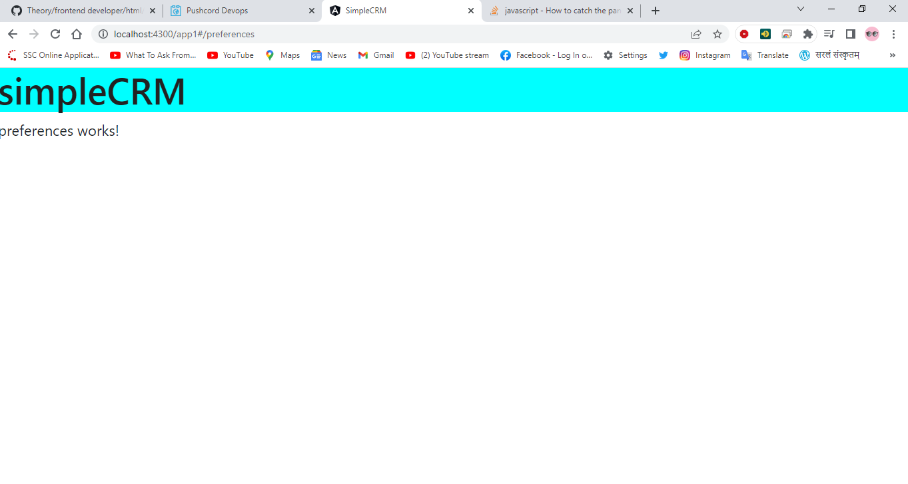
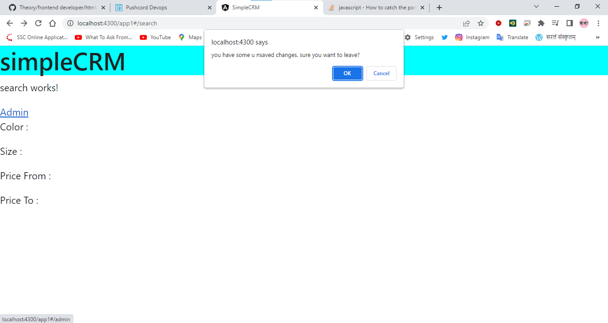
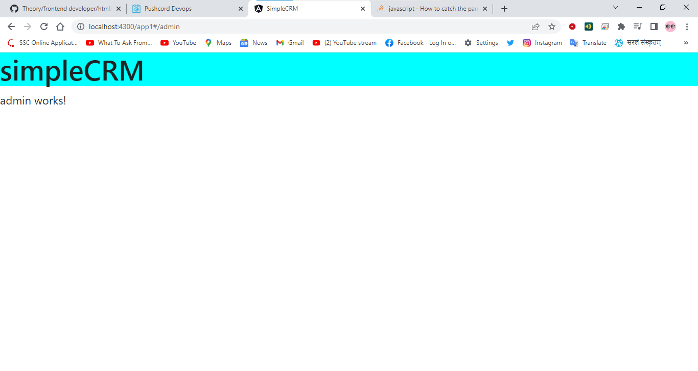

# Topic

48. Route Guards in Angular
49. Route Guards. CanActivate in Angular
50. Route Guards. CanActivateChild
51. Route Guards. CanLoad in Angular
52. Route Guards. CanDeactivate
53. Angular Applications Dark Theme Switch Tutorial | Angular Material Dark Mode Toggle Tutorial
54. Route Guards. Resolve Tutorial


# Route Guards in Angular

## Route Guards by ARC

### Routing — Route Guards

* Use route guards to prevent users from navigating to parts of an app without authorization
* Route Guards are used to secure the route paths
* In most cases, the routes and screens are protected behind a good authentication system
* The route guard resolves to `true` or `false` based on custom logic and functionality
* We can generate any number of guards based on our application requirements
* To generate the route guard we can make use of Angular CLI
  * `ng generate guard <guard-name>`
* Inject the guard in our module under providers
* There are various types of route guards available
  * `CanActivate` — Checks to see if a user can visit a route
  * `CanActivateChild` - Checks to see if a user can visit a routes children
  * `CanLoad` - Checks to see if a user can route to a module that lazy loaded
  * `CanDeactivate` - Checks to see if a user can exit a route
  * `Resolve` - Performs route data retrieval before route activation
* The route guard resolves to true or false based on custom logic and functionality

### important points :-

Episode # 48 - Route Guards 

1. Route Guards helps us secure our routes and screens 

2. E.g 
```ts

    User -> Route Guard                             ->    /Admin 
            -> Custom Logic 
                -> True                             ->    Admin
                    -> can access the route 

                -> False 
                    -> custom logic on failure condition -> home 
```
                    
3. Generate Route Guard 
    ng g guard <guard_name> 

4. Route Guards have something called "interfaces" 
    - canActivate -> can a user access a route 
    - canActivateChild -> can user access child routes of a parent route
    - canDecativate -> check if user can exit the route 
    - canLoad -> Can a lazy loaded module be loaded 
    - resolve -> route data retrival before route activating  

5. I will cover all of these in detail in coming episodes 
    - quick examples 
    - use cases 

6. We can implement more than 1 guards in our application 

### example

**generate a guard**


```js
D:\theory\Angular\ANGULAR BY ARC\project\simpleCRM>ng g guard auth
? Which interfaces would you like to implement? CanActivate   // you can hit more than one guard
CREATE src/app/auth.guard.spec.ts (331 bytes)
CREATE src/app/auth.guard.ts (457 bytes)

D:\theory\Angular\ANGULAR BY ARC\project\simpleCRM>
```

**auth.guard.ts**

```ts
import { Injectable } from '@angular/core';
import { ActivatedRouteSnapshot, CanActivate, RouterStateSnapshot, UrlTree } from '@angular/router';
import { Observable } from 'rxjs';

@Injectable({
  providedIn: 'root'
})
export class AuthGuard implements CanActivate {

  userToken = false;

  canActivate(
    route: ActivatedRouteSnapshot,
    state: RouterStateSnapshot): Observable<boolean | UrlTree> | Promise<boolean | UrlTree> | boolean | UrlTree {
    
      // call an HTTP call to Backend API and get Auth Token for user

      this.userToken = false;
      
      if(this.userToken){
        return true;    // it allows the user to  access the route
      }else{
        return false;   // it does not allow the user to  access the route
      }

      return true;
  }
  
}
```

**auth.guard.spec.ts**

```ts
import { TestBed } from '@angular/core/testing';

import { AuthGuard } from './auth.guard';

describe('AuthGuard', () => {
  let guard: AuthGuard;

  beforeEach(() => {
    TestBed.configureTestingModule({});
    guard = TestBed.inject(AuthGuard);
  });

  it('should be created', () => {
    expect(guard).toBeTruthy();
  });
});
```

**app.routing.module.ts**

```ts
import { CommonModule } from '@angular/common';
import { NgModule } from '@angular/core';
import { RouterModule, Routes } from '@angular/router';
import { AddLoansComponent } from './add-loans/add-loans.component';
import { AuthGuard } from './auth.guard';
import { ClientsComponent } from './clients/clients.component';
import { LeadsGridComponent } from './leads/leads-listing/leads-grid/leads-grid.component';
import { LoanTypesComponent } from './loan-types/loan-types.component';
import { LoansComponent } from './loans/loans.component';
import { P1Component } from './p1/p1.component';
import { P2Component } from './p2/p2.component';
import { P3Component } from './p3/p3.component';
import { P4Component } from './p4/p4.component';
import { PageNotFoundComponent } from './page-not-found/page-not-found.component';
import { ProductComponent } from './product/product.component';
import { SearchComponent } from './search/search.component';


const routes: Routes = [
 
  { 
    path:'product/:id' , 
    component:ProductComponent
  } ,
  { 
    path:'product/:productId/photos/:photoId' , 
    component:ProductComponent
  } ,
  {
    path:'clients',
    component: ClientsComponent,
    canActivate:[AuthGuard]  // it takes more than one routes -> this is authGuard
  },
  {
    path:'',
    redirectTo:'leads',
    pathMatch:'full'
  },
  {
    path:'leads',
    component:LeadsGridComponent
  },
  {
    path:'search',
    component:SearchComponent
  },
 
  { path: 'payments', loadChildren: () => import('./payments/payments.module').then(m => m.PaymentsModule) }, 
  { path: 'customers', loadChildren: () => import('./customers/customers.module').then(m => m.CustomersModule) },
  {
    path:'**',
    component:PageNotFoundComponent
  }
];


@NgModule({
  imports: [
    // CommonModule,
    RouterModule.forRoot(routes)
  ],
  exports: [RouterModule]
})
export class AppRoutingModule { }
```

## Route Guards by  Angular.io

# Route Guards. CanActivate in Angular

## Route Guards. CanActivate by ARC

### Routing — Route Guards

* Use route guards to prevent users from navigating to parts of an app without authorization
* Route Guards are used to secure the route paths
* In most cases, the routes and screens are protected behind a good authentication system
* The route guard resolves to `true` or `false` based on custom logic and functionality
* We can generate any number of guards based on our application requirements
* To generate the route guard we can make use of Angular CLI
  * `ng generate guard <guard-name>`
* Inject the guard in our module under providers
* There are various types of route guards available
  * `CanActivate` — Checks to see if a user can visit a route
  * `CanActivateChild` - Checks to see if a user can visit a routes children
  * `CanLoad` - Checks to see if a user can route to a module that lazy loaded
  * `CanDeactivate` - Checks to see if a user can exit a route
  * `Resolve` - Performs route data retrieval before route activation
* The route guard resolves to true or false based on custom logic and functionality

### important points

1. `ng g guard <guard_name>`  :-  this CLI is to create 

2. choose the option `CanActivate` 

3. In the routing module 
    * we will use option `canActivate` 
    * it will resolve to `true` or `false` 
      * **true means** 
        * user can access the route 
      * **false means** 
        * user cannot access the route 

4. We can use any number of route guards on canActivate 
    * Its an array 
    * all have to resolve to true 

5. Use cases 
    * Check if user is loggedIn 
    * Check if user can Edit the product/order/details/profile 
    * Check if the user is an Admin 

### CanActivate

* A `CanActivate` guard is useful when we want to check on something before a component gets used.

### example for generate multiguardFunction in one guard  :- CanActivate, CanActivateChild, CanDeactivate, CanLoad

**generate a guard**


```js

D:\theory\Angular\ANGULAR BY ARC\project\simpleCRM>ng g guard admin
? Which interfaces would you like to implement? CanActivate  // you can hit more than one guard
CREATE src/app/admin.guard.spec.ts (336 bytes)
CREATE src/app/admin.guard.ts (458 bytes)

D:\theory\Angular\ANGULAR BY ARC\project\simpleCRM>ng g guard multiAdmin
? Which interfaces would you like to implement? (Press <space> to select, <a> to toggle all, <i> to invert selection, and <enter> to     
proceed)
 (*) CanActivate
 (*) CanActivateChild
 (*) CanDeactivate
>(*) CanLoad

D:\theory\Angular\ANGULAR BY ARC\project\simpleCRM>ng g guard multiAdmin
? Which interfaces would you like to implement? CanActivate, CanActivateChild, CanDeactivate, CanLoad
CREATE src/app/multi-admin.guard.spec.ts (362 bytes)
CREATE src/app/multi-admin.guard.ts (1189 bytes)

D:\theory\Angular\ANGULAR BY ARC\project\simpleCRM>
/* 
Press 'space' to select, 
Press 'a' to toggle all, 
Press 'i' to invert selection,  and 
Press 'enter' to proceed
*/
```


**multi-admin.guard.ts**

```ts
import { Injectable } from '@angular/core';
import { ActivatedRouteSnapshot, CanActivate, CanActivateChild, CanDeactivate, CanLoad, Route, RouterStateSnapshot, UrlSegment, UrlTree } from '@angular/router';
import { Observable } from 'rxjs';

@Injectable({
  providedIn: 'root'
})
export class MultiAdminGuard implements CanActivate, CanActivateChild, CanDeactivate<unknown>, CanLoad {
  canActivate(
    route: ActivatedRouteSnapshot,
    state: RouterStateSnapshot): Observable<boolean | UrlTree> | Promise<boolean | UrlTree> | boolean | UrlTree {
    return true;
  }
  canActivateChild(
    childRoute: ActivatedRouteSnapshot,
    state: RouterStateSnapshot): Observable<boolean | UrlTree> | Promise<boolean | UrlTree> | boolean | UrlTree {
    return true;
  }
  canDeactivate(
    component: unknown,
    currentRoute: ActivatedRouteSnapshot,
    currentState: RouterStateSnapshot,
    nextState?: RouterStateSnapshot): Observable<boolean | UrlTree> | Promise<boolean | UrlTree> | boolean | UrlTree {
    return true;
  }
  canLoad(
    route: Route,
    segments: UrlSegment[]): Observable<boolean | UrlTree> | Promise<boolean | UrlTree> | boolean | UrlTree {
    return true;
  }
}
```

**multi-admin.guard.spec.ts**

```ts
import { TestBed } from '@angular/core/testing';

import { MultiAdminGuard } from './multi-admin.guard';

describe('MultiAdminGuard', () => {
  let guard: MultiAdminGuard;

  beforeEach(() => {
    TestBed.configureTestingModule({});
    guard = TestBed.inject(MultiAdminGuard);
  });

  it('should be created', () => {
    expect(guard).toBeTruthy();
  });
});
```

### example :-

**admin.guard.ts**

```ts
import { Injectable } from '@angular/core';
import { ActivatedRouteSnapshot, CanActivate, RouterStateSnapshot, UrlTree } from '@angular/router';
import { Observable } from 'rxjs';

@Injectable({
  providedIn: 'root'
})
export class AdminGuard implements CanActivate {
  canActivate() {
    const isAdmin = false;
    
    if(isAdmin) return true;
    else return false;
    // this.adminService.grtUserDetails().pipe(map)
  }
  
}
```

**auth.guard.ts**

```ts
import { Injectable } from '@angular/core';
import { ActivatedRouteSnapshot, CanActivate, RouterStateSnapshot, UrlTree } from '@angular/router';
import { Observable } from 'rxjs';

@Injectable({
  providedIn: 'root'
})
export class AuthGuard implements CanActivate {

  userToken = false;

  canActivate(
    route: ActivatedRouteSnapshot,
    state: RouterStateSnapshot): Observable<boolean | UrlTree> | Promise<boolean | UrlTree> | boolean | UrlTree {
    
      // call an HTTP call to Backend API and get Auth Token for user

      this.userToken = true;
      
      if(this.userToken){
        return true;
      }else{
        return false;
      }

      return true;
  }
  
}
```

**app.routing.module.ts**

```ts
import { CommonModule } from '@angular/common';
import { NgModule } from '@angular/core';
import { RouterModule, Routes } from '@angular/router';
import { AddLoansComponent } from './add-loans/add-loans.component';
import { AdminGuard } from './admin.guard';
import { AuthGuard } from './auth.guard';
import { ClientsComponent } from './clients/clients.component';
import { LeadsGridComponent } from './leads/leads-listing/leads-grid/leads-grid.component';
import { LoanTypesComponent } from './loan-types/loan-types.component';
import { LoansComponent } from './loans/loans.component';
import { P1Component } from './p1/p1.component';
import { P2Component } from './p2/p2.component';
import { P3Component } from './p3/p3.component';
import { P4Component } from './p4/p4.component';
import { PageNotFoundComponent } from './page-not-found/page-not-found.component';
import { ProductComponent } from './product/product.component';
import { SearchComponent } from './search/search.component';

const routes: Routes = [ 
  { 
    path:'product/:id' , 
    component:ProductComponent
  } ,
  { 
    path:'product/:productId/photos/:photoId' , 
    component:ProductComponent
  } ,
  {
    path:'clients',
    component: ClientsComponent,
    canActivate:[AuthGuard]  // it takes more than one routes
    // if AuthGuard will give access then ClientsComponent will see
  },
  {
    path:'',
    redirectTo:'leads',
    pathMatch:'full'
  },
  {
    path:'leads',
    component:LeadsGridComponent,
    canActivate:[AuthGuard , AdminGuard]  // it takes more than one routes // all guard should return access(means true)
    // if both AuthGuard & AdminGuard will give access then LeadsGridComponent will see
 },
  {
    path:'search',
    component:SearchComponent
  },
  { 
    path: 'payments', 
    loadChildren: () => import('./payments/payments.module').then(m => m.PaymentsModule) 
  }, 
  { 
    path: 'customers', 
    loadChildren: () => import('./customers/customers.module').then(m => m.CustomersModule) 
  },
  {
    path:'**',
    component:PageNotFoundComponent
  }
];

@NgModule({
  imports: [
    // CommonModule,
    RouterModule.forRoot(routes)
  ],
  exports: [RouterModule]
})
export class AppRoutingModule { }
```

**leads-grid.component.ts**

```ts
import { Component, OnInit } from '@angular/core';

@Component({
  selector: 'app-leads-grid',
  templateUrl: './leads-grid.component.html',
  styleUrls: ['./leads-grid.component.scss']
})
export class LeadsGridComponent implements OnInit {

  constructor() { }

  ngOnInit(): void {
  }

}
```

**leads-grid.component.html**

```html
<p>leads-grid works!</p>
```

**clients.component.ts**

```ts
import { Component, OnInit } from '@angular/core';

@Component({
  selector: 'app-clients',
  templateUrl: './clients.component.html',
  styleUrls: ['./clients.component.scss']
})
export class ClientsComponent implements OnInit {

  clientList = [
    { clientId:10 , firstName : 'Raj' , lastName : 'Srini'},
    { clientId:11 , firstName : 'John' , lastName : 'Mike'},
    { clientId:12 , firstName : 'Moon' , lastName : 'Amanuel'},
    { clientId:13 , firstName : 'Cherry' , lastName : 'Ben'},
    { clientId:14 , firstName : 'Berry' , lastName : 'Kumar'},
    { clientId:15 , firstName : 'Steve' , lastName : 'Kumar'},
  ]

  constructor() { }

  ngOnInit(): void {
  }

}
```

**clients.component.html**

```html
<p>clients works!</p>

<a [routerLink]="'/user'">UserList</a>

<table>
    <tr>
        <th>Client Id</th>
        <th>FirstName</th>
        <th>LastName</th>
        <th>Action</th>
    </tr>
    <tr *ngFor="let client of clientList">
        <td> {{ client.clientId }} </td>
        <td> {{ client.firstName }} </td>
        <td> {{ client.lastName }} </td>
        <td> 
            <!-- when you hover on link we see output -->


            <a [routerLink]="'/edit'">Edit</a>  <!-- ti si dynamic routerlink --> 
            | <a [routerLink]="'/delete'">Delete </a> &nbsp;&nbsp;
            <!-- output :- http://localhost:4300/app1#/edit         http://localhost:4300/app1#/delete -->

            <a [routerLink]="['/edit' , client.clientId]">Edit</a>  <!-- ti si dynamic routerlink --> 
            | <a [routerLink]="['/delete' , client.clientId]">Delete </a> &nbsp;&nbsp; 
            <!-- put '/' on only starting variable  , after we donot put '/' -->
            <!-- output :- http://localhost:4300/app1#/edit/10         http://localhost:4300/app1#/delete/10 -->
            <!-- output :- http://localhost:4300/app1#/edit/11         http://localhost:4300/app1#/delete/11 -->
            <!-- output :- http://localhost:4300/app1#/edit/12         http://localhost:4300/app1#/delete/12 -->
            <!-- output :- http://localhost:4300/app1#/edit/13         http://localhost:4300/app1#/delete/13 -->
            <!-- output :- http://localhost:4300/app1#/edit/14         http://localhost:4300/app1#/delete/14 -->
            <!-- output :- http://localhost:4300/app1#/edit/15         http://localhost:4300/app1#/delete/15 -->


            <a [routerLink]="['/edit' , client.clientId , 'edit']">Edit</a>  <!-- ti si dynamic routerlink --> 
            | <a [routerLink]="['/delete' , client.clientId , 'deleted']">Delete </a> &nbsp;&nbsp; 
            <!-- output :- http://localhost:4300/app1#/edit/10/edit         http://localhost:4300/app1#/delete/10/deleted -->
            <!-- output :- http://localhost:4300/app1#/edit/11/edit         http://localhost:4300/app1#/delete/11/deleted -->
            <!-- output :- http://localhost:4300/app1#/edit/12/edit         http://localhost:4300/app1#/delete/12/deleted -->
            <!-- output :- http://localhost:4300/app1#/edit/13/edit         http://localhost:4300/app1#/delete/13/deleted -->
            <!-- output :- http://localhost:4300/app1#/edit/14/edit         http://localhost:4300/app1#/delete/14/deleted -->
            <!-- output :- http://localhost:4300/app1#/edit/15/edit         http://localhost:4300/app1#/delete/15/deleted -->
        </td>
    </tr>
</table>
```


 
 * http://localhost:4300/app1#/leads will not work because  AdminGuard is noţ giving permission (only AuthGuard is giving permission)
 * http://localhost:4300/app1#/clients will not work because  AuthGuard is giving permission
  
## Route Guards. CanActivate by Angular.io

# Route Guards. CanActivateChild

## Route Guards. CanActivateChild by ARC

### Routing — Route Guards

* Use route guards to prevent users from navigating to parts of an app without authorization.
* Route Guards are used to secure the route paths.
* In most cases, the routes and screens are protected behind a good authentication system.
* The route guard resolves to true or false based on custom logic and functionality.
* We can generate any number of guards based on our application requirements.
* To generate the route guard we can make use of Angular CLI
  * `ng generate guard <guard-name>`
* Inject the guard in our module under providers
* There are various types of route guards available
  * `CanActivate` — Checks to see if a user can visit a route
  * `CanActivateChiId` - Checks to see if a user can visit a routes children
  * `CanLoad` - Checks to see if a user can route to a module that lazy loaded
  * `CanDeactivate` - Checks to see if a user can exit a route
  * `Resolve` - Performs route data retrieval before route activation
* The route guard resolves to true or false based on custom logic and functionality

### CanActivateChiId

* The CanActivateChiId guard works similarly to the CanActivate guard, 
  * but the difference is its run before each child route is activated
  
• Routing — CanActivateChild
• CanActivateChiId — The CanActivateChild guard works similarly to the CanActivate guard, but the
before each child route is activated
####  Example Route Syntax:

```js
{
  path: 'admin',
  component: AdminComponent,
  canActivate: [AuthGuard],
  children: [
    {
      path: ''
      canActivateChild: [AuthGuard],
      children: [
          { path: 'crises', component: ManageCrisesComponent },
          { path: 'heroes', component: ManageHeroesComponent },
          { path: '', component: AdminDashboardComponent }
        ]
      }
  ]
}
```

```js
// CanActivateChile Auth Guard
  {
    path:'admin',
    canActivate:[SuperAdminGuard] ,// http://localhost:4300/app1#/admin will work if SuperAdminGuard will give Access.
    children:[
      { path:'', component:AdminComponent }, //  http://localhost:4300/app1#/admin will work
      {
        path:'',
        canActivateChild:[AdminAccessGuard],
        children:[
          { path:'manage', component:AdminManageComponent }, //  http://localhost:4300/app1#/admin/manage will work
          { path:'delete', component:AdminDeleteComponent }, //  http://localhost:4300/app1#/admin/delete will work
          { path:'edit', component:AdminEditComponent }, //  http://localhost:4300/app1#/admin/edit will work
          { path:'access', component:AdminAccessGuard }, //  http://localhost:4300/app1#/admin/access will work
        ]
      },
    ]
  }
```

#### CanActivateChiId — Practical Use Case

```js
{
  path: 'admin',
  component: AdminComponent,
  canActivate: [AuthGuardl], // 1 - redirect to login page if not logged in
  children: [
    //View Access
    {
      //.......
    },
    //Edit Access
    {
      path:'',
      canActivateChild: [EditGuard], //2 - display "you don't have Edit permission to access this page"
      children: [
        { path: 'crises', component: ManageCrisesComponent },
        { path: 'heroes', component: ManageHeroesComponent },
        { path: '', component: AdminDashboardComponent }
      ]
    }
  ]
}
```

### example :-

**create component and guard**

```js
Microsoft Windows [Version 10.0.19044.2364]
(c) Microsoft Corporation. All rights reserved.

D:\theory\Theory\Angular\ANGULAR BY ARC\project\simpleCRM>ng g c admin
CREATE src/app/admin/admin.component.html (20 bytes)
CREATE src/app/admin/admin.component.spec.ts (592 bytes)
CREATE src/app/admin/admin.component.ts (272 bytes)
CREATE src/app/admin/admin.component.scss (0 bytes)
UPDATE src/app/app.module.ts (2112 bytes)

D:\theory\Theory\Angular\ANGULAR BY ARC\project\simpleCRM>ng g c admin-edit --skip-import
CREATE src/app/admin-edit/admin-edit.component.html (25 bytes)
CREATE src/app/admin-edit/admin-edit.component.spec.ts (621 bytes)
CREATE src/app/admin-edit/admin-edit.component.ts (291 bytes)
CREATE src/app/admin-edit/admin-edit.component.scss (0 bytes)

D:\theory\Theory\Angular\ANGULAR BY ARC\project\simpleCRM>ng g c admin-delete --skip-import 
CREATE src/app/admin-delete/admin-delete.component.html (27 bytes)
CREATE src/app/admin-delete/admin-delete.component.spec.ts (635 bytes)
CREATE src/app/admin-delete/admin-delete.component.ts (299 bytes)
CREATE src/app/admin-delete/admin-delete.component.scss (0 bytes)

D:\theory\Theory\Angular\ANGULAR BY ARC\project\simpleCRM>ng g c admin-manage --skip-import 
CREATE src/app/admin-manage/admin-manage.component.html (27 bytes)
CREATE src/app/admin-manage/admin-manage.component.spec.ts (635 bytes)
CREATE src/app/admin-manage/admin-manage.component.ts (299 bytes)
CREATE src/app/admin-manage/admin-manage.component.scss (0 bytes)

D:\theory\Theory\Angular\ANGULAR BY ARC\project\simpleCRM>ng g  guard SuperAdmin          
? Which interfaces would you like to implement? CanActivate
CREATE src/app/super-admin.guard.spec.ts (362 bytes)
CREATE src/app/super-admin.guard.ts (463 bytes)

D:\theory\Theory\Angular\ANGULAR BY ARC\project\simpleCRM>ng g  guard AdminAccess
? Which interfaces would you like to implement? CanActivateChild
CREATE src/app/admin-access.guard.spec.ts (367 bytes)
CREATE src/app/admin-access.guard.ts (484 bytes)

D:\theory\Theory\Angular\ANGULAR BY ARC\project\simpleCRM>
```

**app.routing.module.ts**

```js
import { CommonModule } from '@angular/common';
import { NgModule } from '@angular/core';
import { RouterModule, Routes } from '@angular/router';
import { AddLoansComponent } from './add-loans/add-loans.component';
import { AdminAccessGuard } from './admin-access.guard';
import { AdminDeleteComponent } from './admin-delete/admin-delete.component';
import { AdminEditComponent } from './admin-edit/admin-edit.component';
import { AdminManageComponent } from './admin-manage/admin-manage.component';
import { AdminGuard } from './admin.guard';
import { AdminComponent } from './admin/admin.component';
import { AuthGuard } from './auth.guard';
import { ClientsComponent } from './clients/clients.component';
import { LeadsGridComponent } from './leads/leads-listing/leads-grid/leads-grid.component';
import { LoanTypesComponent } from './loan-types/loan-types.component';
import { LoansComponent } from './loans/loans.component';
import { P1Component } from './p1/p1.component';
import { P2Component } from './p2/p2.component';
import { P3Component } from './p3/p3.component';
import { P4Component } from './p4/p4.component';
import { PageNotFoundComponent } from './page-not-found/page-not-found.component';
import { ProductComponent } from './product/product.component';
import { SearchComponent } from './search/search.component';
import { SuperAdminGuard } from './super-admin.guard';


const routes: Routes = [
 
  { 
    path:'product/:id' , 
    component:ProductComponent
  } ,
  { 
    path:'product/:productId/photos/:photoId' , 
    component:ProductComponent
  } ,
    // CanActivate Auth Guard
  {
    path:'clients',
    component: ClientsComponent,
    canActivate:[AuthGuard]  // it takes more than one routes
  },
  {
    path:'',
    redirectTo:'leads',
    pathMatch:'full'
  },
  // CanActivate Auth Guard
  {
    path:'leads',
    component:LeadsGridComponent,
    canActivate:[AuthGuard , AdminGuard]  // it takes more than one routes // all guard should return access(means true)
  },
  {
    path:'search',
    component:SearchComponent
  },

  // CanActivateChild Auth Guard
  {
    path:'admin',
    canActivate:[SuperAdminGuard] ,// http://localhost:4300/app1#/admin will work if SuperAdminGuard will give Access.
    children:[
      { path:'', component:AdminComponent }, //  http://localhost:4300/app1#/admin will work
      {
        path:'',
        canActivateChild:[AdminAccessGuard],
        children:[
          { path:'manage', component:AdminManageComponent }, //  http://localhost:4300/app1#/admin/manage will work
          { path:'delete', component:AdminDeleteComponent }, //  http://localhost:4300/app1#/admin/delete will work
          { path:'edit', component:AdminEditComponent }, //  http://localhost:4300/app1#/admin/edit will work
          { path:'access', component:AdminAccessGuard }, //  http://localhost:4300/app1#/admin/access will work
        ]
      },
    ]
  },
 
  { path: 'payments', loadChildren: () => import('./payments/payments.module').then(m => m.PaymentsModule) },  // lazy modules
  { path: 'customers', loadChildren: () => import('./customers/customers.module').then(m => m.CustomersModule) },
  {
    path:'**',
    component:PageNotFoundComponent
  }
];


@NgModule({
  imports: [
    // CommonModule,
    RouterModule.forRoot(routes)
  ],
  exports: [RouterModule]
})
export class AppRoutingModule { }
```

**super-admin.guard.ts**

```ts
import { Injectable } from '@angular/core';
import { ActivatedRouteSnapshot, CanActivate, RouterStateSnapshot, UrlTree } from '@angular/router';
import { Observable } from 'rxjs';

@Injectable({
  providedIn: 'root'
})
export class SuperAdminGuard implements CanActivate {
  canActivate(
    route: ActivatedRouteSnapshot,
    state: RouterStateSnapshot): Observable<boolean | UrlTree> | Promise<boolean | UrlTree> | boolean | UrlTree {
    return true;
  }
  
}
```

**admin-access.guard.ts**

```ts
import { Injectable } from '@angular/core';
import { ActivatedRouteSnapshot, CanActivateChild, RouterStateSnapshot, UrlTree } from '@angular/router';
import { Observable } from 'rxjs';

@Injectable({
  providedIn: 'root'
})
export class AdminAccessGuard implements CanActivateChild {
  canActivateChild(
    childRoute: ActivatedRouteSnapshot,
    state: RouterStateSnapshot): Observable<boolean | UrlTree> | Promise<boolean | UrlTree> | boolean | UrlTree {
    return true;
  }
  
}
```

**admin-edit.component.ts**

```ts
import { Component, OnInit } from '@angular/core';

@Component({
  selector: 'app-admin-edit',
  templateUrl: './admin-edit.component.html',
  styleUrls: ['./admin-edit.component.scss']
})
export class AdminEditComponent implements OnInit {

  constructor() { }

  ngOnInit(): void {
  }

}
```

**admin-edit.component.html**

```html
<p>admin-edit works!</p>
```

**admin-delete.component.ts**

```ts
import { Component, OnInit } from '@angular/core';

@Component({
  selector: 'app-admin-delete',
  templateUrl: './admin-delete.component.html',
  styleUrls: ['./admin-delete.component.scss']
})
export class AdminDeleteComponent implements OnInit {

  constructor() { }

  ngOnInit(): void {
  }

}
```

**admin-delete.component.html**

```html
<p>admin-delete works!</p>
```

**admin-manage.component.ts**

```ts
import { Component, OnInit } from '@angular/core';

@Component({
  selector: 'app-admin-manage',
  templateUrl: './admin-manage.component.html',
  styleUrls: ['./admin-manage.component.scss']
})
export class AdminManageComponent implements OnInit {

  constructor() { }

  ngOnInit(): void {
  }

}
```

**admin-manage.component.html**

```html
<p>admin-manage works!</p>
```

**app.component.htnl**

```html
<h1 class="c1">{{title}}</h1>

<router-outlet></router-outlet>  <!-- primary outlet --> 
```


## Route Guards. CanActivateChild by Angular.io

# Route Guards. CanLoad in Angular

## Route Guards. CanLoad by ARC

### Routing — Route Guards

* Use route guards to prevent users from navigating to parts of an app without authorization.
* Route Guards are used to secure the route paths.
* In most cases, the routes and screens are protected behind a good authentication system.
* The route guard resolves to true or false based on custom logic and functionality.
* We can generate any number of guards based on our application requirements.
* To generate the route guard we can make use of Angular CLI
  * `ng generate guard <guard-name>`
* Inject the guard in our module under providers
* There are various types of route guards available
  * `CanActivate` — Checks to see if a user can visit a route
  * `CanActivateChiId` - Checks to see if a user can visit a routes children
  * `CanLoad` - Checks to see if a user can route to a module that lazy loaded
  * `CanDeactivate` - Checks to see if a user can exit a route
  * `Resolve` - Performs route data retrieval before route activation
* The route guard resolves to true or false based on custom logic and functionality.

### Routing — Lazy Loading

* By default, `NgModules` are eagerly loaded,
  * which means that as soon as the app loads,
  * so do all the `NgModules`,
    * whether or not they are immediately necessary.
* For large apps with lots of routes,
  * consider lazy loading—a design pattern that loads `NgModules` as needed.
* Lazy loading helps keep initial bundle sizes smaller,
  * which in turn helps decrease load times.
* From Angular 8,
  * `loadChiIdren` expects a function that uses the dynamic import syntax to import your lazy-loaded module only when it's needed

* With lazy loaded modules in Angular, 
  * it's easy to have features loaded only 
    * when the user navigates to their routes for the first time.

* This can be a huge help for your app's performance 
  * and reducing the initial bundle size. 
* Plus, it's pretty straightforward to setup!

* When the application grows in size, 
  * we should always modularize the application into individual.

* Load the modules on-demand ( we can verify them in the console)
  
* **There are 2 steps to create a lazy loading feature module**
  * Create Feature Module
  * Configure loadChildren in appRouting
* Feature Module is a module specific to certain functionality
* To load a feature module lazily (only on demand) we need to load its children using the loadChiIdren property in route configuration
* Syntax to create the lazy loading is given below
  * `ng g module customers --route customer --module app.module`

### Generate a Lazy Loading Module
* `ng generate module customers --route customers --module app.module`

### canLoad
* This protects the route completely. 
* Such as lazy loading the module and also protects all the routes associated with that module

 if `canLoad` guard will return true , then it gives access to load lazy-loading
 if `canLoad` guard will return false , then it doesnot give access to load lazy-loading

**craete `preferences` module and `preferencesCheck` guard**

```ts

D:\theory\Theory\Angular\ANGULAR BY ARC\project\simpleCRM>ng g module preferences --route settings --module app.module
CREATE src/app/preferences/preferences-routing.module.ts (363 bytes)
CREATE src/app/preferences/preferences.module.ts (392 bytes)
CREATE src/app/preferences/preferences.component.html (26 bytes)
CREATE src/app/preferences/preferences.component.spec.ts (634 bytes)
CREATE src/app/preferences/preferences.component.ts (296 bytes)
CREATE src/app/preferences/preferences.component.scss (0 bytes)
UPDATE src/app/app-routing.module.ts (3341 bytes)

D:\theory\Theory\Angular\ANGULAR BY ARC\project\simpleCRM>ng g guard preferencesCheck  
? Which interfaces would you like to implement? CanLoad
CREATE src/app/preferences-check.guard.spec.ts (392 bytes)
CREATE src/app/preferences-check.guard.ts (407 bytes)

D:\theory\Theory\Angular\ANGULAR BY ARC\project\simpleCRM>
```

**preferences-check.guard.ts**

```ts
import { Injectable } from '@angular/core';
import { CanLoad, Route, UrlSegment, UrlTree } from '@angular/router';
import { Observable } from 'rxjs';

@Injectable({
  providedIn: 'root'
})
export class PreferencesCheckGuard implements CanLoad {
  canLoad(
    route: Route,
    segments: UrlSegment[]): Observable<boolean | UrlTree> | Promise<boolean | UrlTree> | boolean | UrlTree {
    return true;
    // it it returns true then http://localhost:4300/app1#/preferences will give access preferences module  ,  will return preferences component
    // it it returns false then http://localhost:4300/app1#/preferences will not give access preferences module  , will not return preferences component
  }
}
```

**preferences.module.ts**

```ts
import { NgModule } from '@angular/core';
import { CommonModule } from '@angular/common';

import { PreferencesRoutingModule } from './preferences-routing.module';
import { PreferencesComponent } from './preferences.component';


@NgModule({
  declarations: [
    PreferencesComponent
  ],
  imports: [
    CommonModule,
    PreferencesRoutingModule
  ]
})
export class PreferencesModule { }
```

**preferences.component.ts**

```ts
import { Component, OnInit } from '@angular/core';

@Component({
  selector: 'app-preferences',
  templateUrl: './preferences.component.html',
  styleUrls: ['./preferences.component.scss']
})
export class PreferencesComponent implements OnInit {

  constructor() { }

  ngOnInit(): void {
  }

}
```

**preferences.component.html**

```html
<p>preferences works!</p>
```

**preferences-routing.module.ts**

```ts
import { NgModule } from '@angular/core';
import { RouterModule, Routes } from '@angular/router';
import { PreferencesComponent } from './preferences.component';

const routes: Routes = [{ path: '', component: PreferencesComponent }];

@NgModule({
  imports: [RouterModule.forChild(routes)],
  exports: [RouterModule]
})
export class PreferencesRoutingModule { }
```



## Route Guards. CanLoad by Angular.io

# Route Guards. CanDeactivate

## Route Guards. CanDeactivate by ARC

### Routing — Route Guards

* Use route guards to prevent users from navigating to parts of an app without authorization.
* Route Guards are used to secure the route paths.
* In most cases, the routes and screens are protected behind a good authentication system.
* The route guard resolves to true or false based on custom logic and functionality.
* We can generate any number of guards based on our application requirements.
* To generate the route guard we can make use of Angular CLI
  * `ng generate guard <guard-name>`
* Inject the guard in our module under providers
* There are various types of route guards available
  * `CanActivate` — Checks to see if a user can visit a route
  * `CanActivateChiId` - Checks to see if a user can visit a routes children
  * `CanLoad` - Checks to see if a user can route to a module that lazy loaded
  * `CanDeactivate` - Checks to see if a user can exit a route
  * `Resolve` - Performs route data retrieval before route activation
* The route guard resolves to true or false based on custom logic and functionality.
  
### can Deactivate

* When we want to make sure that user can deactivate a particular route — we will use canDeactivate .
* Interface that a class can implement to be a guard deciding if a route can be deactivated.
* If all guards return true, navigation continues. If any guard returns false, navigation is cancelled.

#### example :- 

```ts
{
  canDeactivate(component: SearchComponent){
  console.log(component.isDirty);
  
  if(!component.isDirty) {
      return window.confirm("You have some unsaved changes?");
    }
  return true;
}
```

### example from SRM  project

**create unsave auth guard**

```ts
D:\theory\Theory\Angular\ANGULAR BY ARC\project\simpleCRM>ng g guard unsaved
? Which interfaces would you like to implement? CanDeactivate
CREATE src/app/unsaved.guard.spec.ts (346 bytes)
CREATE src/app/unsaved.guard.ts (550 bytes)

D:\theory\Theory\Angular\ANGULAR BY ARC\project\simpleCRM>
```

**unsaved.guard.ts**

```ts
import { Injectable } from '@angular/core';
import { ActivatedRouteSnapshot, CanDeactivate, RouterStateSnapshot, UrlTree } from '@angular/router';
import { Observable } from 'rxjs';
import { SearchComponent } from './search/search.component';

@Injectable({
  providedIn: 'root'
})
export class UnsavedGuard implements CanDeactivate<unknown> {
  /* canDeactivate(
    component: unknown,
    currentRoute: ActivatedRouteSnapshot,
    currentState: RouterStateSnapshot,
    nextState?: RouterStateSnapshot): Observable<boolean | UrlTree> | Promise<boolean | UrlTree> | boolean | UrlTree {
    return true;
  } */
  canDeactivate(  component: SearchComponent   ) {
    if(component.isDirty)return window.confirm("you have some u nsaved changes. sure you want to leave?");
    return true;
  }

}
```






## Route Guards. CanDeactivate by Angular.io

# Angular Applications Dark Theme Switch Tutorial | Angular Material Dark Mode Toggle Tutorial

## Angular Applications Dark Theme Switch Tutorial | Angular Material Dark Mode Toggle Tutorial by ARC

### Angular Applications Dark Theme

* In this tutorial we will learn how to create/use Dark Theme
* Prerequisites
  * Angular Application
  * Angular Material Design Framework
* Angular material has default support for Dark Theme.
* We just need to enable it.
* In this tutorial — I will teach you step by step to achieve Dark Theme mode.

### In this tutorial — I will teach you step by step to achieve Dark Theme mode.

#### step-1 Install ANgular CLI

`npm i @angular/cli`


```js
Microsoft Windows [Version 10.0.19044.2364]
(c) Microsoft Corporation. All rights reserved.

D:\theory\Theory\Angular\ANGULAR BY ARC\project\DARK-THEME>npm i @angular/cli
npm WARN deprecated @npmcli/move-file@2.0.1: This functionality has been moved to @npmcli/fs
npm WARN deprecated sourcemap-codec@1.4.8: Please use @jridgewell/sourcemap-codec instead

added 231 packages, and audited 232 packages in 51s

26 packages are looking for funding
  run `npm fund` for details

found 0 vulnerabilities

D:\theory\Theory\Angular\ANGULAR BY ARC\project\DARK-THEME>

```

#### step-2 Create The Angular Project

`ng new ProductBoard`


```js
Microsoft Windows [Version 10.0.19044.2364]
(c) Microsoft Corporation. All rights reserved.

D:\theory\Theory\Angular\ANGULAR BY ARC\project\DARK-THEME>ng new ProductBoard
? Would you like to add Angular routing? Yes
? Which stylesheet format would you like to use? SCSS   [ https://sass-lang.com/documentation/syntax#scss
   ]
CREATE ProductBoard/angular.json (2905 bytes)
CREATE ProductBoard/package.json (1044 bytes)
CREATE ProductBoard/README.md (1066 bytes)   
CREATE ProductBoard/tsconfig.json (901 bytes)
CREATE ProductBoard/.editorconfig (274 bytes)
CREATE ProductBoard/.gitignore (548 bytes)
CREATE ProductBoard/tsconfig.app.json (263 bytes)
CREATE ProductBoard/tsconfig.spec.json (273 bytes)
CREATE ProductBoard/.vscode/extensions.json (130 bytes)
CREATE ProductBoard/.vscode/launch.json (474 bytes)
CREATE ProductBoard/.vscode/tasks.json (938 bytes)
CREATE ProductBoard/src/favicon.ico (948 bytes)
CREATE ProductBoard/src/index.html (298 bytes)
CREATE ProductBoard/src/main.ts (214 bytes)
CREATE ProductBoard/src/styles.scss (80 bytes)
CREATE ProductBoard/src/assets/.gitkeep (0 bytes)
CREATE ProductBoard/src/app/app-routing.module.ts (245 bytes)
CREATE ProductBoard/src/app/app.module.ts (393 bytes)
CREATE ProductBoard/src/app/app.component.html (23115 bytes)
CREATE ProductBoard/src/app/app.component.spec.ts (1091 bytes)
CREATE ProductBoard/src/app/app.component.ts (217 bytes)
CREATE ProductBoard/src/app/app.component.scss (0 bytes)
✔ Packages installed successfully.
    Directory is already under version control. Skipping initialization of git.

```

#### step-3 Install Angular Material
* `ng add @angular/material`
  * theming options
* `npm i @angular/material`


```js
Microsoft Windows [Version 10.0.19044.2364]
(c) Microsoft Corporation. All rights reserved.

D:\theory\Theory\Angular\ANGULAR BY ARC\project\DARK-THEME\ProductBoard>ng add @angular/material
? Would you like to share pseudonymous usage data about this project with the Angular Team
at Google under Google's Privacy Policy at https://policies.google.com/privacy. For more  
details and how to change this setting, see https://angular.io/analytics. Yes

Thank you for sharing pseudonymous usage data. Should you change your mind, the following
command will disable this feature entirely:

    ng analytics disable

Global setting: enabled
Local setting: enabled
Effective status: enabled
ℹ Using package manager: npm
✔ Found compatible package version: @angular/material@15.0.3.
✔ Package information loaded.

The package @angular/material@15.0.3 will be installed and executed.
Would you like to proceed? Yes
✔ Packages successfully installed.
? Choose a prebuilt theme name, or "custom" for a custom theme: Custom
? Set up global Angular Material typography styles? Yes  
? Include the Angular animations module? Include and enable animations
UPDATE package.json (1110 bytes)
✔ Packages installed successfully.
UPDATE src/app/app.module.ts (502 bytes)
UPDATE src/styles.scss (1652 bytes)
UPDATE src/index.html (580 bytes)

D:\theory\Theory\Angular\ANGULAR BY ARC\project\DARK-THEME\ProductBoard>

```


#### step-4 Run The Applocation
* `ng serve`


```js
Microsoft Windows [Version 10.0.19044.2364]
(c) Microsoft Corporation. All rights reserved.

D:\theory\Theory\Angular\ANGULAR BY ARC\project\DARK-THEME\ProductBoard>ng s --port 4400
✔ Browser application bundle generation complete.

Initial Chunk Files   | Names         |  Raw Size
vendor.js             | vendor        |   2.33 MB |
polyfills.js          | polyfills     | 314.28 kB |
styles.css, styles.js | styles        | 310.46 kB |
main.js               | main          |  48.44 kB |
runtime.js            | runtime       |   6.52 kB |

                      | Initial Total |   2.99 MB

Build at: 2022-12-15T23:22:08.674Z - Hash: 022cce9b8f3d00c3 - Time: 66127ms

** Angular Live Development Server is listening on localhost:4400, open your browser on http://localhost:4400/ **     


√ Compiled successfully.

```

##### all command run in Angular CLI

```js
Microsoft Windows [Version 10.0.19044.2364]
(c) Microsoft Corporation. All rights reserved.

D:\theory\Theory\Angular\ANGULAR BY ARC\project\DARK-THEME>npm i @angular/cli
npm WARN deprecated @npmcli/move-file@2.0.1: This functionality has been moved to @npmcli/fs
npm WARN deprecated sourcemap-codec@1.4.8: Please use @jridgewell/sourcemap-codec instead

added 231 packages, and audited 232 packages in 51s

26 packages are looking for funding
  run `npm fund` for details

found 0 vulnerabilities

D:\theory\Theory\Angular\ANGULAR BY ARC\project\DARK-THEME>ng new ProductBoard
? Would you like to add Angular routing? Yes
? Which stylesheet format would you like to use? SCSS   [ https://sass-lang.com/documentation/syntax#scss
   ]
CREATE ProductBoard/angular.json (2905 bytes)
CREATE ProductBoard/package.json (1044 bytes)
CREATE ProductBoard/README.md (1066 bytes)   
CREATE ProductBoard/tsconfig.json (901 bytes)
CREATE ProductBoard/.editorconfig (274 bytes)
CREATE ProductBoard/.gitignore (548 bytes)
CREATE ProductBoard/tsconfig.app.json (263 bytes)
CREATE ProductBoard/tsconfig.spec.json (273 bytes)
CREATE ProductBoard/.vscode/extensions.json (130 bytes)
CREATE ProductBoard/.vscode/launch.json (474 bytes)
CREATE ProductBoard/.vscode/tasks.json (938 bytes)
CREATE ProductBoard/src/favicon.ico (948 bytes)
CREATE ProductBoard/src/index.html (298 bytes)
CREATE ProductBoard/src/main.ts (214 bytes)
CREATE ProductBoard/src/styles.scss (80 bytes)
CREATE ProductBoard/src/assets/.gitkeep (0 bytes)
CREATE ProductBoard/src/app/app-routing.module.ts (245 bytes)
CREATE ProductBoard/src/app/app.module.ts (393 bytes)
CREATE ProductBoard/src/app/app.component.html (23115 bytes)
CREATE ProductBoard/src/app/app.component.spec.ts (1091 bytes)
CREATE ProductBoard/src/app/app.component.ts (217 bytes)
CREATE ProductBoard/src/app/app.component.scss (0 bytes)
✔ Packages installed successfully.
    Directory is already under version control. Skipping initialization of git.

D:\theory\Theory\Angular\ANGULAR BY ARC\project\DARK-THEME>cd ProductBoard

D:\theory\Theory\Angular\ANGULAR BY ARC\project\DARK-THEME\ProductBoard>ng add @angular/material
? Would you like to share pseudonymous usage data about this project with the Angular Team
at Google under Google's Privacy Policy at https://policies.google.com/privacy. For more  
details and how to change this setting, see https://angular.io/analytics. Yes

Thank you for sharing pseudonymous usage data. Should you change your mind, the following
command will disable this feature entirely:

    ng analytics disable

Global setting: enabled
Local setting: enabled
Effective status: enabled
ℹ Using package manager: npm
✔ Found compatible package version: @angular/material@15.0.3.
✔ Package information loaded.

The package @angular/material@15.0.3 will be installed and executed.
Would you like to proceed? Yes
✔ Packages successfully installed.
? Choose a prebuilt theme name, or "custom" for a custom theme: Custom
? Set up global Angular Material typography styles? Yes  
? Include the Angular animations module? Include and enable animations
UPDATE package.json (1110 bytes)
✔ Packages installed successfully.
UPDATE src/app/app.module.ts (502 bytes)
UPDATE src/styles.scss (1652 bytes)
UPDATE src/index.html (580 bytes)

D:\theory\Theory\Angular\ANGULAR BY ARC\project\DARK-THEME\ProductBoard>ng s --port 4400
✔ Browser application bundle generation complete.

Initial Chunk Files   | Names         |  Raw Size
vendor.js             | vendor        |   2.33 MB |
polyfills.js          | polyfills     | 314.28 kB |
styles.css, styles.js | styles        | 310.46 kB |
main.js               | main          |  48.44 kB |
runtime.js            | runtime       |   6.52 kB |

                      | Initial Total |   2.99 MB

Build at: 2022-12-15T23:22:08.674Z - Hash: 022cce9b8f3d00c3 - Time: 66127ms

** Angular Live Development Server is listening on localhost:4400, open your browser on http://localhost:4400/ **     


√ Compiled successfully.

```


#### step-5 Clean app.component.html

```html
<p> hi this is app component html</p>

<router-outlet></router-outlet>
```

#### step-6 add some angular-material-module in app.module.ts

* MatSlideToggleModule,
* MatCardModule,
* MatIconModule,
* MatButtonModule,
* MatToolbarModule

**app.module.ts**

```ts
import { NgModule } from '@angular/core';
import { BrowserModule } from '@angular/platform-browser';

import { AppRoutingModule } from './app-routing.module';
import { AppComponent } from './app.component';
import { BrowserAnimationsModule } from '@angular/platform-browser/animations';
import {MatSlideToggleModule} from '@angular/material/slide-toggle';
import { FormsModule } from '@angular/forms';
import {MatCardModule} from '@angular/material/card';
import {MatIconModule} from '@angular/material/icon';
import {MatButtonModule} from '@angular/material/button';
import {MatToolbarModule} from '@angular/material/toolbar';

@NgModule({
  declarations: [
    AppComponent
  ],
  imports: [
    BrowserModule,
    AppRoutingModule,
    BrowserAnimationsModule,
    MatSlideToggleModule,MatCardModule,MatIconModule,MatButtonModule,MatToolbarModule,
    FormsModule,

    
  ],
  providers: [],
  bootstrap: [AppComponent]
})
export class AppModule { }
```

#### step-7   Customize the Dark Mode Theme

* `style.css`
  * make and enable dark theme when class is .dark-theme


### example


## Angular Applications Dark Theme Switch Tutorial | Angular Material Dark Mode Toggle Tutorial by Angular.io

# Route Guards. Resolve Tutorial

## Route Guards. Resolve by ARC

## Route Guards. Resolve by Angular.io
