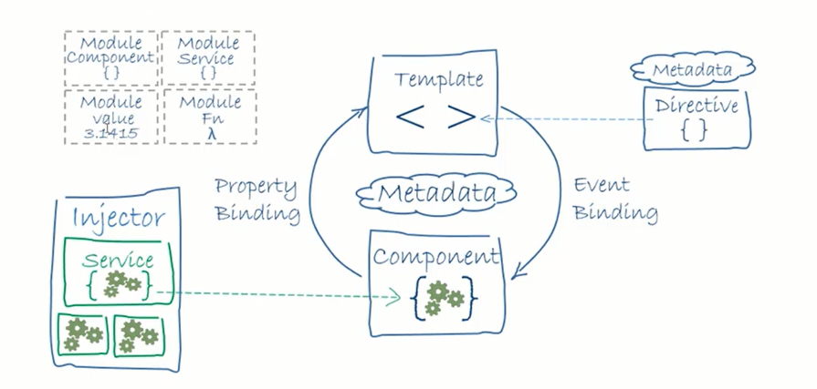
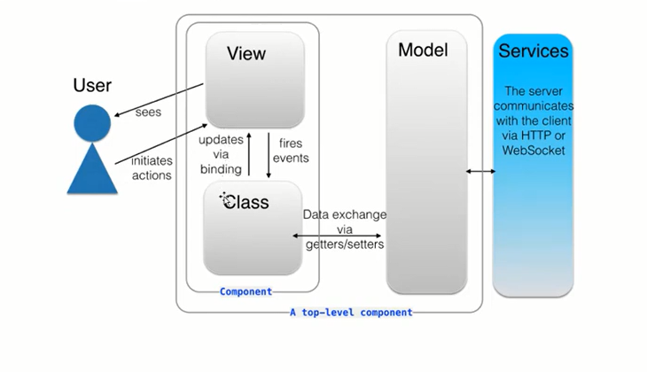

# Agenda: Introduction to Angular

* What is Angular?
* Angular Versions: AngularJS (vs) Angular
* Setup for local development environment
  * Installing NodeJS, NPM
  * Installing Visual Studio Code
  * Angular CLI
* Develop First Angular program using Angular CLI and Visual Studio Code.

## What is Angular?

* **Angular is a framework** for building client applications in HTML and TypeScript.
* It's built using TypeScript (Typed JavaScript) and hence TypeScript is ideal choice for programming Angular applications.
* It lets you use HTML as your template language and lets you extend HTML's syntax to express your application's components clearly and succinctly.
* Angular is best option if you want to create interactive **Single Page Application (SPA)**.
* Angular also empowers developers to build applications that live on not only browser but also mobile or desktop.
* Angular's **data binding and dependency injection** eliminate much of the code you would otherwise have to write. And it handles all of the **DOM** and **AJAX** code you once wrote by hand and puts it in a **well-defined structure**.

### **History**

AJAX -> jQuery / Prototype -> MVC Frameworks (Knockout / Backbone) -> AngularJS1.X -> Angular2 -> Angular4 -> Angular5 -> Angular6 -> Angular7

### Versions of AngularJS / Angular

1. AngularJS / Angular I.X — Oct 2010
2. Angular 2 - May 2016
3. **Angular 3 was skipped to accommodate correct version of@angular/router which was already 3.X verion in 2.**
4. Angular 4 — Mar 2017
5. Angular 5 — Nov 2017
6. Angular 6 — May 2018
7. Angular 7 — Oct 2018

#### Looking forward

8. Angular 8 — March / April 2019
9. Angular 9 — sep / Oct 2019

* Each version is expected to be backward-compatible with the prior release. Google pledged to do twice-a-year upgrades.

* In January 2018, a schedule was announced for phasing-out AngularJS: after releasing 1.7.0, the active development on AngularJS continued till June 30, 2018.
* Afterwards, 1.7 will be supported till June 30, 202i as long-term support.

### Features of AngularJS I.X

* It's based on **Model View Controller (MVC) and Model-View-View Model (MVVM)** design patterns.
* It's an **extension of HTML DOM, written in JavaScript** and has additional attributes which reduces code and makes it easy to program dynamic and responsive applications.
* Its features include everything we need to **build a CRUD app**: data-binding, basic templating, directives, form validation, routing, deep-linking, reusable components, dependency injection.
* AngularJS is built around the belief that **declarative code** is better than imperative when it comes to building Uls and wiring software components together, while imperative code is excellent for expressing business logic.
* Its views are **pure html pages**, and controllers written in **JavaScript** do the business processing.
* AngularJS applications can run on all major browsers and smart phones, including Android and IOS based phones/tablets.

#### Over and above AngularJS I.X, Angular provides

* Code is **simpler** to write and read.
* It's **component based architecture**.
* Better **performance**.
* Improved **Modularity**
* Improved **dependency injection**
* It has better support for **native mobile Apps** — iOS and Android.
* Improved **testability**.

**Note :-** Angular is a bit complicated to learn when compared to AngularJS but is easy to implement.

## Setup the Development Environment - Install Node JS, npm and Angular CLI

**Angular 7 depends upon TypeScript 3.1, RxJS 6.3 and Node 10**

* **Node.js and npm** are essential to modern web development th Angular and other platforms.
* Node powers client development and build tools.
* The **npm package manager**, itself a node application, installs JavaScript libraries.
* npm makes it easy for JavaScript developers to share and reuse code, and makes it easy to update the code that you're sharing, so you can build amazing things.

When you download Node.js, you automatically get npm installed on your computer.

### Step 1: Install Node.js

* <https://nodeis.org/en/> and install the latest stable version available
* Open Command Prompt as Administrator and execute the following commands (one after the other)
  * >    npm install npm@latest -g

**Note:** Precede with sudo if you are using lynx.

#### Verify Node Version

> npm -v

### Step 2: Install Visual Studio Code

* [visual studio](https://visualstudio.microsoft.com/)
  * Click on Download for Windows button under Visual Studio Code Icon

### Step 3: Install TypeScript and Angular CLI

#### Install TypeScript using Node Package Manager (NPM)

> npm install -g typescript

#### Install Angular CLI using Node Package Manager (NPM)

> npm install -g @angular/clil

#### Install Angular CLI using link :- if you install Angular CLI using NPM then ,  don't use this step

> [angular CLI](https://cli.angular.io)

### Step 4: Creating a New Project using Angular CLI

1. D:\Demos>**ng new** DemoApp
    * Following Questions will be asked. Accept the default by pressing enter.
    * ? Would you like to add Angular routing?
    * ? Which stylesheet format would you like to use?

The Angular CLI installs the necessary Angular npm packages and other dependencies. This can take a few minutes.

### Step 5: Build and serve the app

2. D:\Demos>**cd** DemoApp
3. D:\Demos\DemoApp>**ng serve** or **npm start**

> When npm start command is executed,
>
> * firstly it will launch typescript compiler and compiles the application with the following command tsc—p src/
> * Now it will start the lite-server and launches the browser where you can see the output

### Step 6: Understand the Files generated by CLI

4. D:\Demos\DemoApp>code .

#### Following three TypeScript (.ts) files are most important

> **src/app/app.component.ts**
>
> * Defines the same AppComponent as the one in the QuickStart playground.
> *
> * It is the root component of what will become a tree of nested components as the application evolves.

> **src/app/app.module.ts**
>
> * Defines AppModule, the root module
>   * that tells Angular how to assemble the application.
> *
> * Right now it declares only the AppComponent.

> **src/main.ts**
>
> * Compiles the application with the JIT compiler and bootstraps the application to run in the browser.
> *
> * That's a reasonable choice for the development of most projects and
>   * it's the only viable choice for a sample running in a live-coding environment like Plunker.

> **src/index.html**
>
> * Startup Page of the application - Single Page for our Application.

> **/angular.json**
>
> * Angular CLI Configuration File.
> *
> * It contains all options necessary to play around Angular artifacts like
>   * generating components,
>   * pipes,
>   * service provider,
>   * class,
>   * directives etc.

### Step 7: Editing the code to reflect changes

```JS

Options:
      --help                Shows a help message for this command in the console.                              [boolean]
  -c, --configuration       One or more named builder configurations as a comma-separated list as specified in the
                            "configurations" section in angular.json.
                            The builder uses the named configurations to run the given target.
                            For more information, see
                            https://angular.io/guide/workspace-config#alternate-build-configurations.
                                                                         [string] [choices: "development", "production"]
      --allowed-hosts       List of hosts that are allowed to access the dev server.                             [array]
      --browser-target      A browser builder target to serve in the format of `project:target[:configuration]`. You can
                            also pass in more than one configuration name as a comma-separated list. Example:
                            `project:target:production,staging`.                                                [string]
      --disable-host-check  Don't verify connected clients are part of allowed hosts.         [boolean] [default: false]
      --hmr                 Enable hot module replacement.                                    [boolean] [default: false]
      --host                Host to listen on.                                           [string] [default: "localhost"]
      --live-reload         Whether to reload the page on change, using live-reload.           [boolean] [default: true]
  -o, --open                Opens the url in default browser.                                 [boolean] [default: false]
      --poll                Enable and define the file watching poll time period in milliseconds.               [number]
      --port                Port to listen on.                                                  [number] [default: 4200]
      --proxy-config        Proxy configuration file. For more information, see
                            https://angular.io/guide/build#proxying-to-a-backend-server.                        [string]
      --public-host         The URL that the browser client (or live-reload client, if enabled) should use to connect to
                            the development server. Use for a complex dev server setup, such as one with reverse
                            proxies.                                                                            [string]
      --serve-path          The pathname where the application will be served.                                  [string]
      --ssl                 Serve using HTTPS.                                                [boolean] [default: false]
      --ssl-cert            SSL certificate to use for serving HTTPS.                                           [string]
      --ssl-key             SSL key to use for serving HTTPS.                                                   [string]
      --verbose             Adds more details to output logging.                                               [boolean]
      --watch               Rebuild on change.                                                 [boolean] [default: true]

```

# Agenda: Angular Architecture

* Introduction
* Basic Building Blocks of Angular Applications
* Angular Modules and @NgModule decorator
* Angular Libraries
* Component, Templates and Metadata
* DataBinding
* Directives
* Services and Dependency Injection
## Angular Architecture

* Angular is a framework for building client applications in HTML and either JavaScript or a language like TypeScript that compiles to JavaScript.
  
* The framework consists of several libraries, some of them core and some optional.
  
* The architecture diagram identifies the eight main building blocks of an Angular application:
  * Modules
  * Components
  * Templates
  * Metadata
  * Data binding
  * Directives
  * Services
  * Dependency Injection (Dl)
  * Routing



The Figure shows a high-level diagram of a sample Angular application:

