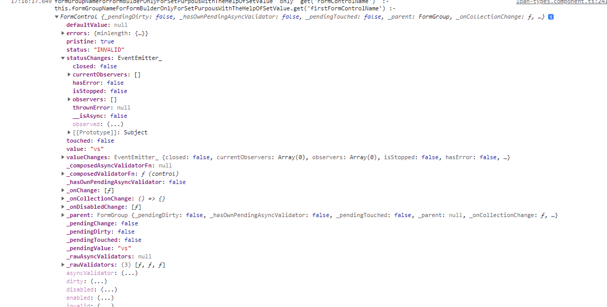
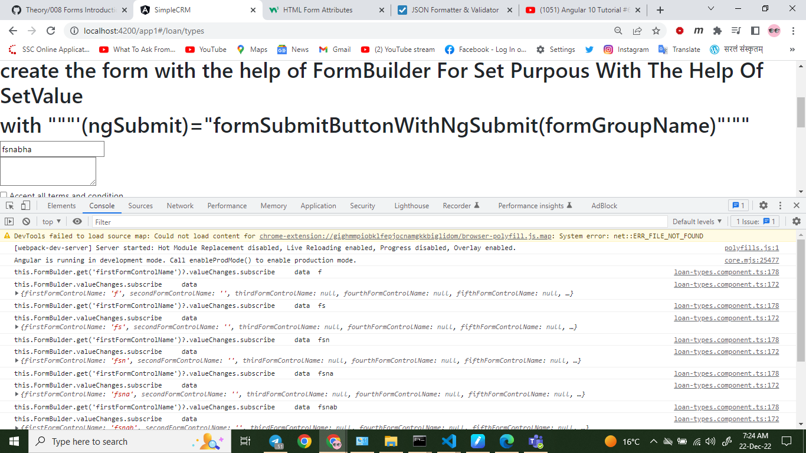
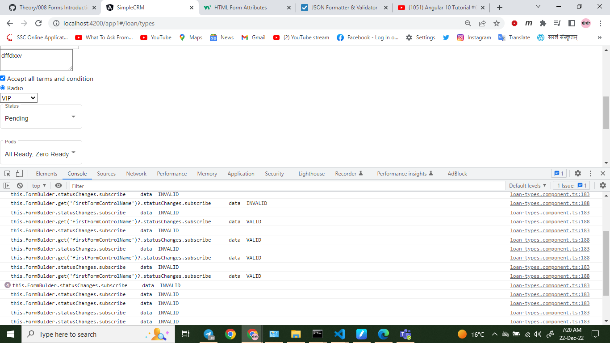

# Topic

60. Reactive Forms Complete Tutorial
61. Reactive Forms. FormGroup, FormControl For Beginners| Angular 10 Tutorial
62. Reactive Forms. FormBuilder
63. Reactive Forms. Set Form Values
64. Reactive Forms. Read Form Values
65. Reactive Forms Validations
66. Reactive Forms State and Validations
67. Reactive Forms Reset Example
68. Reactive Forms Value Changes
69. Reactive Forms State Changes
70. Reactive Forms. FormArray
71. Reactive Forms Add Remove FormControl
72. Component Communication Tutorial
73. Angular Material Design Layout Tutorial | Angular Layout Template Tutorial | Angular Starter Project


# Reactive Forms Value Changes

## Reactive Forms Value Changes by ARC

### Reactive Forms - Introduction

* **Reactive Forms are a way to create Forms** in Angular application
* What's different is how we implement, design and handle the form and the data
* All the form elements, user interactions and validations are handled in the component class
* We will make use of Angular's built in **formGroup** and **formControI**
* Using Reactive Forms we can control better data binding
* Exclusive define custom regular expression patterns of error handling
* We will need to import **ReactiveFormsModuIe** in our app module
> * Very flexible and allows users to define, develop complex requirements of forms
> * More logic in the component class and less in HTML mark up itself
* Angular maintains the state information of forms at all times
  * ng-touched
  * ng-untouched
  * ng-dirty
  * ng-pristine
  * ng-valid
  * ng-invalid

### Just Remember 3 important things in Reactive Forms

* FormControI
* FormGroup
* FormBuiIder

* `formControlName = "key"`   is manadatory for every   `input`,`select`&`option`,`textarea`,etc
* basically we are writing  `formControlName` instead of `name` attribute.

### Reactive Forms in 6 simple Steps

* We will learn and do hands-on exampels of the 6 simple steps

### How to use Reactive Forms

#### Step #1 — Import and Add in the ReactiveFormsModuIe in the app.module.ts

* For template driven forms — `ReactiveFormsModuIe` needs to be imported
* **If we do NOT import this — we will get error**
* Add the module into the array list of imports

#### Step #2 — Create the form in app.component.html

* `FormGroup`
  * We need to use the directive `FormGroup` for the entire form and give it a name
* `formControIName`
  * Every form field should have a "`formControlName`" attribute
  * basically we are writing  `formControlName` instead of `name` attribute of all `input`.
  


####  Step #3 — Create the form in app.component.html -

```html
<form [formGroup]="registerForm" (ngSubmit)="postData()">
    <input type="text" formControlName="firstname">
    <input type="text" formControlName="lastname">
    <input type="text" formControlName="email">
    <input type="submit" value="Post Data" [disabled]="!registerForm.valid">
</form>
```

#### Step #4 — In the component class — import the required modules

```ts
import { Component, OnInit } from '@angular/core';
import { FormBuilder, FormGroup, FormControl, NgForm, Validators} from '@angular/forms';
```

#### Step #5 — Inject the FormBuiIder in the constructor

```ts
constructor(private formBuilder: FormBuilder)
```

#### Step #6 — Create the form instance

```ts
this.registerForm = formBuilder.group({
firstname: new FormControl(),
lastname: new FormControl()
})
```

### Setting values in Reactive Forms

#### Set the value of entire form in one go

```ts
this.formGroupName = new FormGroup({
                                          'FormControlName1' : new FormControl('Value Here'),
                                          'FormControlName2': new FormControl(('Value Here'),
                                          'FormControlName3': new FormControl(('Value Here')
                                    })
```

#### Setting the form values using `setValue`

```ts
const SetObj = {
                    FormControlName1 : 'Value Here',
                    FormControlName2: 'Value Here',
                    FormControlName3: 'Value Here'
                }
// when you do have to pass all "keys/ fields"
this.formGroupName.setValue(SetObj);

// The only difference is -> you do not have to pass all "keys/ fields"
// this.formGroupName.patchVa1ue(SetObj);
```


### Read Reactive Form Values

1. Get Value of Entire Form
   * `this.formGroupName.value`
   * `this.formGroupName.root.value`
2. Get Entire Form Object
   * `this.formGroupName`
3. Get Values of specific Form Control
   * `this.formGroupName.get('formControlName').value;`
   * `this.formGroupName.get('formControlName')?.value;` // if you get "Object is possibly 'null'" as error
4. Get values on changes
   * `this.formGroupName.valueChanges`

### Built-In Reactive Form Validations

#### Validations in `FormControl`

```ts
this.formGroupName = new FormGroup({

'formControlName' : new FormControl('some', [  
                                                Validators.minLength(10),   
                                                Validators.required 
                                            ])

})
```

#### Multiple Validations using `Validators.compose`

```ts
'formControlName' : new FormControl('some', [  
                                                Validators.minLength(10),   
                                                Validators.required 
                                                Validators.pattern('^[a-zA-Z]+$') 
                                                ])

```

#### Get the state of the form -> valid or not

```html
<button (click)="formGroupSubmitButton()" [disabled]="!formGroupName.valid">Add Loan Type</button>
```

#### Disable the form button

```ts
this.formGroupName.valid
```

#### to check form is valid or not
* `console.log(this.formGroupName.valid)`
  * if `this.formGroupName.valid` return true then form is valid
  * if `this.formGroupName.valid` return false then form is invalid

### Reactive Form — Form States

* `.ng-valid`
* `.ng-invalid`
* `.ng-pending`
* `.ng-pristine`
* `.ng-dirty`
* `.ng-untouched`
* `.ng-touched`
  

* `console.log(this.formGroupName.get('firstFormControlName'))` :- try it 
*   


##### Form is `valid` or not
Check if the form is valid or not
##### Form controls were edited — `Dirty`
For was modified by the user
##### Form fields are `Pristine`
Form was not been modified by the user
##### Form fields were `touched`
Form fields were touched

### Reactive Form — `Reset()`

* Reset Form — `reset()`
* We can Reset the entire form using `reset()` method
* Syntax:
  * `this.formGroupName.reset()`

### Reactive Form — Track Value Changes

* Reset Form — `valueChanges()`
* `valueChanges` is yet another important property of Forms or `FormControI`
* `valueChanges` returns an Observable
* We need to Subscribe to the Observable to read the value
* `valueChanges` is a property in `AbstractControl`
* `valueChanges` will emit an event every time there is any change in the values of the control changes
* Syntax:
    ```js
    this.registerForm.valueChanges()
    this.formName.get('email').valueChanges.subscribe(data => {
    Console.log(data);
    })

    // it tracks  ValueChanges in  particular form control
    this.formGroupName.get('FormControlName1')?.valueChanges.subscribe((data: any)=>{
      console.log("this.formGroupName.get('FormControlName1')?.valueChanges.subscribe     data " , data)
    })
    // it tracks  ValueChanges in full form
    this.formGroupName.valueChanges.subscribe((data: any)=>{
      console.log("this.formGroupName.valueChanges.subscribe     data " , data)
    })
    ```

### syntax

**in html file**

```html
<!-- #FormName="ngForm" is not manadatory in reactive form , 
if you want, you can keep otherwise you can remove -->
  <!-- with  (ngSubmit)="formSubmitButton() -->
<form #FormName="ngForm" [formGroup]="formGroupName" (ngSubmit)="formGroupSubmitButton()">
  <!-- with  (ngSubmit)="formSubmitButton(formGroupName) -->
<form #FormName="ngForm" [formGroup]="formGroupName" (ngSubmit)="formGroupSubmitButton(formGroupName)">
  <!-- without  (ngSubmit)="formSubmitButton() or (ngSubmit)="formSubmitButton(formGroupName) -->
<form #FormName="ngForm" [formGroup]="formGroupName">


    <div><input type="text" formControlName="FormControlName1"></div>
    <!--Reactive form valiadation - required, minlength, maxlength -->
    <div *ngIf="formGroupName.get('FormControlName1')?.hasError('required')"> firstFormControlName is required </div>
    <div *ngIf="formGroupName.get('FormControlName1')?.hasError('minlength')"> firstFormControlName is minlength </div>
    <div *ngIf="formGroupName.get('FormControlName1')?.hasError('maxlength')"> firstFormControlName is maxlength </div>
    <!--Reactive form state - valid, invalid, pending, pristine, dirty, touched, untouched -->
    <div *ngIf="formGroupName.get('FormControlName1')?.valid"> firstFormControlName is valid </div>
    <div *ngIf="formGroupName.get('FormControlName1')?.invalid"> firstFormControlName is invalid </div>
    <div *ngIf="formGroupName.get('FormControlName1')?.pending"> firstFormControlName is pending </div>
    <div *ngIf="formGroupName.get('FormControlName1')?.pristine"> firstFormControlName is pristine </div>
    <div *ngIf="formGroupName.get('FormControlName1')?.dirty"> firstFormControlName is dirty </div>
    <div *ngIf="formGroupName.get('FormControlName1')?.touched"> firstFormControlName is touched </div>
    <div *ngIf="formGroupName.get('FormControlName1')?.untouched"> firstFormControlName is untouched </div>
    <!--Reactive form state & valiadation  -->
    <div 
    *ngIf="formGroupName.get('FormControlName1')?.hasError('required') && formGroupName.get('FormControlName1')?.touched" >
    firstFormControlName is required && touched</div>

        

    <div><input type="number" formControlName="FormControlName2"></div>
    <!-- this is for tracks  ValueChanges -->
    <!-- if you define ValueChanges inside ngOnInit method ,  
    then you don't need create a seperate event function -->
    <!-- <div><input type="number" formControlName="FormControlName2"  (blur)="formValueChanges()"></div> -->
    <!-- <div><input type="number" formControlName="FormControlName2"  (keyup)="formValueChanges()"></div> -->
    <!-- <div><input type="number" formControlName="FormControlName2"  (keypress)="formValueChanges()"></div> -->

    <div><input type="date" formControlName="FormControlName3"></div>
    <!--  formControlName = "key"   is manadatory for every   input,select&option,textarea,etc -->
    <!-- basically we are writing  formControlName instead of name attribute -->


  <!-- without  (ngSubmit)="formSubmitButton() or (ngSubmit)="formSubmitButton(formGroupName) -->
    <div><button (click)="formGroupSubmitButton()">Submit Button Name</button></div>

    <div><button (click)="formGroupSubmitButton()" [disabled]="!formGroupName.valid">
        Submit Button Name with disable feature according to validators</button>
    <!--    if formGroupName.valid return true then form is valid   if formGroupName.valid return false then form is invalid  -->
    </div>


  <!-- with  (ngSubmit)="formSubmitButton() or (ngSubmit)="formSubmitButton(formGroupName) -->
    <div><button type="submit">Submit Button Name</button></div>
    <div><button type="submit" [disabled]="!formGroupName.valid">
        Submit Button Name with disable feature according to validators</button></div>
<!-- or     :-  you can add 'type="submit"'   or        you can't add 'type="submit"'-->

  <!-- with  (ngSubmit)="formSubmitButton() or (ngSubmit)="formSubmitButton(formGroupName) -->
    <div><button >Submit Button Name</button></div>
    <div><button  [disabled]="!formGroupName.valid">
        Submit Button Name with disable feature according to validators</button></div>


<!-- set form button -->
    <div><button (click)="setForm()">Set Form</button></div>


<!-- Reset form button -->
        <div><button (click)="formGroupName.reset()">Reset Button Name</button></div>
        <div><button (click)="resetForm()">Reset Button Name by function</button></div>

</form>
```

**in ts file**

```ts
import { Component, OnInit } from '@angular/core';
import { FormControl, FormGroup } from '@angular/forms';

@Component({
  selector: 'app-loan-types',
  templateUrl: './loan-types.component.html',
  styleUrls: ['./loan-types.component.scss']
})
export class LoanTypesComponent implements OnInit {


// reactive form creation
// method-1
//  this FormGroup is created with the help of  FormGroup constructor
  formGroupName : FormGroup = new FormGroup({
    'FormControlName1': new FormControl(),
    'FormControlName2': new FormControl(),
    'FormControlName3': new FormControl(),
  }) ;

// method-2
//  this FormGroup is created with the help of  FormBuilder
  formGroupName : FormGroup = this.formBuilder.group({
    'FormControlName1': new FormControl(),
    'FormControlName2': new FormControl(),
    'FormControlName3': new FormControl(),
  }) ;


// set value in reactive form
// method-1 
//  SetValue  in reactive Form by formControl Constructor- FormGroup constructor method
formGroupName : FormGroup = new FormGroup({
                                          'FormControlName1' : new FormControl('Value Here'),
                                          'FormControlName2' : new FormControl('Value Here'),
                                          'FormControlName3' : new FormControl('Value Here')
                                    })
// method-2 
//  SetValue  in reactive Form by formControl Constructor- FormBuilder method
formGroupName : FormGroup = this.formBuilder.group({
                                          'FormControlName1' : new FormControl('Value Here'),
                                          'FormControlName2' : new FormControl('Value Here'),
                                          'FormControlName3' : new FormControl('Value Here')
                                    })
// method-3 
// SetValue  in reactive Form by set method - FormBuilder method & FormGroup constructor method
setForm() {
    let SetObj :any = {
      'FormControlName1' : 'Value Here',
      'FormControlName2' : 'Value Here',
      'FormControlName3' : 'Value Here'
    };
    // when you do have to pass all "keys/ fields"
    this.formGroupName.setValue(SetObj);

    // The only difference is -> you do not have to pass all "keys/ fields"
    // this.formGroupName.patchVa1ue(SetObj);
  }


  
// reactive form creation with validations
// method-1
//  this FormGroup is created with the help of  FormGroup constructor
  formGroupName : FormGroup = new FormGroup({
    'FormControlName1': new FormControl('Value Here',   [  
                                                            Validators.minLength(4),   
                                                            Validators.required , 
                                                            Validators.maxLength(8)
                                                        ] 
                                        ),
    // Validators.compose is used for re-use :- you can check on google
    'FormControlName2': new FormControl('Value Here',  Validators.compose([
                                                                            Validators.minLength(4),   
                                                                            Validators.required , 
                                                                            Validators.maxLength(8)
                                                                        ]) 
                                        ),

    'FormControlName3': new FormControl(),
  }) ;

// method-2
//  this FormGroup is created with the help of  FormBuilder
  formGroupName : FormGroup = this.formBuilder.group({
    'FormControlName1': new FormControl('Value Here',   [  
                                                            Validators.minLength(4),   
                                                            Validators.required , 
                                                            Validators.maxLength(8)
                                                        ] 
                                        ),
    // Validators.compose is used for re-use :- you can check on google
    'FormControlName2': new FormControl('Value Here',  Validators.compose([
                                                                            Validators.minLength(4),   
                                                                            Validators.required , 
                                                                            Validators.maxLength(8)
                                                                        ]) 
                                        ),
    'FormControlName3': new FormControl(),
  }) ;


  constructor(private formBuilder:FormBuilder) { }

  ngOnInit(): void {


    // tracks  ValueChanges
    // it tracks  ValueChanges in  particular form control
    this.formGroupName.get('FormControlName1')?.valueChanges.subscribe((data: any)=>{
      console.log("this.formGroupName.get('FormControlName2')?.valueChanges.subscribe     data " , data)
    })
    // it tracks  ValueChanges in full form
    this.formGroupName.valueChanges.subscribe((data: any)=>{
      console.log("this.formGroupName.valueChanges.subscribe     data " , data)
    })


  }

  // tracks  ValueChanges
  // if you define ValueChanges inside ngOnInit method ,  then you don't need create a seperate event function
  formValueChanges(): void {
    console.log("value changed")
    // it tracks  ValueChanges in full form
    this.formGroupName.valueChanges.subscribe(data=>{
      console.log("this.formGroupName.valueChanges.subscribe     data " , data)
    })

    // it tracks  ValueChanges in  particular form control
    this.formGroupName.get('FormControlName2')?.valueChanges.subscribe((data: any)=>{
      console.log("this.formGroupName.get('FormControlName1')?.valueChanges.subscribe     data " , data)
    })
  }


// submit button of form


  // with  (ngSubmit)="formSubmitButton(formGroupName)"  in html file
  formGroupSubmitButton(formGroupName: { value: any; }){
    console.log("formGroupName.value  :-  ",formGroupName.value)

  // with  (ngSubmit)="formSubmitButton()"  in html file      or
  // without  (ngSubmit)="formSubmitButton()"  or (ngSubmit)="formSubmitButton(formGroupName)"    in html file   
  formGroupSubmitButton(){

    // Get Value of Entire Form
    console.log('this.formGroupName.value :-  ',this.formGroupName.value);
    console.log('this.formGroupName.root.value :-  ',this.formGroupName.root.value);

    // Get Entire Form object with all value and prototype
    console.log('this.formGroupName :-  ',this.formGroupName);

    // Get Values of specific Form Control
    console.log("this.formGroupName.get('FormControlName1')?.value :-  ", this.formGroupName.get('FormControlName1')?.value);
    console.log("this.formGroupName.get('FormControlName2')?.value :-  ", this.formGroupName.get('FormControlName2')?.value);
    console.log("this.formGroupName.get('FormControlName3')?.value :-  ", this.formGroupName.get('FormControlName3')?.value);


    // Get values on changes
    /* 
    when you are going to do valueChanges then 
            you have to do subscribe 
            or you haveé to pass data through pipe
    because valueChanges return observable

            1. when valueChanges  subscribe :- 

            this.formGroupName.valueChanges.subscribe(data=>{
                console.log(data)
                //data
            })

            2. when valueChanges  are passed through pipe

            this.formGroupName.valueChanges.pipe(
                map(element => {
                    //code
                })
            )
    */

   this.formGroupName.valueChanges.subscribe(data=>{
                console.log(data)
                //data
            })

    
    // to check form is valid or not
    console.log(this.formGroupName.valid)
    // if this.formGroupName.valid return true then form is valid
    // if this.formGroupName.valid return false then form is invalid

    // all below will be return boolean , 
    //you can validate with the help of  'valid, invalid, pending, pristine, dirty, touched, untouched' in if-condition
    console.log("this.formGroupName.valid   :-  ",this.formGroupName.valid)
    console.log("this.formGroupName.invalid   :-  ",this.formGroupName.invalid)
    console.log("this.formGroupName.pending   :-  ",this.formGroupName.pending)
    console.log("this.formGroupName.pristine   :-  ",this.formGroupName.pristine)
    console.log("this.formGroupName.dirty   :-  ",this.formGroupName.dirty)
    console.log("this.formGroupName.touched   :-  ",this.formGroupName.touched)
    console.log("this.formGroupName.untouched   :-  ",this.formGroupName.untouched)

    // after submitting form then resetted form  :- if you want you can use
    this.formGroupName.reset()
 
  }


  // Reset form  by function
  resetForm(){
    this.formGroupName.reset();
  }

}

```

### Example :-

**add-customer.component.html**


```html
<p>loan-types works!</p>

<!-- 
   with  (ngSubmit)="formSubmitButton(FormBulder)
 -->

<div class="ByFormBulder">
    <h1> create the form with the help of FormBuilder For Set Purpous With The Help Of SetValue</h1>
    <h1>    with """'(ngSubmit)="formSubmitButtonWithNgSubmit(formGroupName)"'"" </h1>

    <!-- <form #form="ngForm" [formGroup]="FormBulder" (ngSubmit)="formSubmitButtonWithNgSubmit()"> -->
    <form #form="ngForm" [formGroup]="FormBulder" (ngSubmit)="formSubmitButtonWithNgSubmit(FormBulder)" >
        <!-- <div><input type="text" formControlName="firstFormControlName"  (blur)="formValueChanges()"></div> -->
        <!-- <div><input type="text" formControlName="firstFormControlName"  (keyup)="formValueChanges()"></div> -->
        <!-- <div><input type="text" formControlName="firstFormControlName"  (keypress)="formValueChanges()"></div> -->
        <div><input type="text" formControlName="firstFormControlName"></div>
        <div *ngIf="FormBulder.get('firstFormControlName')?.hasError('required')" >
            firstFormControlName is required</div>
        <div *ngIf="FormBulder.get('firstFormControlName')?.hasError('minlength')" >
            firstFormControlName is minlength</div>
        <div *ngIf="FormBulder.get('firstFormControlName')?.hasError('maxlength')" >
            firstFormControlName is maxlength</div>
        <div *ngIf="FormBulder.get('firstFormControlName')?.hasError('required') && FormBulder.get('firstFormControlName')?.touched" >firstFormControlName is required && touched</div>
        <!--  formControlName = "key"   is manadatory for every   input,select&option,textarea,etc -->
        <div><textarea formControlName="secondFormControlName" ></textarea></div>
        <div><input type="checkbox" formControlName="thirdFormControlName"  > Accept all terms and condition</div>
        <div><input type="radio" formControlName="fourthFormControlName">   Radio</div>
    
        <div>
            <select formControlName="fifthFormControlName" >
                <option value="premium">Premium</option>
                <option value="vip">VIP</option>
                <option value="economic">Economic</option>
            </select>
        </div>
    
        
        <div>
            <mat-form-field appearance="outline" class=" _w-50  _ml-10">
                <mat-label>Status</mat-label>
                <mat-select  [multiple]="false" formControlName="sixthFormControlName" >
            
                    <mat-option *ngFor="let groupFilter of status" [value]="groupFilter.value">
                        {{groupFilter.name}}
                    </mat-option>
                </mat-select>
            </mat-form-field>
        </div>
        
      
      <div>
        <mat-form-field appearance="outline" class="  _w-50 _ml-10">
            <mat-label>Pods</mat-label>
            <mat-select [multiple]="true" formControlName="seventhFormControlName" >
                <mat-option *ngFor="let groupFilter of pods" [value]="groupFilter.value">
                    {{groupFilter.name}}
                </mat-option>
            </mat-select>
        </mat-form-field>
      </div>
      
      <div>
            <mat-form-field appearance="outline">
            <mat-label>Favorite food</mat-label>
            <mat-select formControlName="eightthFormControlName"  >
              <mat-option *ngFor="let food of foods" [value]="food.value" >
                {{food.viewValue}}
              </mat-option>
            </mat-select>
          </mat-form-field>
      </div>
      
      <div>
        <mat-slide-toggle formControlName="ninethFormControlName" >Slide me!</mat-slide-toggle>
      </div>
    

    <!--    without       <form [formGroup]="form" (ngSubmit)="onSignln(form)"> ... </form>     -->
        <!-- <div><button (click)="formSubmitButtonWithoutNgSubmit()">
            Submit Button Name For Set Purpous With The Help Of SetValue </button></div>
        <div><button (click)="formSubmitButtonWithoutNgSubmit()" [disabled]="!FormBulder.valid">
            Submit Button Name For Set Purpous With The Help Of SetValue with disable feature </button></div> -->

    <!--    with       <form [formGroup]="form" (ngSubmit)="onSignln(form)"> ... </form>     -->
        <div><button type="submit">
            Submit Button Name For Set Purpous With The Help Of SetValue </button></div>
        <div><button type="submit" [disabled]="!FormBulder.valid">
            Submit Button Name For Set Purpous With The Help Of SetValue with disable feature </button></div>


        <div><button (click)="SetValueButton()">set Button Name</button></div>


        <div><button (click)="FormBulder.reset()">Reset Button Name</button></div>
        <div><button (click)="resetForm()">Reset Button Name by function</button></div>
    </form>
</div>
```

**add-customer.component.ts**

```ts
import { Component, OnInit } from '@angular/core';
import {AbstractControl, FormBuilder, FormControl, FormGroup, NgForm, Validators } from '@angular/forms';


interface Food {
  value: string;
  viewValue: string;
}


@Component({
  selector: 'app-loan-types',
  templateUrl: './loan-types.component.html',
  styleUrls: ['./loan-types.component.scss']
})
export class LoanTypesComponent implements OnInit {
  
  FormBulder : FormGroup = this.fb.group({
    'firstFormControlName': new FormControl('', [  Validators.minLength(4),   Validators.required , Validators.maxLength(8)] ),
    'secondFormControlName': new FormControl('',  Validators.compose([Validators.minLength(4),   Validators.required , Validators.maxLength(8)]) ),
    'thirdFormControlName': new FormControl(),
    'fourthFormControlName': new FormControl(),
    'fifthFormControlName': new FormControl(),
    'sixthFormControlName': new FormControl(),
    'seventhFormControlName': new FormControl(),
    'eightthFormControlName': new FormControl(),
    'ninethFormControlName': new FormControl(),
  }) ;

  status: any = [
    { name: "Success", value: "SUCCESS" },
    { name: "Error", value: "FAILED" },
    { name: "Pending", value: "PENDING" },
  ];
  pods: any = [
    { name: "All Ready", value: "allReady" },
    { name: "Zero Ready", value: "zeroReady" },
    { name: "Partial Ready", value: "partialReady" },
  ];


  /* 
  interface Food {
  value: string;
  viewValue: string;
}
  foods: Food[] = [
    {value: 'steak-0', viewValue: 'Steak'},
    {value: 'pizza-1', viewValue: 'Pizza'},
    {value: 'tacos-2', viewValue: 'Tacos'},
  ];
  */
  foods: Food[] = [
    { value: 'steak-0', viewValue: 'Steak' },
    { value: 'pizza-1', viewValue: 'Pizza' },
    { value: 'tacos-2', viewValue: 'Tacos' },
  ];
  constructor(private fb:FormBuilder) { }

  formValueChanges(): void {
    
    console.log("value changed")
    // this.FormBulder.valueChanges.subscribe(data=>{
    //   console.log("this.FormBulder.valueChanges.subscribe     data " , data)
    // })
    this.FormBulder.get('firstFormControlName')?.valueChanges.subscribe((data: any)=>{
      console.log("this.FormBulder.valueChanges.subscribe     data " , data)
    })
  }

  ngOnInit(): void {
    // this.FormBulder.valueChanges.subscribe(data=>{
    //   console.log("this.FormBulder.valueChanges.subscribe     data " , data)
    // })
    this.FormBulder.get('firstFormControlName')?.valueChanges.subscribe((data: any)=>{
      console.log("this.FormBulder.valueChanges.subscribe     data " , data)
    })
  }


  // formSubmitButtonWithNgSubmit(){
  formSubmitButtonWithNgSubmit(FormBulder: { value: any; }){
    console.log("FormBulder.form.value  :-  ",FormBulder.value)
    // to check form is valid or not
    console.log("this.FormBulder.valid   :-  ",this.FormBulder.valid)
    // if this.formGroupName.valid return true then form is valid
    // if this.formGroupName.valid return false then form is invalid

    console.log('FormBulder  :-    this.FormBulder.value :-  ',this.FormBulder.value)
    console.log('FormBulder  :-    this.FormBulder :-  ',this.FormBulder)
    console.log('FormBulder  :-    this.FormBulder.root.value :-  ',this.FormBulder.root.value)

    console.log("FormBulder  only  get('FormControlName')  :-    this.FormBulder.get('firstFormControlName') :-  ", this.FormBulder.get('firstFormControlName'))
    console.log("FormBulder  firstFormControlName :-    this.FormBulder.get('firstFormControlName')?.value :-  ", this.FormBulder.get('firstFormControlName')?.value)
    console.log("FormBulder  secondFormControlName :-    this.FormBulder.get('secondFormControlName')?.value :-  ", this.FormBulder.get('secondFormControlName')?.value)
    console.log("FormBulder  thirdFormControlName :-    this.FormBulder.get('thirdFormControlName')?.value :-  ", this.FormBulder.get('thirdFormControlName')?.value)
    console.log("FormBulder  fourthFormControlName :-    this.FormBulder.get('fourthFormControlName')?.value :-  ", this.FormBulder.get('fourthFormControlName')?.value)
    console.log("FormBulder  fifthFormControlName :-    this.FormBulder.get('fifthFormControlName')?.value :-  ", this.FormBulder.get('fifthFormControlName')?.value)
    console.log("FormBulder  sixthFormControlName :-    this.FormBulder.get('sixthFormControlName')?.value :-  ", this.FormBulder.get('sixthFormControlName')?.value)
    console.log("FormBulder  seventhFormControlName :-    this.FormBulder.get('seventhFormControlName')?.value :-  ", this.FormBulder.get('seventhFormControlName')?.value)
    console.log("FormBulder  eightthFormControlName :-    this.FormBulder.get('eightthFormControlName')?.value :-  ", this.FormBulder.get('eightthFormControlName')?.value)
    console.log("FormBulder  ninethFormControlName :-    this.FormBulder.get('ninethFormControlName')?.value :-  ", this.FormBulder.get('ninethFormControlName')?.value)
    


    // all below will be return boolean , you can validate with the help of  'valid, invalid, pending, pristine, dirty, touched, untouched' in if-condition
    console.log("this.FormBulder.valid   :-  ",this.FormBulder.valid)
    console.log("this.FormBulder.invalid   :-  ",this.FormBulder.invalid)
    console.log("this.FormBulder.pending   :-  ",this.FormBulder.pending)
    console.log("this.FormBulder.pristine   :-  ",this.FormBulder.pristine)
    console.log("this.FormBulder.dirty   :-  ",this.FormBulder.dirty)
    console.log("this.FormBulder.touched   :-  ",this.FormBulder.touched)
    console.log("this.FormBulder.untouched   :-  ",this.FormBulder.untouched)

    // after submitting then resetted form
    this.FormBulder.reset()

  
  }
  SetValueButton(){

    let settObj : any =   {
      'firstFormControlName'  : 'vs',
      'secondFormControlName' : "dadasa",
      'thirdFormControlName'  : true,
      'fourthFormControlName' : true,
      'fifthFormControlName'  : "vip",
      'sixthFormControlName'  : "FAILED",
      'seventhFormControlName': ['zeroReady',' partialReady ' ],
      'eightthFormControlName': "tacos -2",
      'ninethFormControlName' : true,
    };

    // this.FormBulder.setValue(settObj);
    this.FormBulder.patchValue(settObj);
   
  }

  resetForm(){
    this.FormBulder.reset();
  }


}

```

## Reactive Forms Value Changes by  Angular.io

# Reactive Forms State Changes

## Reactive Forms State Changes by ARC


### Reactive Forms - Introduction

* **Reactive Forms are a way to create Forms** in Angular application
* What's different is how we implement, design and handle the form and the data
* All the form elements, user interactions and validations are handled in the component class
* We will make use of Angular's built in **formGroup** and **formControI**
* Using Reactive Forms we can control better data binding
* Exclusive define custom regular expression patterns of error handling
* We will need to import **ReactiveFormsModuIe** in our app module
> * Very flexible and allows users to define, develop complex requirements of forms
> * More logic in the component class and less in HTML mark up itself
* Angular maintains the state information of forms at all times
  * ng-touched
  * ng-untouched
  * ng-dirty
  * ng-pristine
  * ng-valid
  * ng-invalid

### Just Remember 3 important things in Reactive Forms

* FormControI
* FormGroup
* FormBuiIder

* `formControlName = "key"`   is manadatory for every   `input`,`select`&`option`,`textarea`,etc
* basically we are writing  `formControlName` instead of `name` attribute.

### Reactive Forms in 6 simple Steps

* We will learn and do hands-on exampels of the 6 simple steps

### How to use Reactive Forms

#### Step #1 — Import and Add in the ReactiveFormsModuIe in the app.module.ts

* For template driven forms — `ReactiveFormsModuIe` needs to be imported
* **If we do NOT import this — we will get error**
* Add the module into the array list of imports

#### Step #2 — Create the form in app.component.html

* `FormGroup`
  * We need to use the directive `FormGroup` for the entire form and give it a name
* `formControIName`
  * Every form field should have a "`formControlName`" attribute
  * basically we are writing  `formControlName` instead of `name` attribute of all `input`.
  


####  Step #3 — Create the form in app.component.html -

```html
<form [formGroup]="registerForm" (ngSubmit)="postData()">
    <input type="text" formControlName="firstname">
    <input type="text" formControlName="lastname">
    <input type="text" formControlName="email">
    <input type="submit" value="Post Data" [disabled]="!registerForm.valid">
</form>
```

#### Step #4 — In the component class — import the required modules

```ts
import { Component, OnInit } from '@angular/core';
import { FormBuilder, FormGroup, FormControl, NgForm, Validators} from '@angular/forms';
```

#### Step #5 — Inject the FormBuiIder in the constructor

```ts
constructor(private formBuilder: FormBuilder)
```

#### Step #6 — Create the form instance

```ts
this.registerForm = formBuilder.group({
firstname: new FormControl(),
lastname: new FormControl()
})
```

### Setting values in Reactive Forms

#### Set the value of entire form in one go

```ts
this.formGroupName = new FormGroup({
                                          'FormControlName1' : new FormControl('Value Here'),
                                          'FormControlName2': new FormControl(('Value Here'),
                                          'FormControlName3': new FormControl(('Value Here')
                                    })
```

#### Setting the form values using `setValue`

```ts
const SetObj = {
                    FormControlName1 : 'Value Here',
                    FormControlName2: 'Value Here',
                    FormControlName3: 'Value Here'
                }
// when you do have to pass all "keys/ fields"
this.formGroupName.setValue(SetObj);

// The only difference is -> you do not have to pass all "keys/ fields"
// this.formGroupName.patchVa1ue(SetObj);
```


### Read Reactive Form Values

1. Get Value of Entire Form
   * `this.formGroupName.value`
   * `this.formGroupName.root.value`
2. Get Entire Form Object
   * `this.formGroupName`
3. Get Values of specific Form Control
   * `this.formGroupName.get('formControlName').value;`
   * `this.formGroupName.get('formControlName')?.value;` // if you get "Object is possibly 'null'" as error
4. Get values on changes
   * `this.formGroupName.valueChanges`

### Built-In Reactive Form Validations

#### Validations in `FormControl`

```ts
this.formGroupName = new FormGroup({

'formControlName' : new FormControl('some', [  
                                                Validators.minLength(10),   
                                                Validators.required 
                                            ])

})
```

#### Multiple Validations using `Validators.compose`

```ts
'formControlName' : new FormControl('some', [  
                                                Validators.minLength(10),   
                                                Validators.required 
                                                Validators.pattern('^[a-zA-Z]+$') 
                                                ])

```

#### Get the state of the form -> valid or not

```html
<button (click)="formGroupSubmitButton()" [disabled]="!formGroupName.valid">Add Loan Type</button>
```

#### Disable the form button

```ts
this.formGroupName.valid
```

#### to check form is valid or not
* `console.log(this.formGroupName.valid)`
  * if `this.formGroupName.valid` return true then form is valid
  * if `this.formGroupName.valid` return false then form is invalid

### Reactive Form — Form States

* `.ng-valid`
* `.ng-invalid`
* `.ng-pending`
* `.ng-pristine`
* `.ng-dirty`
* `.ng-untouched`
* `.ng-touched`
  

* `console.log(this.formGroupName.get('firstFormControlName'))` :- try it 
*   


##### Form is `valid` or not
Check if the form is valid or not
##### Form controls were edited — `Dirty`
For was modified by the user
##### Form fields are `Pristine`
Form was not been modified by the user
##### Form fields were `touched`
Form fields were touched

### Reactive Form — `Reset()`

* Reset Form — `reset()`
* We can Reset the entire form using `reset()` method
* Syntax:
  * `this.formGroupName.reset()`

### Reactive Form — Track Value Changes

* Reset Form — `valueChanges()`
* `valueChanges` is yet another important property of Forms or `FormControI`
* `valueChanges` returns an Observable
* We need to Subscribe to the Observable to read the value
* `valueChanges` is a property in `AbstractControl`
* `valueChanges` will emit an event every time there is any change in the values of the control changes
* Syntax:
    ```js
    this.registerForm.valueChanges()
    this.formName.get('email').valueChanges.subscribe(data => {
    Console.log(data);
    })

    // it tracks  ValueChanges in  particular form control
    this.formGroupName.get('FormControlName1')?.valueChanges.subscribe((data: any)=>{
      console.log("this.formGroupName.get('FormControlName1')?.valueChanges.subscribe     data " , data)
    })
    // it tracks  ValueChanges in full form
    this.formGroupName.valueChanges.subscribe((data: any)=>{
      console.log("this.formGroupName.valueChanges.subscribe     data " , data)
    })
    ```

### Reactive Form — Track state Changes

* Reactive Form — statusChanges()
* We can subscribe to status changes happening in the form at any time
* statusChanges is yet another important property of FormControl, FormGroup, and FormArray
* statusChanges returns an Observable. We need to Subscribe to the Observable to read the value
* statusChanges is a property in AbstractControI
* statusChanges will emit an event every time there is any change in the validation status of the control changes
* Syntax:
    ```ts
        this-formName.statusChanges();

        this-formName.statusChanges(data => {

        });

        this.formName.get('email').statusChanges.subscribe(data => {
          Console.log(data);
        })
        this.formName.get('fname').statusChanges.subscribe(data => {
          Console.log(data);
        })

        // it tracks  statusChanges in  particular form control
        this.formGroupName.get('FormControlName1')?.statusChanges.subscribe((data: any)=>{
          console.log("this.formGroupName.get('FormControlName1')?.statusChanges.subscribe     data " , data)
        })
        // it tracks  statusChanges in full form
        this.formGroupName.statusChanges.subscribe((data: any)=>{
          console.log("this.formGroupName.statusChanges.subscribe     data " , data)
        })

    ```




### syntax

**in html file**

```html
<!-- #FormName="ngForm" is not manadatory in reactive form , 
if you want, you can keep otherwise you can remove -->
  <!-- with  (ngSubmit)="formSubmitButton() -->
<form #FormName="ngForm" [formGroup]="formGroupName" (ngSubmit)="formGroupSubmitButton()">
  <!-- with  (ngSubmit)="formSubmitButton(formGroupName) -->
<form #FormName="ngForm" [formGroup]="formGroupName" (ngSubmit)="formGroupSubmitButton(formGroupName)">
  <!-- without  (ngSubmit)="formSubmitButton() or (ngSubmit)="formSubmitButton(formGroupName) -->
<form #FormName="ngForm" [formGroup]="formGroupName">


    <div><input type="text" formControlName="FormControlName1"></div>
    <!--Reactive form valiadation - required, minlength, maxlength -->
    <div *ngIf="formGroupName.get('FormControlName1')?.hasError('required')"> firstFormControlName is required </div>
    <div *ngIf="formGroupName.get('FormControlName1')?.hasError('minlength')"> firstFormControlName is minlength </div>
    <div *ngIf="formGroupName.get('FormControlName1')?.hasError('maxlength')"> firstFormControlName is maxlength </div>
    <!--Reactive form state - valid, invalid, pending, pristine, dirty, touched, untouched -->
    <div *ngIf="formGroupName.get('FormControlName1')?.valid"> firstFormControlName is valid </div>
    <div *ngIf="formGroupName.get('FormControlName1')?.invalid"> firstFormControlName is invalid </div>
    <div *ngIf="formGroupName.get('FormControlName1')?.pending"> firstFormControlName is pending </div>
    <div *ngIf="formGroupName.get('FormControlName1')?.pristine"> firstFormControlName is pristine </div>
    <div *ngIf="formGroupName.get('FormControlName1')?.dirty"> firstFormControlName is dirty </div>
    <div *ngIf="formGroupName.get('FormControlName1')?.touched"> firstFormControlName is touched </div>
    <div *ngIf="formGroupName.get('FormControlName1')?.untouched"> firstFormControlName is untouched </div>
    <!--Reactive form state & valiadation  -->
    <div 
    *ngIf="formGroupName.get('FormControlName1')?.hasError('required') && formGroupName.get('FormControlName1')?.touched" >
    firstFormControlName is required && touched</div>

        

    <div><input type="number" formControlName="FormControlName2"></div>
    <!-- this is for tracks  ValueChanges -->
    <!-- if you define ValueChanges inside ngOnInit method ,  
    then you don't need create a seperate event function -->
    <!-- <div><input type="number" formControlName="FormControlName2"  (blur)="formChangesTrack()"></div> -->
    <!-- <div><input type="number" formControlName="FormControlName2"  (keyup)="formChangesTrack()"></div> -->
    <!-- <div><input type="number" formControlName="FormControlName2"  (keypress)="formChangesTrack()"></div> -->

    <div><input type="date" formControlName="FormControlName3"></div>
    <!--  formControlName = "key"   is manadatory for every   input,select&option,textarea,etc -->
    <!-- basically we are writing  formControlName instead of name attribute -->


  <!-- without  (ngSubmit)="formSubmitButton() or (ngSubmit)="formSubmitButton(formGroupName) -->
    <div><button (click)="formGroupSubmitButton()">Submit Button Name</button></div>

    <div><button (click)="formGroupSubmitButton()" [disabled]="!formGroupName.valid">
        Submit Button Name with disable feature according to validators</button>
    <!--    if formGroupName.valid return true then form is valid   if formGroupName.valid return false then form is invalid  -->
    </div>


  <!-- with  (ngSubmit)="formSubmitButton() or (ngSubmit)="formSubmitButton(formGroupName) -->
    <div><button type="submit">Submit Button Name</button></div>
    <div><button type="submit" [disabled]="!formGroupName.valid">
        Submit Button Name with disable feature according to validators</button></div>
<!-- or     :-  you can add 'type="submit"'   or        you can't add 'type="submit"'-->

  <!-- with  (ngSubmit)="formSubmitButton() or (ngSubmit)="formSubmitButton(formGroupName) -->
    <div><button >Submit Button Name</button></div>
    <div><button  [disabled]="!formGroupName.valid">
        Submit Button Name with disable feature according to validators</button></div>


<!-- set form button -->
    <div><button (click)="setForm()">Set Form</button></div>


<!-- Reset form button -->
        <div><button (click)="formGroupName.reset()">Reset Button Name</button></div>
        <div><button (click)="resetForm()">Reset Button Name by function</button></div>

</form>
```

**in ts file**

```ts
import { Component, OnInit } from '@angular/core';
import { FormControl, FormGroup } from '@angular/forms';

@Component({
  selector: 'app-loan-types',
  templateUrl: './loan-types.component.html',
  styleUrls: ['./loan-types.component.scss']
})
export class LoanTypesComponent implements OnInit {


// reactive form creation
// method-1
//  this FormGroup is created with the help of  FormGroup constructor
  formGroupName : FormGroup = new FormGroup({
    'FormControlName1': new FormControl(),
    'FormControlName2': new FormControl(),
    'FormControlName3': new FormControl(),
  }) ;

// method-2
//  this FormGroup is created with the help of  FormBuilder
  formGroupName : FormGroup = this.formBuilder.group({
    'FormControlName1': new FormControl(),
    'FormControlName2': new FormControl(),
    'FormControlName3': new FormControl(),
  }) ;


// set value in reactive form
// method-1 
//  SetValue  in reactive Form by formControl Constructor- FormGroup constructor method
formGroupName : FormGroup = new FormGroup({
                                          'FormControlName1' : new FormControl('Value Here'),
                                          'FormControlName2' : new FormControl('Value Here'),
                                          'FormControlName3' : new FormControl('Value Here')
                                    })
// method-2 
//  SetValue  in reactive Form by formControl Constructor- FormBuilder method
formGroupName : FormGroup = this.formBuilder.group({
                                          'FormControlName1' : new FormControl('Value Here'),
                                          'FormControlName2' : new FormControl('Value Here'),
                                          'FormControlName3' : new FormControl('Value Here')
                                    })
// method-3 
// SetValue  in reactive Form by set method - FormBuilder method & FormGroup constructor method
setForm() {
    let SetObj :any = {
      'FormControlName1' : 'Value Here',
      'FormControlName2' : 'Value Here',
      'FormControlName3' : 'Value Here'
    };
    // when you do have to pass all "keys/ fields"
    this.formGroupName.setValue(SetObj);

    // The only difference is -> you do not have to pass all "keys/ fields"
    // this.formGroupName.patchVa1ue(SetObj);
  }


  
// reactive form creation with validations
// method-1
//  this FormGroup is created with the help of  FormGroup constructor
  formGroupName : FormGroup = new FormGroup({
    'FormControlName1': new FormControl('Value Here',   [  
                                                            Validators.minLength(4),   
                                                            Validators.required , 
                                                            Validators.maxLength(8)
                                                        ] 
                                        ),
    // Validators.compose is used for re-use :- you can check on google
    'FormControlName2': new FormControl('Value Here',  Validators.compose([
                                                                            Validators.minLength(4),   
                                                                            Validators.required , 
                                                                            Validators.maxLength(8)
                                                                        ]) 
                                        ),

    'FormControlName3': new FormControl(),
  }) ;

// method-2
//  this FormGroup is created with the help of  FormBuilder
  formGroupName : FormGroup = this.formBuilder.group({
    'FormControlName1': new FormControl('Value Here',   [  
                                                            Validators.minLength(4),   
                                                            Validators.required , 
                                                            Validators.maxLength(8)
                                                        ] 
                                        ),
    // Validators.compose is used for re-use :- you can check on google
    'FormControlName2': new FormControl('Value Here',  Validators.compose([
                                                                            Validators.minLength(4),   
                                                                            Validators.required , 
                                                                            Validators.maxLength(8)
                                                                        ]) 
                                        ),
    'FormControlName3': new FormControl(),
  }) ;


  constructor(private formBuilder:FormBuilder) { }

  ngOnInit(): void {


    // tracks  ValueChanges
    // it tracks  ValueChanges in  particular form control
    this.formGroupName.get('FormControlName1')?.valueChanges.subscribe((data: any)=>{
      console.log("this.formGroupName.get('FormControlName2')?.valueChanges.subscribe     data " , data)
    })
    // it tracks  ValueChanges in full form
    this.formGroupName.valueChanges.subscribe((data: any)=>{
      console.log("this.formGroupName.valueChanges.subscribe     data " , data)
    })


    // tracks  statusChanges
    // it tracks  statusChanges in  particular form control
    this.formGroupName.get('FormControlName1')?.statusChanges.subscribe((data: any)=>{
      console.log("this.formGroupName.get('FormControlName2')?.statusChanges.subscribe     data " , data)
    })
    // it tracks  statusChanges in full form
    this.formGroupName.statusChanges.subscribe((data: any)=>{
      console.log("this.formGroupName.statusChanges.subscribe     data " , data)
    })

  }

  // tracks  ValueChanges and statusChanges
  // if you define ValueChanges/statusChanges inside ngOnInit method ,  
  // then you don't need create a seperate event function
  formChangesTrack(): void {
    console.log("value changed")
    // tracks  ValueChanges
    // it tracks  ValueChanges in  particular form control
    this.formGroupName.get('FormControlName1')?.valueChanges.subscribe((data: any)=>{
      console.log("this.formGroupName.get('FormControlName2')?.valueChanges.subscribe     data " , data)
    })
    // it tracks  ValueChanges in full form
    this.formGroupName.valueChanges.subscribe((data: any)=>{
      console.log("this.formGroupName.valueChanges.subscribe     data " , data)
    })


    // tracks  statusChanges
    // it tracks  statusChanges in  particular form control
    this.formGroupName.get('FormControlName1')?.statusChanges.subscribe((data: any)=>{
      console.log("this.formGroupName.get('FormControlName2')?.statusChanges.subscribe     data " , data)
    })
    // it tracks  statusChanges in full form
    this.formGroupName.statusChanges.subscribe((data: any)=>{
      console.log("this.formGroupName.statusChanges.subscribe     data " , data)
    })
  }


// submit button of form


  // with  (ngSubmit)="formSubmitButton(formGroupName)"  in html file
  formGroupSubmitButton(formGroupName: { value: any; }){
    console.log("formGroupName.value  :-  ",formGroupName.value)

  // with  (ngSubmit)="formSubmitButton()"  in html file      or
  // without  (ngSubmit)="formSubmitButton()"  or (ngSubmit)="formSubmitButton(formGroupName)"    in html file   
  formGroupSubmitButton(){

    // Get Value of Entire Form
    console.log('this.formGroupName.value :-  ',this.formGroupName.value);
    console.log('this.formGroupName.root.value :-  ',this.formGroupName.root.value);

    // Get Entire Form object with all value and prototype
    console.log('this.formGroupName :-  ',this.formGroupName);

    // Get Values of specific Form Control
    console.log("this.formGroupName.get('FormControlName1')?.value :-  ", this.formGroupName.get('FormControlName1')?.value);
    console.log("this.formGroupName.get('FormControlName2')?.value :-  ", this.formGroupName.get('FormControlName2')?.value);
    console.log("this.formGroupName.get('FormControlName3')?.value :-  ", this.formGroupName.get('FormControlName3')?.value);


    // Get values on changes
    /* 
    when you are going to do valueChanges then 
            you have to do subscribe 
            or you haveé to pass data through pipe
    because valueChanges return observable

            1. when valueChanges  subscribe :- 

            this.formGroupName.valueChanges.subscribe(data=>{
                console.log(data)
                //data
            })

            2. when valueChanges  are passed through pipe

            this.formGroupName.valueChanges.pipe(
                map(element => {
                    //code
                })
            )
    */

   this.formGroupName.valueChanges.subscribe(data=>{
                console.log(data)
                //data
            })

    
    // to check form is valid or not
    console.log(this.formGroupName.valid)
    // if this.formGroupName.valid return true then form is valid
    // if this.formGroupName.valid return false then form is invalid

    // all below will be return boolean , 
    //you can validate with the help of  'valid, invalid, pending, pristine, dirty, touched, untouched' in if-condition
    console.log("this.formGroupName.valid   :-  ",this.formGroupName.valid)
    console.log("this.formGroupName.invalid   :-  ",this.formGroupName.invalid)
    console.log("this.formGroupName.pending   :-  ",this.formGroupName.pending)
    console.log("this.formGroupName.pristine   :-  ",this.formGroupName.pristine)
    console.log("this.formGroupName.dirty   :-  ",this.formGroupName.dirty)
    console.log("this.formGroupName.touched   :-  ",this.formGroupName.touched)
    console.log("this.formGroupName.untouched   :-  ",this.formGroupName.untouched)

    // after submitting form then resetted form  :- if you want you can use
    this.formGroupName.reset()
 
  }


  // Reset form  by function
  resetForm(){
    this.formGroupName.reset();
  }

}

```

### Example :-

**add-customer.component.html**


```html
<p>loan-types works!</p>

<!-- 
   with  (ngSubmit)="formSubmitButton(FormBulder)
 -->

<div class="ByFormBulder">
    <h1> create the form with the help of FormBuilder For Set Purpous With The Help Of SetValue</h1>
    <h1>    with """'(ngSubmit)="formSubmitButtonWithNgSubmit(formGroupName)"'"" </h1>

    <!-- <form #form="ngForm" [formGroup]="FormBulder" (ngSubmit)="formSubmitButtonWithNgSubmit()"> -->
    <form #form="ngForm" [formGroup]="FormBulder" (ngSubmit)="formSubmitButtonWithNgSubmit(FormBulder)" >
        <!-- <div><input type="text" formControlName="firstFormControlName"  (blur)="formValueChanges()"></div> -->
        <!-- <div><input type="text" formControlName="firstFormControlName"  (keyup)="formValueChanges()"></div> -->
        <!-- <div><input type="text" formControlName="firstFormControlName"  (keypress)="formValueChanges()"></div> -->
        <div><input type="text" formControlName="firstFormControlName"></div>
        <div *ngIf="FormBulder.get('firstFormControlName')?.hasError('required')" >
            firstFormControlName is required</div>
        <div *ngIf="FormBulder.get('firstFormControlName')?.hasError('minlength')" >
            firstFormControlName is minlength</div>
        <div *ngIf="FormBulder.get('firstFormControlName')?.hasError('maxlength')" >
            firstFormControlName is maxlength</div>
        <div *ngIf="FormBulder.get('firstFormControlName')?.hasError('required') && FormBulder.get('firstFormControlName')?.touched" >firstFormControlName is required && touched</div>
        <!--  formControlName = "key"   is manadatory for every   input,select&option,textarea,etc -->
        <div><textarea formControlName="secondFormControlName" ></textarea></div>
        <div><input type="checkbox" formControlName="thirdFormControlName"  > Accept all terms and condition</div>
        <div><input type="radio" formControlName="fourthFormControlName">   Radio</div>
    
        <div>
            <select formControlName="fifthFormControlName" >
                <option value="premium">Premium</option>
                <option value="vip">VIP</option>
                <option value="economic">Economic</option>
            </select>
        </div>
    
        
        <div>
            <mat-form-field appearance="outline" class=" _w-50  _ml-10">
                <mat-label>Status</mat-label>
                <mat-select  [multiple]="false" formControlName="sixthFormControlName" >
            
                    <mat-option *ngFor="let groupFilter of status" [value]="groupFilter.value">
                        {{groupFilter.name}}
                    </mat-option>
                </mat-select>
            </mat-form-field>
        </div>
        
      
      <div>
        <mat-form-field appearance="outline" class="  _w-50 _ml-10">
            <mat-label>Pods</mat-label>
            <mat-select [multiple]="true" formControlName="seventhFormControlName" >
                <mat-option *ngFor="let groupFilter of pods" [value]="groupFilter.value">
                    {{groupFilter.name}}
                </mat-option>
            </mat-select>
        </mat-form-field>
      </div>
      
      <div>
            <mat-form-field appearance="outline">
            <mat-label>Favorite food</mat-label>
            <mat-select formControlName="eightthFormControlName"  >
              <mat-option *ngFor="let food of foods" [value]="food.value" >
                {{food.viewValue}}
              </mat-option>
            </mat-select>
          </mat-form-field>
      </div>
      
      <div>
        <mat-slide-toggle formControlName="ninethFormControlName" >Slide me!</mat-slide-toggle>
      </div>
    

    <!--    without       <form [formGroup]="form" (ngSubmit)="onSignln(form)"> ... </form>     -->
        <!-- <div><button (click)="formSubmitButtonWithoutNgSubmit()">
            Submit Button Name For Set Purpous With The Help Of SetValue </button></div>
        <div><button (click)="formSubmitButtonWithoutNgSubmit()" [disabled]="!FormBulder.valid">
            Submit Button Name For Set Purpous With The Help Of SetValue with disable feature </button></div> -->

    <!--    with       <form [formGroup]="form" (ngSubmit)="onSignln(form)"> ... </form>     -->
        <div><button type="submit">
            Submit Button Name For Set Purpous With The Help Of SetValue </button></div>
        <div><button type="submit" [disabled]="!FormBulder.valid">
            Submit Button Name For Set Purpous With The Help Of SetValue with disable feature </button></div>


        <div><button (click)="SetValueButton()">set Button Name</button></div>


        <div><button (click)="FormBulder.reset()">Reset Button Name</button></div>
        <div><button (click)="resetForm()">Reset Button Name by function</button></div>
    </form>
</div>
```

**add-customer.component.ts**

```ts
import { Component, OnInit } from '@angular/core';
import {AbstractControl, FormBuilder, FormControl, FormGroup, NgForm, Validators } from '@angular/forms';


interface Food {
  value: string;
  viewValue: string;
}


@Component({
  selector: 'app-loan-types',
  templateUrl: './loan-types.component.html',
  styleUrls: ['./loan-types.component.scss']
})
export class LoanTypesComponent implements OnInit {
  
  FormBulder : FormGroup = this.fb.group({
    'firstFormControlName': new FormControl('', [  Validators.minLength(4),   Validators.required , Validators.maxLength(8)] ),
    'secondFormControlName': new FormControl('',  Validators.compose([Validators.minLength(4),   Validators.required , Validators.maxLength(8)]) ),
    'thirdFormControlName': new FormControl(),
    'fourthFormControlName': new FormControl(),
    'fifthFormControlName': new FormControl(),
    'sixthFormControlName': new FormControl(),
    'seventhFormControlName': new FormControl(),
    'eightthFormControlName': new FormControl(),
    'ninethFormControlName': new FormControl(),
  }) ;

  status: any = [
    { name: "Success", value: "SUCCESS" },
    { name: "Error", value: "FAILED" },
    { name: "Pending", value: "PENDING" },
  ];
  pods: any = [
    { name: "All Ready", value: "allReady" },
    { name: "Zero Ready", value: "zeroReady" },
    { name: "Partial Ready", value: "partialReady" },
  ];


  /* 
  interface Food {
  value: string;
  viewValue: string;
}
  foods: Food[] = [
    {value: 'steak-0', viewValue: 'Steak'},
    {value: 'pizza-1', viewValue: 'Pizza'},
    {value: 'tacos-2', viewValue: 'Tacos'},
  ];
  */
  foods: Food[] = [
    { value: 'steak-0', viewValue: 'Steak' },
    { value: 'pizza-1', viewValue: 'Pizza' },
    { value: 'tacos-2', viewValue: 'Tacos' },
  ];
  constructor(private fb:FormBuilder) { }

  formValueChanges(): void {
    
    console.log("value changed")
    // it tracks  valueChanges in full form
    // this.FormBulder.valueChanges.subscribe(data=>{
    //   console.log("this.FormBulder.valueChanges.subscribe     data " , data)
    // })

    // it tracks  valueChanges in  particular form control
    this.FormBulder.get('firstFormControlName')?.valueChanges.subscribe((data: any)=>{
      console.log("this.FormBulder.valueChanges.subscribe     data " , data)
    })

    // it tracks  statusChanges in full form
    this.FormBulder.statusChanges.subscribe(data=>{
      console.log("this.FormBulder.statusChanges.subscribe     data " , data)
    })

    // it tracks  statusChanges in  particular form control
    this.FormBulder.get('firstFormControlName')?.statusChanges.subscribe((data: any)=>{
      console.log("this.FormBulder.get('firstFormControlName')?.statusChanges.subscribe      data " , data)
    })
  }

  ngOnInit(): void {
    // it tracks  valueChanges in full form
    // this.FormBulder.valueChanges.subscribe(data=>{
    //   console.log("this.FormBulder.valueChanges.subscribe     data " , data)
    // })

    // it tracks  valueChanges in  particular form control
    this.FormBulder.get('firstFormControlName')?.valueChanges.subscribe((data: any)=>{
      console.log("this.FormBulder.valueChanges.subscribe     data " , data)
    })

    // it tracks  statusChanges in full form
    this.FormBulder.statusChanges.subscribe(data=>{
      console.log("this.FormBulder.statusChanges.subscribe     data " , data)
    })

    // it tracks  statusChanges in  particular form control
    this.FormBulder.get('firstFormControlName')?.statusChanges.subscribe((data: any)=>{
      console.log("this.FormBulder.get('firstFormControlName')?.statusChanges.subscribe      data " , data)
    })
  }


  // formSubmitButtonWithNgSubmit(){
  formSubmitButtonWithNgSubmit(FormBulder: { value: any; }){
    console.log("FormBulder.form.value  :-  ",FormBulder.value)
    // to check form is valid or not
    console.log("this.FormBulder.valid   :-  ",this.FormBulder.valid)
    // if this.formGroupName.valid return true then form is valid
    // if this.formGroupName.valid return false then form is invalid

    console.log('FormBulder  :-    this.FormBulder.value :-  ',this.FormBulder.value)
    console.log('FormBulder  :-    this.FormBulder :-  ',this.FormBulder)
    console.log('FormBulder  :-    this.FormBulder.root.value :-  ',this.FormBulder.root.value)

    console.log("FormBulder  only  get('FormControlName')  :-    this.FormBulder.get('firstFormControlName') :-  ", this.FormBulder.get('firstFormControlName'))
    console.log("FormBulder  firstFormControlName :-    this.FormBulder.get('firstFormControlName')?.value :-  ", this.FormBulder.get('firstFormControlName')?.value)
    console.log("FormBulder  secondFormControlName :-    this.FormBulder.get('secondFormControlName')?.value :-  ", this.FormBulder.get('secondFormControlName')?.value)
    console.log("FormBulder  thirdFormControlName :-    this.FormBulder.get('thirdFormControlName')?.value :-  ", this.FormBulder.get('thirdFormControlName')?.value)
    console.log("FormBulder  fourthFormControlName :-    this.FormBulder.get('fourthFormControlName')?.value :-  ", this.FormBulder.get('fourthFormControlName')?.value)
    console.log("FormBulder  fifthFormControlName :-    this.FormBulder.get('fifthFormControlName')?.value :-  ", this.FormBulder.get('fifthFormControlName')?.value)
    console.log("FormBulder  sixthFormControlName :-    this.FormBulder.get('sixthFormControlName')?.value :-  ", this.FormBulder.get('sixthFormControlName')?.value)
    console.log("FormBulder  seventhFormControlName :-    this.FormBulder.get('seventhFormControlName')?.value :-  ", this.FormBulder.get('seventhFormControlName')?.value)
    console.log("FormBulder  eightthFormControlName :-    this.FormBulder.get('eightthFormControlName')?.value :-  ", this.FormBulder.get('eightthFormControlName')?.value)
    console.log("FormBulder  ninethFormControlName :-    this.FormBulder.get('ninethFormControlName')?.value :-  ", this.FormBulder.get('ninethFormControlName')?.value)
    


    // all below will be return boolean , you can validate with the help of  'valid, invalid, pending, pristine, dirty, touched, untouched' in if-condition
    console.log("this.FormBulder.valid   :-  ",this.FormBulder.valid)
    console.log("this.FormBulder.invalid   :-  ",this.FormBulder.invalid)
    console.log("this.FormBulder.pending   :-  ",this.FormBulder.pending)
    console.log("this.FormBulder.pristine   :-  ",this.FormBulder.pristine)
    console.log("this.FormBulder.dirty   :-  ",this.FormBulder.dirty)
    console.log("this.FormBulder.touched   :-  ",this.FormBulder.touched)
    console.log("this.FormBulder.untouched   :-  ",this.FormBulder.untouched)

    // after submitting then resetted form
    this.FormBulder.reset()

  
  }
  SetValueButton(){

    let settObj : any =   {
      'firstFormControlName'  : 'vs',
      'secondFormControlName' : "dadasa",
      'thirdFormControlName'  : true,
      'fourthFormControlName' : true,
      'fifthFormControlName'  : "vip",
      'sixthFormControlName'  : "FAILED",
      'seventhFormControlName': ['zeroReady',' partialReady ' ],
      'eightthFormControlName': "tacos -2",
      'ninethFormControlName' : true,
    };

    // this.FormBulder.setValue(settObj);
    this.FormBulder.patchValue(settObj);
   
  }

  resetForm(){
    this.FormBulder.reset();
  }


}

```


## Reactive Forms State Changes by  Angular.io

# Reactive Forms. FormArray

## Reactive Forms. FormArray by ARC

## Reactive Forms. FormArray by  Angular.io

# Reactive Forms Add Remove FormControl

## Reactive Forms Add Remove FormControl by ARC

## Reactive Forms Add Remove FormControl by  Angular.io

# Component Communication Tutorial

## Component Communication Tutorial by ARC

## Component Communication Tutorial by  Angular.io

# Angular Material Design Layout Tutorial | Angular Layout Template Tutorial | Angular Starter Project

## Angular Material Design Layout Tutorial by ARC

## Angular Material Design Layout Tutorial by  Angular.io


