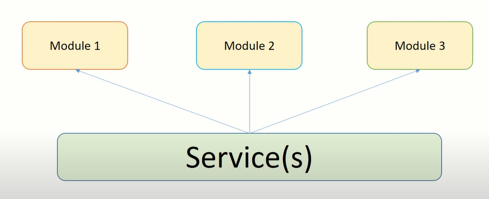

74. Services Tutorial
75. HttpClient Tutorial
76. HTTP GET Tutorial
77. HTTP POST Tutorial
78. HTTP PUT Tutorial
79. HTTP DELETE Tutorial
80. HTTP Interceptor Tutorial
81. Observable Subscribe Tutorial

# Dependency Injection

* Dependency injection (Dl), is an important application design pattern.
* Dependency injection is the ability to add the functionality of components at runtime
* The Dl framework lets you supply data to a component from an injectable service class, defined in its own file
* Angular has its own Dl framework,
  * which is typically used in the design of Angular applications to increase their efficiency and modularity.
* Dependencies are services or objects that a class needs to perform its function.
* Dl is a coding pattern in which a class asks for dependencies from external sources rather than creating them itself.

* DI is a design pattern which is used for dynamically providing the dependencies .
* A class which we call as "services " .
* Services are resuable classes which can be shared between components .
* These services and dependencies are provided at run time .
* This helps in increading the effecincy of apps .
* We will load services whatever is required for those components only .
* its easy to maintain and its faster in performance .

* What do we cover in dependencies
  * Services we create and inject into our components
  * We will use a decorator called "@lnjecttle" to let components know that this is a Dependency

# service tutorial

* Services allows us to create reusable common shared functionality between various modules and components
* Services are singleton
* Services are injected into application using Dependency Injection mechanism
* We need to create and inject services in components where we want to use them
* Services are an abstraction layer or process layer which consists of our application business logic
* Services are commonly used for making HTTP requests to our endpoints APIs to request and receive the response
* A service can have a value, methods or a combination of both!



* How to generate services using CLI
  * `ng generate service <service_name>`

```js
import { Injectable } from '@angular/core';

@Injectable({
  providedIn: 'root'
})
export class ContactsService {
  constructor() { }
}
```

* Services are used for resubing the comon shared functionality
* For e.g
  * Contacts - Module
    * components
      * create contact
      * view contact
      * edit contact
      * delete contact
    * Services
      * contacts. service. ts
        * HTTP
        * processing data
        * cleaning data

* Services are singleton
  * they need to be injected into the components where we want to use them
* Unline components - Services need not be included in your modules
* We can create any number of services
  * no restriction
* Services are used for sharing data between components
* Importing and injection services into components is called "Dependency Injection"
* Services are injected at "runtime" into components
* The code becomes highly efficient and easy to maintain
* The code becomes much easier to test -
* We can have a values, methods or both in the services
* You can relate that service is simply a javascript class with methods and variables
* `ng g service <service-name>`
* we can generate the service in any folder we want
  * the best practice is always keep all services related into modules
* @lnjectable decorator informs Angular that we can inject it into components that its service class
* The service is provided in "root" which means its available across the application
  * can be injected into any component we need

### @lnjectable

* Dependency injection (Dl), is an important application design pattern.
* The Dl framework lets you supply data to a component from an injectable service class, defined in its own file .
* DI is a coding pattern in which a class asks for dependencies from external sources rather than creating them  itself.
* A class which has the injectable decorator becomes a service class .
* The injectable decorator allows the functionality of this class to be injected and used in any Angular JS module

### Learn to use Services in 4 easy steps

* **Step #1: Generate the Service**
  * ng generate service leads
* **Step #2 : Import the Service in the component class**

    ```js
        Import { leads } from '../leads.service';
    ```

* **Step #3 : Initialize in the constructor method i.e Dependency Injection**

  ```js
  constructor(private formBuilder: FormBuilder,
              private leadsService: LeadsService)
  ```

* **Step #4: Call the methods and properties in the class (component class)**

  ```js
    this. leadsService.methodName()
  ```

* **Step #3.1 : Call the methods directly in the template (html file)**
  * Make sure your service instance is PUBLIC — else error in compiling

    ```js
    constructor(private formBuilder: FormBuilder,
                public leadsService: LeadsService)
    ```

* **Step #4.2: Call the methods and properties in the temlate**

  ```js
    leadsService.methodName()
  ```

### Example :-

**contact.service.ts**

```js
import { Injectable } from '@angular/core';

@Injectable({
  providedIn: 'root'
})
export class ContactsService {
  constructor() { }
  getContacts(){
    // HTTP calls here
    const contatcsList = [
      { contactId : 1 , contactName : 'Name1'},
      { contactId : 2 , contactName : 'Name2'},
      { contactId : 3 , contactName : 'Name3'},
      { contactId : 4 , contactName : 'Name4'},
      { contactId : 5 , contactName : 'Name5'},
      { contactId : 6 , contactName : 'Name6'},
      { contactId : 7 , contactName : 'Name7'},
      { contactId : 8 , contactName : 'Name8'},
      { contactId : 9 , contactName : 'Name9'},
      { contactId : 10 , contactName : 'Name10'},
      { contactId : 11 , contactName : 'Name11'},
      { contactId : 12 , contactName : 'Name12'},
    ]
    return contatcsList;
  }
}
```

**contact.component.ts**

```js
import { Component, OnInit } from '@angular/core';
import { ContactsService } from '../services/contacts.service';
@Component({
  selector: 'app-contacts',
  templateUrl: './contacts.component.html',
  styleUrls: ['./contacts.component.scss']
})
export class ContactsComponent implements OnInit {
  contactList: any = [];
  constructor(private contactService : ContactsService) { }
  ngOnInit(): void {
    this.contactList=this.contactService.getContacts();
    console.log(this.contactList)
  }
}
```

**contact.component.ts**

```html
<ul>
  <li *ngFor="let contact of contactList">
    {{contact.contactId}} :- {{contact.contactName}}
  </li>
</ul>
```

# HttpClient

* **HttpClient** is used for performing HTTP requests and responses.
* The **HttpClient** service is available in the **@angular/common/http** package
* The new **HttpClient** service is included in the Http Client module which is used to initiate HTTP request and responses in Angular apps
* The **HttpClientModule** needs to be imported into the module. Usually in the app module.
* **HttpClient** also gives other useful functionality like interceptors, headers etc

## HttpClient Methods

* get()
* post()
* put()
* delete()
* head()
* jsonp()
* options()
* options()
* patch()

## Benefits of HttpCIient

* HttpClient includes Observable APIs
* HttpClient can have the HTTP Headers in options
* HttpClient includes the highly testability features
* HttpClient includes typed request
* HttpClient includes response objects
* HttpClient includes request and response interception
* HttpClient include error handling

## CRUD Operations using HttpClient

* **Create** — usually a POST method call
* **Read** — usually a GET method call
* **Update** — Usually a PUT method call
* **Delete** — is a Delete method Call.
  * Technically — we should NEVER delete anything. Only soft deletes which means setting a flag or so.

## Setting up local Server — Multiple Options

* Using a Mock API Server like json-server
  * We will use this in our examples.
  * I will be sharing MEAN stack tutorial using Node and Express JS to setup APIs
* setup using XAMPP or WAMP or MAMP
* Setup using Python based module SimpleHTTP
* Setup using Node and Express JS
* Setup using IIS or Apache etc
* There is No right way to setUp a server. It all depends on your application infrastructure

## notes

* we use HttpC1ient to make request and process response of HTTP calls
* we make HTTP calls to server - endpoints or APIs
* To work with HttpC1ient we need to import HttpC1ientModu1e in our App Module
  * WITHOUT this step - our HTTP will not work
* we will need to import HttpC1ient in our component if we want to make HTTP calls
* As best practice - we usually make HTTP calls in our services
  * However technically speaking - there is no restriction on where you can use
* Setup a mock server for our examples and app
  * I will be covering MEAN stack tutorials next week
  * NODE and Express JS based API framework

## HttpClient Get Method

* Making API calls to retrieve data is GET method call
* To make a call all we need is a endpoint or an API URL
  * `get('api-endpoint')`
* We can also pass various parameters as options to the GET call
  * `get('url', options:{})`
* We will use options to pass parameters like headers, params, responseType, withCredentials etc
  * `get('url', options: { headers:{}, params:{} } )`
* The response type will be an observable.

### How to use HttpCIient GET Method in 6 easy Steps

* **Step 1:-** Import **HttpClientModule** in our App Module
  * if you have parent or child module (lazy-load relationship) , then import HttpClientModule in both module
* **Step 2:-** Import **HttpClient** in our service or component wherever we are making the HTTP request
  * It's good practice to have all HTTP calls in services
  * Becomes resuable and easy to maintain code
  * Easy to share between various components
* **Step 3:-** Inject the **HttpClient** in the constructor method of the class
* **Step 4:-** Implement the **GET** method call
* **Step 5:-** Import the **Services** into the required calling component class.
* **Step 6:-** Call the method to make the HTTP request.

## HttpClient Post Method

### common Post Examples

* Login Form
* Create New User
* Contact Us

* Whereever we want the data to be hidden and secured via forms

### HttpClient Post Method

* Making API calls to submit the data is referred to as a POST call
* To make a call ,  we need an endpoint or an API URL and data that needs to be submitted
  * `post('url', body)`
* We can also pass various parameters as options to the POST call
  * `post('url', body, options:{})`
* We will use options to pass parameters like headers, params, responseType, withCredentials etc
  * `post('url', body, options: { headers:{}, params:{} } )`
* The response type will be an observable.

### How to use HttpCIient POST Method in 6 easy Steps

* **Step 1:-** Import **HttpClientModule** in our App Module
  * if you have parent or child module (lazy-load relationship) , then import HttpClientModule in both module
* **Step 2:-** Import **HttpClient** in our service or component wherever we are making the HTTP request
  * It's good practice to have all HTTP calls in services
  * Becomes resuable and easy to maintain code
  * Easy to share between various components
* **Step 3:-** Inject the **HttpClient** in the constructor method of the class
* **Step 4:-** Implement the **POST** method call
* **Step 5:-** Import the **Services** into the required calling component class.
* **Step 6:-** Call the method to make the HTTP request.

## HttpClient Put Method

* Making API calls to submit to "Update" the existing data is referred to as a PUT call
* To make a call ,  we need an endpoint or an API URL and data that needs to be submitted
  * `put('url', body)`
    * here url will be `url + '/' +id` .
      * id will be unique number of every element of array-object
* We can also pass various parameters as options to the PUT call
  * `put('url', body, options:{})`
* We will use options to pass parameters like headers, params, responseType, withCredentials etc
  * `put('url', body, options: { headers:{}, params:{} } )`
* The response type will be an observable.

### How to use HttpCIient PUT Method in 6 easy Steps

* **Step 1:-** Import **HttpClientModule** in our App Module
  * if you have parent or child module (lazy-load relationship) , then import HttpClientModule in both module
* **Step 2:-** Import **HttpClient** in our service or component wherever we are making the HTTP request
  * It's good practice to have all HTTP calls in services
  * Becomes resuable and easy to maintain code
  * Easy to share between various components
* **Step 3:-** Inject the **HttpClient** in the constructor method of the class
* **Step 4:-** Implement the **PUT** method call
* **Step 5:-** Import the **Services** into the required calling component class.
* **Step 6:-** Call the method to make the HTTP request.

## HttpClient Delete Method

* Making API calls to submit to "delete" the existing data is referred to as a Delete call
* To make a call ,  we need an endpoint or an API URL and data that needs to be submitted
  * `delete('url')`
    * here url will be `url + '/' +id` .
      * id will be unique number of every element of array-object
* We can also pass various parameters as options to the PUT call
  * `delete('url', options:{})`
* We will use options to pass parameters like headers, params, responseType, withCredentials etc
  * `delete('url', options: { headers:{}, params:{} } )`
* The response type will be an observable.

### How to use HttpCIient Delete Method in 6 easy Steps

* **Step 1:-** Import **HttpClientModule** in our App Module
  * if you have parent or child module (lazy-load relationship) , then import HttpClientModule in both module
* **Step 2:-** Import **HttpClient** in our service or component wherever we are making the HTTP request
  * It's good practice to have all HTTP calls in services
  * Becomes resuable and easy to maintain code
  * Easy to share between various components
* **Step 3:-** Inject the **HttpClient** in the constructor method of the class
* **Step 4:-** Implement the **Deelete** method call
* **Step 5:-** Import the **Services** into the required calling component class.
* **Step 6:-** Call the method to make the HTTP request.

## example - 1

**deb.json**

```json
{
  "posts": [
    {"id": 0,"title": "json-server0","author": "typicode0"},
    {"id": 1,"title": "json-server1","author": "typicode1"},
    {"id": 2,"title": "json-server2","author": "typicode2"},
    {"id": 3,"title": "json-server3","author": "typicode3"},
    {"id": 4,"title": "json-server4","author": "typicode4"},
    {"id": 5,"title": "json-server5","author": "typicode5"},
    {"id": 6,"title": "json-server6","author": "typicode6"},
    {"id": 7,"title": "json-server7","author": "typicode7"},
    {"id": 8,"title": "json-server8","author": "typicode8"},
    {"id": 9,"title": "json-server9","author": "typicode9"},
    {"id": 10,"title": "json-server10","author": "typicode10"}
  ],
  "comments": [
    {"id": 100,"body": "some comment0","postId": 1000},
    {"id": 101,"body": "some comment1","postId": 1001},
    {"id": 102,"body": "some comment2","postId": 1002},
    {"id": 103,"body": "some comment3","postId": 1003},
    {"id": 104,"body": "some comment4","postId": 1004},
    {"id": 105,"body": "some comment5","postId": 1005},
    {"id": 106,"body": "some comment6","postId": 1006},
    {"id": 107,"body": "some comment7","postId": 1007},
    {"id": 108,"body": "some comment8","postId": 1008},
    {"id": 109,"body": "some comment9","postId": 1009}
  ],
  "profile": {"name": "typicode"}
}
```

**contacts.service.ts**

```js
import { Injectable } from '@angular/core';
import { HttpClient , HttpHeaders, HttpParams } from '@angular/common/http';

@Injectable({
  providedIn: 'root'
})
export class ContactsService {

  constructor( private http : HttpClient) { }

/*
  getContacts(){
    // HTTP calls here
    const contatcsList = [
      { contactId : 1 , contactName : 'Name1'},
      { contactId : 2 , contactName : 'Name2'},
      { contactId : 3 , contactName : 'Name3'},
      { contactId : 4 , contactName : 'Name4'},
      { contactId : 5 , contactName : 'Name5'},
      { contactId : 6 , contactName : 'Name6'},
      { contactId : 7 , contactName : 'Name7'},
      { contactId : 8 , contactName : 'Name8'},
      { contactId : 9 , contactName : 'Name9'},
      { contactId : 10 , contactName : 'Name10'},
      { contactId : 11 , contactName : 'Name11'},
      { contactId : 12 , contactName : 'Name12'},
    ]
    return contatcsList;
  }
 */

  getContacts(url:string){ // retrieve contact list
    return this.http.get(url);
  }
  postContacts(url:string , body:object){  // add contact list
    return this.http.post(url,body);
  }
  putContacts(url:string , id:number , body:object){  // update contact list
    return this.http.put((url+'/'+id),body);
  }
  deleteContacts(url:string , id:number){  // delete contact list
    return this.http.delete((url+'/'+id));
  }

}
```

**contacts.component.ts**

```ts
import { Component, OnInit } from '@angular/core';
import { ContactsService } from '../services/contacts.service';

@Component({
  selector: 'app-contacts',
  templateUrl: './contacts.component.html',
  styleUrls: ['./contacts.component.scss']
})
export class ContactsComponent implements OnInit {

  contactList: any = [];
  url = 'http://localhost:3000/posts' ;
  constructor(private contactService : ContactsService) { }

  ngOnInit(): void {
    this.getContact();
  }

  getContact(){
    this.contactService.getContacts(this.url).subscribe(data=>{
      this.contactList = data;
    });
  }

  body = {
    "id": this.contactList.length+1 ,
    "title": "json-server"+ String(this.contactList.length+1),
    "author": "typicode"+ String(this.contactList.length+1)
  }

  addNewContact(){
    this.contactService.postContacts(this.url,this.body).subscribe(data=>{
      this.contactList = data;
      this.getContact();
    });
  }

  updateNewContact(){
    let id = this.contactList.length;
    let  body = {
      "id": this.contactList.length ,
      "title": "json-server"+ String(this.contactList.length) + String(this.contactList.length),
      "author": "typicode"+ String(this.contactList.length) + String(this.contactList.length)
    }
    this.contactService.putContacts(this.url, id, body).subscribe(data=>{
      this.contactList = data;
      this.getContact();
    });
  }

  deleteNewContact(){
    let id = this.contactList.length;
    this.contactService.deleteContacts(this.url, id).subscribe(data=>{
      this.contactList = data;
      this.getContact();
    });
  }

}
```

**contacts.component.html**

```html
<p>contacts works!</p>

<ul>
  <li *ngFor="let contact of contactList">
    <span style="font-weight: 700;">ID</span> :- {{contact.id}} <span style="font-weight: 700;">Author</span>:- {{contact.author}} <span style="font-weight: 700;">Title</span> :- {{contact.title}}
  </li>
</ul>


<h3>Create New Contact</h3>


<button (click)="addNewContact()">add contact</button>
<button (click)="updateNewContact()">update contact</button>
<button (click)="deleteNewContact()">delete contact</button>
```

## HttpCIient Headers

* We can send Headers with our HTTP calls
* **HttpHeaders are Immutable — they CANNOT be modified**
* Some of the examples of various HTTP headers are
  * Authorization
  * Content-type
* We can add Headers to
  * POST
  * GET
  * DELETE
  * PUT
  * PATCH
* Extremely important and useful concept specially when working with RESTful APIs
* We define the headers using **HttpHeaders**
* HttpHeader consists of below 7 methods
  * Append
  * Get
  * Keys
  * getAll
  * Set
  * delete

* some headers method :-
  * headers define :- http headers is in the **HttpHeaders class**
    * `const httpHeaders = new HttpHeaders();`
  * add (append) content in headers
    * `httpHeaders = httpHeaders.append('content-type', 'application/json');`
    * `httpHeaders.append('AuthorizationI, 'dfgdfgfg345345sdff');`
  * set some value in headers
    * `httpHeaders.set('x-content-id', 'your-value');`
  * check value persent in headers or not
    * `httpHeader.has('x-content-id', '')`
  * get all the keys of the headers
    * `httpHeader.keys()` // will give all the keys of the headers

* Http headers is in the **HttpHeaders class**
* we need to import the class **HttpHeaders**
* We can pass any number of headers.
  * we can't send duplicate headers in the same request
    * ex:-

      ```ts
        // both headers are same
        header('content-type' : 'application/json')
        header('content-type' : 'application/text')
      ```

* we can also custom headers which are required by our application specific requirements or needs
* we can set custom headers.
* Let's do some hands-on examples

## HttpCIient Params

* We define the Params using **HttpParams**
* **HttpParams are Immutable — they CANNOT be modified**
* We can add HttpParams to
  * POST
  * GET
  * DELETE
  * PUT
  * PATCH
* ex:- `http://localhost:4200/test?param1=value1&param2=value2`
* **HttpParams** consists of below 8 methods
  * Append
  * Has
  * Get
  * Keys
  * getAll
  * Set
  * delete
  * toString
* we define the parameters using HttpParams using fromObject and fromSTring:

    ```js
      const params = new HttpParams({
        fromObject:{   // easiest way
          param1 :'value1',
          param2 :'value2',
        }
      })

      // http://localhost:4200/test?param1=value1&param2=value2


      const params = new HttpParams({
        fromString:`param1=${var1} & param1=${var1}`
      })

      // http://localhost:4200/test?param1=value1&param2=value2
    ````

* Http params is in the **HttpParams class**
* we need to import the class **HttpParams**
* create an object instance and initialize with some variable that we want to pass
* We can pass any number of headers.
  * we can't send duplicate headers in the same request
    * ex:-

      ```ts
        // both headers are same
        header('content-type' : 'application/json')
        header('content-type' : 'application/text')
      ```

* we can also custom headers which are required by our application specific requirements or needs
* we can set custom headers.
* Let's do some hands-on examples

**contacts.service.ts**

```js
import { Injectable } from '@angular/core';
import { HttpClient , HttpHeaders, HttpParams } from '@angular/common/http';

@Injectable({
  providedIn: 'root'
})
export class ContactsService {

  // method - 1

  httpHeaders = new HttpHeaders({
    'content-type' : 'application/json',
    'Authorization':'AbhayKumarAmu@2020'
  })


  // method - 2
  // httpHeaders = new HttpHeaders()

  constructor( private http : HttpClient) { }

  getContacts(url:string){ // retrieve contact list
    // method - 1
    let httpHeaders = new HttpHeaders({
      'content-type' : 'application/json',
      'Authorization':'AbhayKumarAmu@2020',
      'timeOutSeconds':'3000'
    })

    // headers are immutable

    // custom headers - use either set or append method
    httpHeaders = httpHeaders.set('arc-tutorial-id' , '118')

    let time = httpHeaders.get('timeOutSeconds')
    if(time == '3000'){
      // at the API we can check if Authorization is empty - redirect user to logIn Screen
      // SOme Custome Logic
      httpHeaders = httpHeaders.set('Authorization' , '')
    }

    return this.http.get(url , {headers:httpHeaders});
  }
  postContacts(url:string , body:object){  // add contact list
    return this.http.post(url,body);
  }
  putContacts(url:string , id:number , body:object){  // update contact list
    return this.http.put((url+'/'+id),body);
  }
  deleteContacts(url:string , id:number){  // delete contact list
    return this.http.delete((url+'/'+id));
  }

// get contact by id :- http params
getContactById(url:string){
  const httpParams = new HttpParams({
    fromObject:{
      // http://localhost:3000/posts?id=6
      // id : 6


      // http://localhost:3000/posts?id=6&id=4
      // id : [6,4]

      // http://localhost:3000/posts?id=6&title=json-server8
      id : 6,
      "title": "json-server8"
    }
  });

  return this.http.get(url , {params:httpParams});
}

}

```

**contacts.component.ts**

```ts
import { Component, OnInit } from '@angular/core';
import { ContactsService } from '../services/contacts.service';

@Component({
  selector: 'app-contacts',
  templateUrl: './contacts.component.html',
  styleUrls: ['./contacts.component.scss']
})
export class ContactsComponent implements OnInit {

  contactList: any = [];
  url = 'http://localhost:3000/posts' ;

  // http heders

  // const httpHeaders = new this.httpHeaders

  constructor(private contactService : ContactsService) { }

  ngOnInit(): void {
    this.getContact();
  }

  getContact(){
    this.contactService.getContacts(this.url).subscribe(data=>{
      this.contactList = data;
    });
  }

  body = {
    "id": this.contactList.length+2 ,
    "title": "json-server"+ String(this.contactList.length+2),
    "author": "typicode"+ String(this.contactList.length+2)
  }

  addNewContact(){
    this.contactService.postContacts(this.url,this.body).subscribe(data=>{
      this.contactList = data;
      this.getContact();
    });
  }

  updateNewContact(){
    let id = this.contactList.length+1;
    let  body = {
      "id": this.contactList.length+1 ,
      "title": "json-server"+ String(this.contactList.length+1) + String(this.contactList.length+1),
      "author": "typicode"+ String(this.contactList.length+1) + String(this.contactList.length+1)
    }
    this.contactService.putContacts(this.url, id, body).subscribe(data=>{
      this.contactList = data;
      this.getContact();
    });
  }

  deleteNewContact(){
    let id = this.contactList.length+1;
    this.contactService.deleteContacts(this.url, id).subscribe(data=>{
      this.contactList = data;
      this.getContact();
    });
  }

  getSpecificContact(){
    this.contactService.getContactById(this.url).subscribe(data =>{
      console.log("hello  :-  " , data)
    })
  }

}

```

**contacts.component.html**

```html
<p>contacts works!</p>

<ul>
  <li *ngFor="let contact of contactList">
    <span style="font-weight: 700;">ID</span> :- {{contact.id}} <span style="font-weight: 700;">Author</span>:- {{contact.author}} <span style="font-weight: 700;">Title</span> :- {{contact.title}}
  </li>
</ul>


<h3>Create New Contact</h3>


<button (click)="addNewContact()">add contact</button>
<button (click)="updateNewContact()">update contact</button>
<button (click)="deleteNewContact()">delete contact</button>
<button (click)="getSpecificContact()">get specific contact</button>

```

## Http Interceptors

* Intercepts and handles an HttpRequest or HttpResponse
* Most interceptors transform the outgoing request before passing it to the next interceptor in the chain, by calling next.handle(transformedReq)
* An interceptor may transform the response event stream as well, by applying additional RxJS  operators on the stream returned by next.handle()
* It is also rare but valid for an interceptor to return multiple responses on the event stream for a single request.

-----------------------

client(ui) -> request           -> interceptor ->modifyRequest            server
-----------------------

then

-----------------------

client(ui)            <-           <-response    server(API)
-----------------------

* we can use HttpInterceptor when we do HTTP calls
  * **use case-1** :- whenever there is a HTTP call - log all activities
    * Create Contact -> log that data -> then call server
    * Edit Contact -> log that data -> then call server
    * Delete Contact -> log that data -> then call server
    * Get Contact -> log that data -> then call server
  * **use case-1** :- whenever there is a HTTP call - show Loading Icon
    * Create Contact -> show Loading Icon -> then call server
    * Edit Contact -> show Loading Icon -> then call server
    * Delete Contact -> show Loading Icon -> then call server
    * Get Contact -> show Loading Icon -> then call server
* **step :- 1 :-** generate interceptor
  * `ng generate interceptor <interceptorName>`
* **step :- 2 :-** include it in APP Module

  ```ts
    import { UsersComponent } from './../users/users.component';
    import { NgModule } from '@angular/core';
    import { CommonModule } from '@angular/common';
    import { ContactsComponent } from './contacts/contacts.component';
    import { ContactsRoutingModule } from './contacts-routing.module';
    import { HttpClientModule, HTTP_INTERCEPTORS } from '@angular/common/http';
    import { LoggingInterceptor } from './API interceptor/logging.interceptor';


    @NgModule({
      declarations: [
        ContactsComponent
      ],
      imports: [
        CommonModule,
        ContactsRoutingModule,
        HttpClientModule
      ],
      providers:[
        {provide: HTTP_INTERCEPTORS , useClass:LoggingInterceptor , multi:true} // add httpInterceptor here i.e; in providers array
      ]
    })
    export class ContactsModule { }

  ```

### Http Interceptors in 3 simple steps

* **Step #1:-** Use Angular CLI to generate the Interceptor using the command
  * `ng g interceptor <interceptor_name>`
* **Step #2:-** Include the Interceptor in the App Module's Providers

  ```ts
      providers: [ 
              { provide: HTTP_INTERCEPTORS, useCIass: Loadinglnterceptor, multi: true} 
      ]
  ```
 
* **Step #3:** Ext(énd the functionality of the Interceptor's code as per required logic 

### exmple :- 

**app.modulr.ts**

```ts
import { NgModule } from '@angular/core';
import { BrowserModule } from '@angular/platform-browser';

import { AppRoutingModule } from './app-routing.module';  //  importing routing module
import { AppComponent } from './app.component';
import { HighlightDirective } from './highlight.directive';
import { UsersComponent } from './users/users.component';

import { LoansComponent } from './loans/loans.component';
import { LoanTypesComponent } from './loan-types/loan-types.component';
import { AddLoansComponent } from './add-loans/add-loans.component'
import { HashLocationStrategy, LocationStrategy , PathLocationStrategy } from '@angular/common';
import { ProductComponent } from './product/product.component';
import { ClientsComponent } from './clients/clients.component';
import { ProfileComponent } from './profile/profile.component';
import { SearchComponent } from './search/search.component';
import { PageNotFoundComponent } from './page-not-found/page-not-found.component';
import { AdminComponent } from './admin/admin.component'; // import routing strategy here


import { FormsModule, ReactiveFormsModule } from '@angular/forms';
import { HttpClientModule, HTTP_INTERCEPTORS } from '@angular/common/http';


@NgModule({
  declarations: [
    AppComponent,
    HighlightDirective,
    UsersComponent,
    LoansComponent,
    LoanTypesComponent,
    AddLoansComponent,
    P1Component,
    P2Component,
    P3Component,
    P4Component,
    ProductComponent,
    ClientsComponent,
    ProfileComponent,
    SearchComponent,
    PageNotFoundComponent,
    AdminComponent,
    RxJSLearningComponent
  ],
  imports: [
    BrowserModule,
    AppRoutingModule, // routing module add in  imports array

    BrowserAnimationsModule,
        FormsModule,ReactiveFormsModule,HttpClientModule,
  

  ],
  providers: [
    {provide: HTTP_INTERCEPTORS , useClass:LoggingInterceptor , multi:true} // add httpInterceptor here i.e; in providers array
  ],

  bootstrap: [AppComponent]
})
export class AppModule { }

```


**logging.interceptor.ts**

```ts
import { Injectable } from '@angular/core';
import {
  HttpRequest,
  HttpHandler,
  HttpEvent,
  HttpInterceptor
} from '@angular/common/http';
import { Observable } from 'rxjs';

@Injectable()
export class LoggingInterceptor implements HttpInterceptor {

  constructor() {}

  intercept(request: HttpRequest<unknown>, next: HttpHandler): Observable<HttpEvent<unknown>> {
    // console.log(request);
    console.log("request :- before ABHAY KUMAR   :-  " , request);
    // console.log("request.url :- ABHAY KUMAR   :-  " , request.url);

    // you can access tocken , change token , refresh it, extend the time , go to log in , etc;
    // now we are doing change the authotization token inside the interceptor
    let httpAuth = request.headers.get('Authorization')
    httpAuth = "addingValueFromInterceptor" + httpAuth

    request.headers.append('Authorization' , httpAuth)
    // if(request.method==='GET'){

    // }

    console.log("httpAuth :- after ABHAY KUMAR   :-  " , httpAuth);
    console.log("request :- after ABHAY KUMAR   :-  " , request);


    return next.handle(request);
  }
}

```