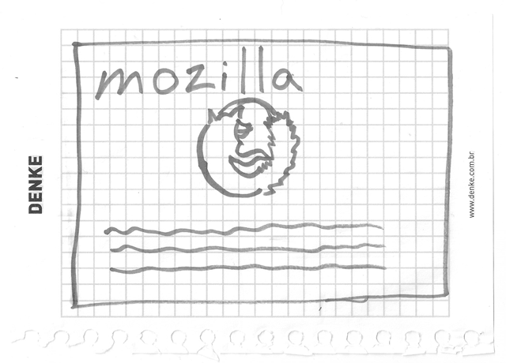
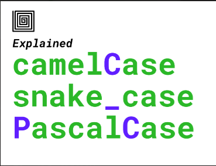

# Installing basic software

* In Installing basic software,
  * we show you what tools you need to do simple web development and how to install them properly.

## What tools do I actually need, right now?

* In this article,
  * we'll set you up with the bare minimum — a text editor and some modern web browsers.

### Installing a text editor

* You probably already have a basic **text editor** on your computer.

* By default
  * **Windows includes `Notepad`** and
  * **macOS comes with `TextEdit`**.

* Linux distros vary; the Ubuntu 22.04 LTS release comes with `GNOME Text Editor` by default.
  
* **We recommend starting with `Visual Studio Code`**, which is a free editor, that offers live previews and code hints.

### Installing modern web browsers

* For now, we'll install a couple of desktop web browsers to test our code in.
* Choose your operating system below and click the relevant links to download installers for your favorite browsers:

* **Linux**: Firefox, Chrome, Opera, Brave.
* **Windows**: Firefox, Chrome, Opera, Microsoft Edge, Brave
* **macOS**: Firefox, Chrome, Opera, Safari, Brave .

* Before going on, you should install at least two of these browsers and have them ready for testing.

### Installing a local web server

#### Local files vs. remote files

* Throughout most of the learning area,
  * we tell you to just open your examples directly in a browser —
    * this can be done by double-clicking the HTML file,
    * dragging and dropping it into the browser window,
    * or choosing File > Open…
    * and navigating to the HTML file.
  
* There are many ways to achieve this.

* If the web address path starts with `file://` followed by the path to the file on your local hard drive, a local file is being used.

* In contrast,
  * if you view one of our examples hosted on GitHub (or an example on some other remote server),
  * the web address will start with `http://` or `https://`, to show that
    * the file has been received via HTTP.

#### The problem with testing local files

Some examples won't run if you open them as local files. This can be due to a variety of reasons, the most likely being:

* **They feature asynchronous requests.**
  * Some browsers (including Chrome) will not run async requests (see `Fetching data from the server`)
    * if you just run the example from a local file.
  * This is because of security restrictions (for more on web security, read `Website security`).

* **They feature a server-side language.**
  * Server-side languages (such as PHP or Python) require a special server to interpret the code and deliver the results.

* **They include other files.**
  * Browsers commonly treat requests to load resources using the `file://` schema as cross-origin requests.
  * So if you load a local file that includes other local files, this may trigger a `CORS` error.

#### Running a simple local HTTP server

* To get around the problem of async requests,
  * we need to test such examples by running them through a local web server.
* One of the easiest ways to do this for our purposes is to use Python's `http.server` module.

> **Note:-**
>
> * Older versions of Python (up to version 2.7) provided a similar module named `SimpleHTTPServer`.
> * If you are using Python 2.x, you can follow this guide by replacing all uses of `http.server` with `SimpleHTTPServer`.
> * However, we recommend you use the latest version of Python.

##### To do this

1. Install Python. If you are using Linux or macOS, it should be available on your system already. If you are a Windows user, you can get an installer from the Python homepage and follow the instructions to install it:
   * Go to `python.org`
   * Under the Download section, click the link for Python "3.xxx".
   * At the bottom of the page, click the Windows Installer link to download the installer file.
   * When it has downloaded, run it.
   * On the first installer page, make sure you check the "Add Python 3.xxx to PATH" checkbox.
   * Click Install, then click Close when the installation has finished.
2. Open your command prompt (Windows) / terminal (macOS/ Linux). To check if Python is installed, enter the following command:

```PY
python -V
# If the above fails, try:
python3 -V
# Or, if the "py" command is available, try:
py -V
```

3. This should return a version number. If this is OK, navigate to the directory that your example is inside, using the cd command.

```PY
# include the directory name to enter it, for example
cd Desktop
# use two dots to jump up one directory level if you need to
cd ..
```

3. Enter the command to start up the server in that directory:

```PY
# If Python version returned above is 3.X
# On Windows, try "python -m http.server" or "py -3 -m http.server"
python3 -m http.server
# If Python version returned above is 2.X
python -m SimpleHTTPServer
```

5. By default, this will run the contents of the directory on a local web server, on port 8000. You can go to this server by going to the URL `localhost:8000` in your web browser. Here you'll see the contents of the directory listed — click the HTML file you want to run.

> **Note:-**
>
> * If you already have something running on port 8000,
>   * you can choose another port by running the server command followed by an alternative port number,
>     * e.g. `python3 -m http.server 7800` (Python 3.x) or
>     * `python -m SimpleHTTPServer 7800` (Python 2.x).
> * You can then access your content at `localhost:7800`.

#### Running server-side languages locally

> * Python's `http.server` (or `SimpleHTTPServer` for Python 2) module is useful,
>   * but it is merely a static file server;
>   * it doesn't know how to run code written in languages such as Python, PHP or JavaScript.
> * To handle them,
>   * you'll need something more
>       — exactly what you'll need depends on the server-side language you are trying to run.

Here are a few examples:

* To run Python server-side code, you'll need to use a Python web framework.
  * There are many popular Python web frameworks, such as Django (a guide is available), Flask, and Pyramid.
* To run Node.js (JavaScript) server-side code, you'll need to use raw node or a framework built on top of it.
  * Express is a good choice — see `Express Web Framework` (`Node.js/JavaScript`).
* To run PHP server-side code, launch `PHP's built-in development server`:

```PY
cd path/to/your/php/code
php -S localhost:8000
```

## What tools do the professionals use?

* The following looks like a scary list,
  * but fortunately, you can get started in web development without knowing anything about most of these.

* **A computer.**
  * Maybe that sounds obvious to some people,
    * but some of you are reading this article on your phone or a library computer.
  * For serious web development,
    * it's better to invest in a desktop or laptop computer running Windows, macOS or Linux.

* **A text editor**,
  * to write code in.
  * This could be a
    * text editor (e.g. Visual Studio Code, Notepad++, Sublime Text, GNU Emacs, or VIM),
    * or a hybrid editor (e.g. Dreamweaver or WebStorm).
  * Office document editors are not suitable for this use,
    * as they rely on hidden elements that interfere with the rendering engines used by web browsers.

* **Web browsers**,
  * to test code in.
  * Currently, the most-used browsers are Firefox, Chrome, Opera, Safari, Internet Explorer and Microsoft Edge.
  * You should also test how your site performs on mobile devices and on any old browsers your target audience may still be using (such as IE 8–10).
  * Lynx, a text-based terminal web browser, is great for seeing how your site is experienced by visually-impaired users.

* **A graphics editor,**
  * like GIMP, Figma, Paint.NET, Photoshop, Sketch or XD,
    * to make images or graphics for your web pages.

* **A version control system**,
  * to manage files on servers,
    * collaborate on a project with a team,
    * share code and assets and avoid editing conflicts.
  * Right now,
    * `Git` is the most popular version control system along with the `GitHub` or `GitLab` hosting service.

* **An FTP program,**
  * used on older web hosting accounts to manage files on servers (Git is increasingly replacing FTP for this purpose).
  * There are loads of (S)FTP programs available including Cyberduck, Fetch and FileZilla.

* **An automation system,**
  * like Webpack, Grunt, or Gulp to automatically perform repetitive tasks, such as minifying code and running tests.

* **Libraries, frameworks, etc.**,
  * to speed up writing common functionality.
  * A library tends to be an existing JavaScript or CSS file
    * that provides ready-rolled functionality for you to make use of in your code.
  * A framework tends to take this idea further,
    * offering a complete system with some custom syntaxes for you to write a web app on top of.

# What will your website look like?

* What will your website look like?
  * discusses the planning and design work you have to do for your website before writing code, including
    * "What information does my website offer?",
    * "What fonts and colors do I want?", and
    * "What does my site do?"

## First things first: planning

* Before doing anything, you need some ideas.
* What should your website actually do?
  * A website can do basically anything,
    * but, for your first try,
    * you should keep things simple.
  * We'll start by creating a simple webpage with a heading,
    * an image, and a few paragraphs.

### To begin, you'll need to answer these questions

1. **What is your website about?**
   * Do you like dogs, New York, or Pac-Man?
2. **What information are you presenting on the subject?**
   * Write a title and a few paragraphs and think of an image you'd like to show on your page.
3. **What does your website look like,** in simple high-level terms?
   * What's the background color?
   * What kind of font is appropriate:
     * formal,
     * cartoony,
     * bold and loud, s
     * ubtle?

> **Note:-**
>
> * Complex projects need detailed guidelines
>   * that go into all the details of
>     * colors,
>     * fonts,
>     * spacing between items on a page,
>     * appropriate writing style,
>     * and so on.
> * This is sometimes called a design guide, design system, or brand book, and
>   * you can see an example at the Firefox Photon Design System.

## Sketching out your design

* Next,
  * grab pen and paper and sketch out roughly
  * how you want your site to look.
* For your first simple webpage,
  * there's not much to sketch out,
  * but you should get in the habit of doing this now.
* It really helps —
  * you don't have to be Van Gogh!



> **Note:-**
>
> * Even on real, complex websites, the design teams usually start out with rough sketches on paper and later on build digital mockups using a graphics editor or web technologies.
>
> * Web teams often include both
>   * a graphic designer and
>   * a user experience (UX) designer.
> * Graphic designers put together the visuals of the website.
> * UX designers have a somewhat more abstract role in addressing
>   * how users will experience and interact with the website.

## Choosing your assets

* At this point,
  * it's good to start putting together the content
  * that will eventually appear on your webpage.

### Text

* You should still have your paragraphs and title from earlier.
* Keep these close by.

### Theme color

* To choose a color, go to the [Color Picker](https://developer.mozilla.org/en-US/docs/Web/CSS/CSS_Colors/Color_picker_tool)
  * and find a color you like.
* When you click on a color, you'll see a strange six-character code like `#660066`.
* That's called a _hex code_ (short for hexadecimal), and represents your color.
* Copy the code down somewhere safe for now.

### Images

* To choose an image,
  * go to [Google Images](https://www.google.com/imghp?gws_rd=ssl)
  * and search for something suitable.
* When you find the image you want,
  * click on the image to get an enlarged view of it.
* Right-click the image (Ctrl + click on a Mac), choose Save Image As…, and choose a safe place to save your image.
* Alternatively, copy the image's web address from your browser's address bar for later use.

### Font

To choose a font:

* Go to Google Fonts and find one you like.
* Copy the lines of code Google gives you into your text editor to save for later.
* For more details about using Google Fonts, see this page

# Dealing with files

## Where should your website live on your computer?

* When you are working on a website locally on your computer,
  * you should keep all the related files in a single folder
  * that mirrors the published website's file structure on the server.
* This folder can live anywhere you like,
  * but you should put it somewhere where you can easily find it,
  * maybe on your Desktop, in your Home folder, or at the root of your hard drive.

1. Choose a place to store your website projects. 
   * Inside your chosen place, create a new folder called `web-projects` (or similar).
   * This is where all your website projects will live.
2. Inside this first folder, create another folder to store your first website in.
   * Call it `test-site` (or something more imaginative).

## An aside on casing and spacing

You'll notice that throughout this article, we ask you to name folders and files completely in lowercase with no spaces. This is because:

1. Many computers, particularly web servers, are case-sensitive. 
   * So for example, 
     * if you put an image on your website at `test-site/MyImage.jpg` and 
     * then in a different file you try to invoke the image as `test-site/myimage.jpg`, 
     * it may not work.
2. Browsers, web servers, and programming languages do not handle spaces consistently. 
   * For example, 
     * if you use spaces in your filename, 
     * some systems may treat the filename as two filenames. 
   * Some servers will replace the areas in your filenames with "%20" (the character code for spaces in URLs), 
     * resulting in all your links being broken. 
   * It's better to separate words with hyphens, rather than underscores: `my-file.html` vs. `my_file.html`.

* The short answer is that you should use a hyphen for your file names. 
* The Google search engine treats a hyphen as a word separator 
  * but does not regard an underscore that way. 
* For these reasons, 
  * it is best to get into the habit of writing your folder and file names lowercase with no spaces and with words separated by hyphens, at least until you know what you're doing. 
* That way you'll bump into fewer problems later down the road.

## What structure should your website have?

Next, let's look at what structure our test site should have. 
The most common things we'll have on any website project we create are an index HTML file and folders to contain images, style files, and script files. 
Let's create these now:

1. `index.html`: 
   * This file will generally contain your homepage content, 
     * that is, the text and images 
     * that people see when they first go to your site. 
   * Using your text editor, 
     * create a new file called `index.html` 
     * and save it just inside your `test-site` folder.
2. `images` folder: 
   * This folder will contain all the images 
     * that you use on your site. 
   * Create a folder called `images`, 
     * inside your `test-site` folder.
3. `styles` folder: 
   * This folder will contain the CSS code used to style your content (for example, setting text and background colors). 
   * Create a folder called `styles`, 
     * inside your `test-site` folder.
4. `scripts` folder: 
   * This folder will contain all the JavaScript code used to add interactive functionality to your site (e.g. buttons that load data when clicked). 
   * Create a folder called `scripts`, 
     * inside your `test-site` folder.
   
# naming convention

## types of case

1. **camelCase**
2. **snake_case**
3. **PascalCase**
4. **dot.case**


## For programming

### case-wise

**PascalCase** -

* ClassName
* InterfaceName

**snake_case**

**camelCase**

* functionName
* variableName

**dot.case**

* packageName

### specifically

#### variables

* prefer `camelCase`
  * ex:- `var dogName = 'Droopy';`   // prefer
* try to make all variable shoulďbe different name
* if multiple variables with the same name then
* use like this ex:-
  * `var dogName = 'Droopy';`   // prefer first
  * `var dog_name = 'Droopy';`  // prefer second
  * `var DogName  = 'Droopy';`  // prefer third
  * `var Dog_Name  = 'Droopy';`  // prefer fourth
  * `var DOGNAME  = 'Droopy';`  // prefer fifth
  * `var DOG_NAME  = 'Droopy';`  // prefer sixth
* ex:-
  
    ```js
        // bad
        var dogname = 'Droopy'; 
        // bad
        var dog_name = 'Droopy'; 
        // bad
        var DOGNAME = ‘Droopy’; 
        // bad
        var DOG_NAME = 'Droopy'; 
        // good
        var dogName = 'Droopy';
    ```

#### booleans

* we should use `is` or `has` or `are` as prefixes.
* prefer `camelCase`
* ex:-
  * `var isBark = false;`
  * `var areIdeal = true;`
  * `var hasOwner = true;`
* ex:-

    ```js
        // bad
        var bark = false;
        // good
        var isBark = false;
        // bad
        var ideal = true;
        // good
        var areIdeal = true;
        // bad
        var owner = true;
        // good
        var hasOwner = true;
    ```
  
#### methods/functions

* prefer `camelCase`
* you should use descriptive nouns and verbs as prefixes.
  * For example, if we declare a function to retrieve a name, the function name should be `getName()`.
* ex:-

    ```ts
        // bad
        function name(dogName, ownerName) { 
        return '${dogName} ${ownerName}';
        }

        // good
        function getName(dogName, ownerName) { 
        return '${dogName} ${ownerName}';
        }
    ```

#### constants

* prefer `UPPERCASE`
  * ex:-

    ```js
            var LEG = 4;
            var TAIL = 1;
            var MOVABLE = LEG + TAIL;
    ```

* If the variable declaration name contains more than one word,
  * you should use  `UPPER_SNAKE_CASE`
  * ex:-

    ```js
        var DAYS_UNTIL_TOMORROW = 1;
    ```

* ex:-

    ```js
        export const PERMISSION = {
            SPEC: {
                READ: "devops_k8s_spec_template_read",
                ADD: "devops_k8s_spec_template_add",
                UPDATE: "devops_k8s_spec_template_update",
                DELETE: "devops_k8s_spec_template_delete"
            },
            RT: {
                READ: "devops_rt_read",
                ADD: "devops_rt_add",
                UPDATE: "devops_rt_update",
                DELETE: "devops_rt_delete",
                DEPLOY: "devops_rt_deploy",
                LOCKUNLOCK: "devops_rt_lock_unlock",
            },
            NS: {
                ADD: "devops_ns_add",
                READ: "devops_ns_read"
            },
            SERVICE: {
                READ: "devops_service_read",
                ADD: "devops_service_add",
                UPDATE: "devops_service_update",
                DELETE: "devops_service_delete"
            },
            SERVICE_RELEASE: {
                READ: "devops_service_release_read",
                ADD: "devops_service_release_add",
                UPDATE: "devops_service_release_update",
                DELETE: "devops_service_release_delete",
                DEPLOY: "devops_service_release_deploy"
            }
        }
    ```

#### class

* prefer `PascalCase`
* ex-

    ```js
        class DogCartoon { 
            constructor(dogName, ownerName) { 
                this.dogName = dogName; 
                this.ownerName = ownerName; 
            }
        }
        var cartoon = new DogCartoon('Scooby-Doo', 'Shaggy');
    ```
  
#### interfaces

* j
  
#### components

* prefer `PascalCase`
* JavaScript components are widely used in front-end frameworks like React.
* Ex:-

    ```js
        // bad
        function dogCartoon(roles) { 
            return ( 
                < div > 
                < span > Dog Name: { roles.dogName } < /span> 
                < span > Owner Name: { roles.ownerName } < /span> 
                < /div> 
            );
        } 

        // good
        function DogCartoon(roles) { 
            return ( 
                < div > 
                < span > Dog Name: { roles.dogName } < /span> 
                < span > Owner Name: { roles.ownerName } < /span> 
                < /div> 
            );
        }
    ```

#### Private Functions

* In JavaScript,
  * an underscore is used to denote `private variables` or `functions`.

* For example,
  * if you have a private function name like `toonName`, 
  * you can denote it as a private function by adding an underscore as a prefix (`_toonName`).

* ex:-

    ```js
        class DogCartoon { 
        constructor(dogName, ownerName) { 
            this.dogName = dogName; 
            this.ownerName = ownerName; 
            this.name = _toonName(dogName, ownerName); 
        } 
        _toonName(dogName, ownerName) { 
            return `${dogName} ${ownerName}`; 
        } 
        }

        var cartoon = new DodCartoon('Scooby-Doo', 'Shaggy'); 

        // good
        var name = cartoon.name;
        console.log(name);
        // "Scooby-Doo Shaggy" 

        // bad
        name =cartoon._toonName(cartoon.dogName, cartoon.ownerName);
        console.log(name);
        // "Scooby-Doo Shaggy"
    ```

#### Global Variables

* It is recommended to use 
  * `camelCase` for mutable global variables and 
  * `UPPERCASE` for immutable global variables.
#### packages

* It should be a lowercase letter such as java, lang.
* If the name contains multiple words, 
  * it should be separated by dots (.) such as java.util, java.lang.
* ex:- `package com.javatpoint;`

#### project

* recommended to use `small-case`

#### file

* recommended to use `camelCase`
  * or use `small-case`

#### folder

* recommended to use `camelCase`
  * or use `small-case`

