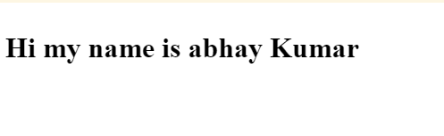

# JavaScript basics

* JavaScript is a programming language that adds interactivity to your website. 

# What is JavaScript?

* JavaScript is a powerful programming language that can add interactivity to a website. 
* It was invented by Brendan Eich.

* JavaScript is versatile and beginner-friendly. 
* With more experience, 
  * you'll be able to create 
    * games, 
    * animated 2D and 3D graphics, 
    * comprehensive database-driven apps, 
    * and much more!

* JavaScript itself is relatively compact, yet very flexible. 
* Developers have written a variety of tools on top of the core JavaScript language, 
  * unlocking a vast amount of functionality with minimum effort. 
  * These include:
    * Browser **Application Programming Interfaces** (APIs) built into web browsers, 
      * providing functionality such as dynamically creating HTML and setting CSS styles; 
      * collecting and manipulating a video stream from a user's webcam, 
      * or generating 3D graphics and audio samples.
    * **Third-party APIs** 
      * that allow developers to incorporate functionality in sites from other content providers, 
      * such as Twitter or Facebook.
    * **Third-party frameworks and libraries** 
      * that you can apply to HTML to accelerate the work of building sites and applications.

# A "Hello world!" example

**step-1**

* create a project or folder which name is `test-site`
* inside `test-site` create folder which is isted below.
  * scripts
  * styles
  * images
  * videos
  * songs
* inside `test-site` create file `index.html`.
* in `index.html` write below code
  ```html
    <!DOCTYPE html>
    <html lang="en">
    <head>
        <meta charset="UTF-8">
        <meta http-equiv="X-UA-Compatible" content="IE=edge">
        <meta name="viewport" content="width=device-width, initial-scale=1.0">
        <title>Document</title>
    </head>
    <body>

    </body>
    </html>
  ```

**step-2**

* Go to your test site and create a new folder named scripts. 
* Within the scripts folder, create a new text document called `main.js`, and save it.

**step-3**

* In your `index.html` file, 
  * enter this code on a new line, just before the closing `</body>` tag
  
  ```html
    <script src="scripts/main.js"></script>
  ```

**step-4**

* This is doing the same job as the `<link>` element for CSS. 
* It applies the JavaScript to the page, 
  * so it can have an effect on the HTML (along with the CSS, and anything else on the page).

**step-5**

* Add this code to the `main.js` file
  ```js
    const myHeading = document.querySelector("h1");
    myHeading.textContent = "Hello world!";
  ```

**step-6**

index.html
```html
  <!DOCTYPE html>
  <html lang="en">

  <head>
      <meta charset="UTF-8">
      <meta http-equiv="X-UA-Compatible" content="IE=edge">
      <meta name="viewport" content="width=device-width, initial-scale=1.0">
      <title>Document</title>
  </head>

  <body>
      <script src="./scripts/main.js"></script>
  </body>

  </html>
```

main.js

```js
  let myBody = document.querySelector("body");
  let myHeading = document.createElement("h1")
  myHeading.innerHTML=`<p>Hi my name is abhay Kumar</p>`
  myBody.appendChild(myHeading)
```



# Language basics crash course

## Variables

* Variables are containers that store values
* You start by declaring a variable with the `let` or `var` keyword, followed by the name you give to the variable:
  
  ```js
  let myVariable;
  ```

## semicolon

* A semicolon at the end of a line indicates where a statement ends. 
* It is only required when you need to separate statements on a single line. 

### Required: When two statements are on the same line

The **semicolon is only obligatory when you have two or more statements on the same line**:

```js
  var i = 0; i++        // <-- semicolon obligatory(requiered)
                        //     (but optional before newline)
  var i = 0             // <-- semicolon optional
      i++               // <-- semicolon optional
```

### Optional: After statements

* The semicolon in JavaScript is used to separate statements, 
  * but it can be omitted if the statement is followed by a line break (or there’s only one statement in a `{`block`}`). 
* A statement is a piece of code that tells the computer to do something. 
* Here are the most common types of statements:

```js
  var i;                        // variable declaration
  i = 5;                        // value assignment
  i = i + 1;                    // value assignment
  i++;                          // same as above
  var x = 9;                    // declaration & assignment
  var fun = function() {...};   // var decl., assignmt, and func. defin.
  alert("hi");                  // function call
```

* All of these statements can end with a `;` but none of them must. 
* Some consider it a good habit to terminate each statement with a `;` 
  * – that makes your code a little easier to parse, and to compress: 
    * if you remove line breaks you needn't worry about several statements ending up unseparated on the same line.

### Avoid to use semicolon , "After a closing curly bracket"

* You shouldn’t put a semicolon after a closing curly bracket `}`. 
* The only exceptions are assignment statements, such as `var obj = {};`,

```js
  // NO semicolons after }:
  if  (...) {...} else {...}
  for (...) {...}
  while (...) {...}

  // BUT:
  do {...} while (...);

  // function statement: 
  function (arg) { /*do this*/ } // NO semicolon after }
```

### Avoid to use semicolon ," After the round bracket of an if, for, while or switch statement"

* It won't harm to put a semicolon after the `{ }` of an `if` statement 
  * (it will be ignored, and you might see a warning that it's unnecessary). 
* But a semicolon where it doesn't belong (such as after the round `(`brackets`)` of an `if`, `for`, `while`, or `switch` statement) is a very bad idea:

```js
if (0 === 1); { alert("hi") }

// equivalent to:

if (0 === 1) /*do nothing*/ ;
alert ("hi");
```

## Comments

## Operators

## Conditionals

## Functions

## Events
