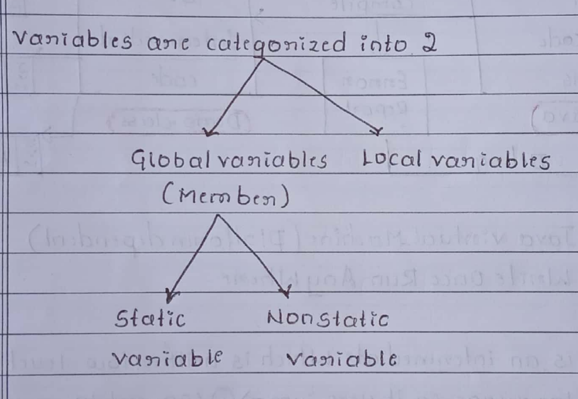
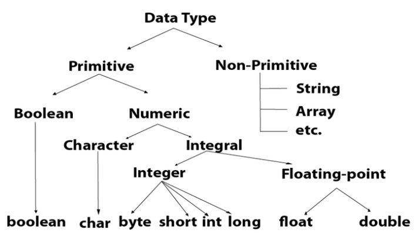

# Java : Getting started

## The language of 50 keywords

### keywords

* keyword are reserved word.
* Meaning of word , is known to compiler.
* Keyword cannot be used as name of variable.
* Keywords are particular words that act as a key to a code.
>
> * Keywords are predefined words by Java
>   * so they cannot be used as a **variable** or **object name** or **class name**.

#### List of Keyword

```Java

abstract        continue        for             new             switch
assert***       default         goto*           package         synchronized
boolean         do              if              private         this
break           double          implements      protected       throw
byte            else            import          public          throws
case            enum****        instanceof      return          transient
catch           extends         int             short           try
char            final           interface       static          void
class           finally         long            strictfp**      volatile
const*          float           native          super           while


*       not used        :-  goto , const
**      added in 1.2
***     added in 1.4
****    added in 5.0
```

#### keywords explanation

**A list of Java keywords or reserved words are given below:**

* **abstract**:
  * Java `abstract` keyword is used to declare an `abstract` class.
  * An `abstract` class can provide the implementation of the `interface`.
  * It can have `abstract` and non-abstract methods.

* **boolean**:
  * Java `boolean` keyword is used to declare a variable as a `boolean` type.
  * It can hold True and False values only.

* **break**:
  * Java `break` keyword is used to `break` the loop or `switch` statement (for `switch` ).
  * It breaks the current flow of the program at specified conditions.

* **byte**:
  * Java `byte` keyword is used to declare a variable that can hold 8-bit data values.

* **case**:
  * Java `case` keyword is used with the `switch` statements to mark blocks of text.

* **catch**:
  * Java `catch` keyword is used to catch the exceptions generated by `try` statements.
  * It must be used after the `try` block only.

* **char**:
  * Java `char` keyword is used to declare a variable that can hold unsigned 16-bit Unicode characters

* **class**:
  * Java `class` keyword is used to declare a `class`.

* **continue**:
  * Java `continue` keyword is used to continue the loop.
  * It continues the current flow of the program
    * and skips the remaining code at the specified condition.

* **default**:
  * Java `default` keyword is used to specify the default block of code in a `switch` statement.

* **do**:
  * Java `do` keyword is used in the control statement to declare a loop.
  * It can iterate a part of the program several times.

* **double**:
  * Java `double` keyword is used to declare a variable that can hold 64-bit floating-point number.

* **else**:
  * Java `else` keyword is used to indicate the alternative branches in an `if` statement.

* **enum**:
  * Java `enum` keyword is used to define a fixed set of constants.
  * Enum constructors are always `private` or `default`.

* **extends**:
  * Java `extends` keyword is used to indicate that
    * a class is derived from another class or interface.

* **final**: (instead of **const**)
  * Java `final` keyword is used to indicate that
    * a variable holds a constant value.
  * It is used with a variable.
  * It is used to restrict the user from updating the value of the variable.

* **finally**:
  * Java `finally` keyword indicates a block of code in a try-catch structure.
  * This block is always executed whether an exception is handled or not.

* **float**:
  * Java `float` keyword is used to declare a variable
    * that can hold a 32-bit floating-point number.

* **for**:
  * Java `for` keyword is used to start a for loop.
  * It is used to execute a set of instructions/functions repeatedly
    * when some condition becomes true.
  * If the number of iteration is fixed,
    * it is recommended to use `for` loop.

* **if**:
  * Java `if` keyword tests the condition.
  * It executes the `if block` if the condition is true.

* **implements**:
  * Java `implements` keyword is used to implement an `interface`.

* **import**:
  * Java `import` keyword makes classes and interfaces available and accessible to the current source code.

* **instanceof**:
  * Java `instanceof` keyword is used to test
    * whether the object is an instance of the specified class or implements an interface.

* **int**:
  * Java `int` keyword is used to declare a variable
    * that can hold a 32-bit signed integer.

* **interface**:
  * Java `interface` keyword is used to declare an interface.
  * It can have only abstract methods.

* **long**:
  * Java `long` keyword is used to declare a variable
    * that can hold a 64-bit integer.

* **native**:
  * Java `native` keyword is used to specify that
    * a method is implemented in native code using JNI (Java Native Interface).

* **new**:
  * Java `new` keyword is used to create new objects.

* **null**:
  * Java `null` keyword is used to indicate that
    * a reference does not refer to anything.
  * It removes the garbage value.

* **package**:
  * Java `package` keyword is used to declare a Java package
    * that includes the classes.

* **private**:
  * Java `private` keyword is an access modifier.
  * It is used to indicate that
    * a method or variable may be accessed only in the class
      * in which it is declared.

* **protected**:
  * Java `protected` keyword is an access modifier.
  * It can be accessible within the package and outside the package but through inheritance only.
  * It can't be applied with the class.

* **public**:
  * Java `public` keyword is an access modifier.
  * It is used to indicate that an item is accessible anywhere.
  * It has the widest scope among all other modifiers.

* **return**:
  * Java `return` keyword is used to return from a method
    * when its execution is complete.

* **short**:
  * Java `short` keyword is used to declare a variable
    * that can hold a 16-bit integer.

* **static**:
  * Java `static` keyword is used to indicate that
    * a variable or method is a class method.
  * The `static` keyword in Java is mainly used for memory management.

* **strictfp**:
  * Java `strictfp` is used to restrict the floating-point calculations to ensure portability.

* **super**:
  * Java `super` keyword is a reference variable
    * that is used to refer to parent class objects.
  * It can be used to invoke the immediate parent class method.

* **switch**:
  * The Java `switch` keyword contains a switch statement
    * that executes code based on test value.
  * The switch statement tests the equality of a variable against multiple values.

* **synchronized**:
  * Java `synchronized` keyword is used to specify the critical sections or methods in multithreaded code.

* **this**:
  * Java `this` keyword can be used to refer the current object in a method or constructor.

* **throw**:
  * The Java `throw` keyword is used to explicitly throw an exception.
  * The `throw` keyword is mainly used to throw custom exceptions.
  * It is followed by an instance.

* **throws**:
  * The Java `throws` keyword is used to declare an exception.
  * Checked exceptions can be propagated with `throws`.

* **transient**:
  * Java `transient` keyword is used in serialization.
  * If you define any data member as `transient`,
    * it will not be serialized.

* **try**:
  * Java `try` keyword is used to start a block of code
    * that will be tested for exceptions.
  * The `try` block must be followed by either catch or finally block.

* **void**:
  * Java `void` keyword is used to specify that
    * a method does not have a return value.

* **volatile**:
  * Java `volatile` keyword is used to indicate that
    * a variable may change asynchronously.

* **while**:
  * Java `while` keyword is used to start a `while` loop.
  * This loop iterates a part of the program several times.
  * If the number of iteration is not fixed,
    * it is recommended to use the `while` loop.

## Our First Java Program

```Java
/**
 * 
 */
package basicsToArray;

/**
 * @author abhay.kumar
 *
 */
public class BasicsToArrays {

 /**
  * 
  */
 
// public BasicsToArrays() {
//  // TODO Auto-generated constructor stub
// }
 

 /**
  * @param args
  */
 public static void main(String[] args) {
  // TODO Auto-generated method stub

  System.out.println("Hello Java");
 }

}
```

> Save the above file as
> `BasicsToArrays.java`.

> To compile:
> `javac BasicsToArrays.java`

> To execute:
> `java BasicsToArrays`

> Output:
> `Hello Java`

> When we compile Java program using javac tool, the Java compiler converts the source-code into byte-code.
> 

### Parameters used in First Java Program

Let's see what is the meaning of class, public, static, void, main, String[], System.out.println().

* **class**:-
  * `class` keyword is used to **declare a class in Java**.

* **public**:-
  * `public` keyword is an access modifier that represents visibility.
  * It means it is visible to all.

* **static**:-
  * `static` is a keyword.
  * If we declare any method as static,
    * it is known as the **static method**.
  * The **core advantage of the static method** is that
    * there is **no need to create an object to invoke the static method**.
  * The main() method is executed by the JVM,
    * so it doesn't require creating an object to invoke the main() method.
  * So, it saves memory.

> * The **main() method** is executed by the JVM,
>   * so it doesn't require creating an object to invoke the main() method.

* **void**
  * it is the return **type of the method**.
  * It means it **doesn't return any value**.

* **main**:-
  * it represents the starting point of the program.

* **String[] args** or **String args[]** :-
  * it is used for command line argument.
  * We will discuss it in coming section.

* **System.out.println()**:-  
  * it is used to print statement.
  * Here,
    * `System` is a **class**,
    * `out` is an **object of the PrintStream class**,
    * `println()` is a **method of the PrintStream class**.
  * We will discuss the internal working of `System.out.println()` statement in the coming section.

### In how many ways we can write a Java program?

There are many ways to write a Java program. The modifications that can be done in a Java program are given below:

##### 1) By changing the sequence of the modifiers, method prototype is not changed in Java

Let's see the simple code of the main method.

```java
static public void main(String args[])  
```

##### 2) The subscript notation in the Java array can be used after type, before the variable or after the variable

Let's see the different codes to write the main method.

```java
public static void main(String[] args)  
public static void main(String []args)  
public static void main(String args[])  
```

##### 3) You can provide var-args support to the main() method by passing 3 ellipses (dots)

Let's see the simple code of using var-args in the main() method. We will learn about var-args later in the Java New Features chapter.

```java
public static void main(String... args)  
```

##### 4) Having a semicolon at the end of class is optional in Java

Let's see the simple code.

```java
class A{  
static public void main(String... args){  
System.out.println("hello java4");  
}  
};  
```

#### Valid Java main() method signature

```java
public static void main(String[] args)  
public static void main(String []args)  
public static void main(String args[])  
public static void main(String... args)  
static public void main(String[] args)  
public static final void main(String[] args)  
final public static void main(String[] args)  
final strictfp public static void main(String[] args)  
```

#### Invalid Java main() method signature

```java
public void main(String[] args)  
static void main(String[] args)  
public void static main(String[] args)  
abstract public static void main(String[] args)  
```

### Internal Details of Hello Java Program

#### What happens at compile time?

At compile time, the Java file is compiled by Java Compiler (It does not interact with OS) and converts the Java code into bytecode.


#### What happens at runtime?

At runtime, the following steps are performed:


**Classloader**: It is the subsystem of JVM that is used to load class files.

**Bytecode Verifier**: Checks the code fragments for illegal code that can violate access rights to objects.

**Interpreter**: Read bytecode stream then execute the instructions.

#### Q) Can you save a Java source file by another name than the class name?

* Yes, if the class is not public.
* It is explained in the figure given below:


> if the class is public ,you must save a Java source file by the class name, (which is public class)

> To compile:
> javac Hard.java

> To execute:
> java Simple

* Observe that,
  * we have compiled the code with file name
  * but running the program with class name.
* Therefore, we can save a Java program other than class name if class is not public.

#### Q) Can you have multiple classes in a java source file?

Yes, like the figure given below illustrates:


### JVM

* JVM (Java Virtual Machine) is an abstract machine.

* It is called a virtual machine
  * because it doesn't physically exist.

* It is a specification that provides a runtime environment
  * in which Java bytecode can be executed.

* It can also run those programs
  * which are written in other languages and compiled to Java bytecode.

* JVMs are available for many hardware and software platforms.

> 

* **JVM, JRE, and JDK are platform dependent**
  * because the configuration of each OS is different from each other.

* However, Java is platform independent.

* There are three notions of the JVM:
  * specification,
  * implementation, and
  * instance.

* The JVM performs the following main tasks:
  * Loads code
  * Verifies code
  * Executes code
  * Provides runtime environment

### JRE

* JRE is an acronym for Java Runtime Environment.

* It is also written as Java RTE.

* The Java Runtime Environment is a set of software tools which are used for developing Java applications.

* It is used to provide the runtime environment.

* It is the implementation of JVM. It physically exists.

* It contains `a set of libraries + other files` that JVM uses at runtime.

* The implementation of JVM is also actively released by other companies besides `Sun Micro Systems`.


### JDK

* JDK is an acronym for Java Development Kit.

* The Java Development Kit (JDK) is a software development environment
  * which is used to develop Java applications and applets.

* It physically exists.

* It contains `JRE + development tools`.

* JDK is an implementation of any one of the below given Java Platforms released by Oracle Corporation:
  * Standard Edition Java Platform
  * Enterprise Edition Java Platform
  * Micro Edition Java Platform

* The JDK contains `a private Java Virtual Machine (JVM) and a few other resources`
  * such as
    * an interpreter/loader (java),
    * a compiler (javac),
    * an archiver (jar),
    * a documentation generator (Javadoc), etc. to complete the development of a Java Application.


## Variable and data Type

### variable

* A variable is a container which holds the value while the Java program is executed.

* A variable is assigned with a data type.

* Variable is a name of memory location.

* There are three types of variables in java:
  * local variable,
  * instance variable and
  * static variable.

* 

* A variable is the name of a reserved area allocated in memory.

* In other words, it is a name of the memory location.

* It is a combination of "vary + able" which means its value can be changed.(the value can be able to vary is called variable)


#### 1) Local Variable

* A variable declared **inside the body of the method** is called local variable.

* You can use this variable only within that method
  * and the other methods in the class aren't even aware that the variable exists.

* A local variable **cannot be defined with "static" keyword**.

#### 2) Instance Variable (non-static variable)

* A variable declared **inside the class**
  * **but outside the body of the method**,
  * is called an instance variable.
* It is not declared as static.

* It is called an instance variable
  * because its value is instance-specific
  * and is not shared among instances.

#### 3) Static variable

* A variable that is **declared as static** is called a static variable.
* It **cannot be local**.

* You can create a single copy of the static variable
  * and share it among all the instances of the class.

* Memory allocation for static variables happens only once
  * when the class is loaded in the memory.

## understanding variables

### Declaring (Creating) Variables ( for non-static and local)

> **Syntax**

```java
dataType variableName ;
```

### initializing  Variables ( for non-static and local)

> **Syntax**

```java
variableName = value ;
```

### declaring and initializing  Variables ( for non-static and local)

> **Syntax**

```java
dataType variableName = value ;
```

* Where
  * `dataType` is one of Java's types (such as int or String),
  * and `variableName` is the name of the variable (such as x or name).
  * The equal (`=`) sign is used to assign values to the variable.

### declaring  static Variables

**Syntax**

```java
static dataType variableName ;
```

### initializing  static Variables

**Syntax**

```java
variableName = value ;
```

### declaring and initializing  static Variables

**Syntax**

```java
static dataType variableName = value ;
```

### declaring and initializing Final Variables (or constant)

**Syntax**

```java
final dataType variableName = value ;
```

* If you don't want others (or yourself) to overwrite existing values,
  * use the final keyword (this will declare the variable as "final" or "constant",
  * which means unchangeable and read-only):

> Example

```java
final int myNum = 15;
myNum = 20;  // will generate an error: cannot assign a value to a final variable
```

### example :-

```java
public class BasicsToArray {
    public static void main(String[] args) {

        int LocalVariable1 ; // declaring Local variable
        LocalVariable1 =110; // initializing Local variable
        int LocalVariable2 = 120; // declaring and initializing Local variable

        System.out.println("Hello World");
        Variable nonStaticVariable1 = new Variable(10);
        System.out.println("value of 'nonStatic1' nonstatic variable id :-   " + nonStaticVariable1.nonStatic1);
        System.out.println("value of 'nonStatic2' nonstatic variable id :-   " + nonStaticVariable1.nonStatic2);
        System.out.println("value of 'nonStatic3' nonstatic variable id :-   " + nonStaticVariable1.nonStatic3);
        System.out.println("value of 'nonStatic4' nonstatic variable id :-   " + nonStaticVariable1.nonStatic4);
        Variable.onlyStatic1 = 100; //initializing static variable 
        System.out.println("value of 'onlyStatic1' static variable id with object :-   " + nonStaticVariable1.onlyStatic1);
        System.out.println("value of 'onlyStatic2' static variable id with object :-   " + nonStaticVariable1.onlyStatic2);
        System.out.println("value of 'final1' finaL variable id with class :-   " + nonStaticVariable1.final1);
        System.out.println("value of 'onlyStatic1' static variable id with class :-   " + Variable.onlyStatic1);
        System.out.println("value of 'onlyStatic2' static variable id with class :-   " + Variable.onlyStatic2);

    }
}

class Variable{

    int nonStatic1 ;  // declaring non static variable
    int nonStatic2 ;  // declaring non static variable
    int nonStatic3 ;  // declaring non static variable
    int nonStatic4 = 40 ;  // declaring and initializing non static variable

    
    static int onlyStatic1 ;  // declaring static variable 
    static int onlyStatic2 = 200 ;  // declaring and initializing static variable 

    final int final1 = 1000 ;  // declaring and initializing final-variable (constant) 

    Variable(int nonStatic1){
        this.nonStatic1 =nonStatic1; // initializing non static variable by constructor
        // this.nonStatic1 is global variable
        // Variable(int nonStatic1) :- nonStatic1 is passing as a argument by constructor

        this.nonStatic2 = 20; // this.nonStatic2 is act as a global variable

        nonStatic3 = 30; // nonStatic3 is act as a global variable :-
        // if nonStatic3 is not passing as a argument by constructor
         // if nonStatic3 is not assigned by same name of an argument which is passed  by constructor
    }

}
```

**output**

```java
D:\theory\java Full Stack\java full stack by tutorials point - chand sheikh\java>javac BasicsToArray.java && java BasicsToArray
Hello World
value of 'nonStatic1' nonstatic variable id :-   10
value of 'nonStatic2' nonstatic variable id :-   20
value of 'nonStatic3' nonstatic variable id :-   30
value of 'nonStatic4' nonstatic variable id :-   40
value of 'onlyStatic1' static variable id with object :-   100
value of 'onlyStatic2' static variable id with object :-   200
value of 'onlyStatic1' static variable id with class :-   100
value of 'onlyStatic2' static variable id with class :-   200
value of 'final1' finaL variable id with class :-   1000
value of 'LocalVariable1' static variable id with class :-   110
value of 'LocalVariable2' static variable id with class :-   120
```

###### A demonstration of how to declare variables of other types

```java
int myNum = 5;
float myFloatNum = 5.99f;
char myLetter = 'D';
boolean myBool = true;
String myText = "Hello";
```

## data types

There are two types of data types in Java:-

* Primitive data types:
  * byte
  * short
  * int
  * long
  * float
  * double
  * boolean
  * char

* Non-primitive data types:
  * Classes
  * Interfaces
  * Arrays

### Java Primitive Data Types

* In Java language,
  * primitive data types are the **building blocks of data manipulation.**
* These are the most basic data types available in Java language.

* Java is a statically-typed programming language.
* It means, all variables must be declared before its use.
* That is why we need to declare variable's type and name.



```java
Data-Type     Default-Value    Default-size   Description

boolean       false            1 bit          Stores true or false values
char          '\u0000'         2 byte         Stores a single character/letter or ASCII values
byte          0                1 byte         Stores whole numbers from -(2^7) to (2^7)-1
short         0                2 byte         Stores whole numbers from -(2^15) to (2^15)-1
int           0                4 byte         Stores whole numbers from -(2^31) to (2^31)-1
long          0L               8 byte         Stores whole numbers from -(2^63) to (2^63)-1
float         0.0f             4 byte         Stores decimal numbers  :- storing (2*4-1) decimal digits
double        0.0d             8 byte         Stores decimal numbers :- storing (2*8-1) decimal digits


(2^7) = 2*2*2*2*2*2*2 = 128
(2^15) = 2*2*2*2*2*2*2*2*2*2*2*2*2*2*2 = 32,768
(2^31) = 2*2*2*2*2*2*2*2*2*2*2*2*2*2*2*2*2*2*2*2*2*2*2*2*2*2*2*2*2*2*2 = 2,147,483,648
(2^63) = 9,223,372,036,854,775,808
(2^7)-1 = 127
(2^15)-1 = 32,767
(2^31)-1 = 2,147,483,647
(2^63)-1 = 9,223,372,036,854,775,807
```

**default value of Non-primitive data types** is `null`
default value of String is `null`
default value of Arrays is `null`
default value of class is `null`

#### Byte

* The `byte` data type can store whole numbers(or integer) from -128 to 127. 

#### Short

* The `short` data type can store whole numbers(or integer) from -32768  to 32767 . 

#### Int

* The `int` data type can store whole numbers(or integer) from -2147483648  to 2147483647 . 
* he int data type is the preferred data type when we create variables with a numeric value.

#### Long

* The `long` data type can store whole numbers from -9223372036854775808 to 9223372036854775807. 
* This is used when int is not large enough to store the value.
* Note that you should end the value with an "L".

#### Float

* The `float`  can store fractional (decimal) numbers. 
* Note that you should end the value with an "f" or "F" for floats.
* The precision of float is only 7 decimal digits
* Its value range is unlimited. 
* It is recommended to use a float (instead of double) 
  * if you need to save memory in large arrays of floating point numbers. 
* The float data type should never be used for precise values, such as currency. 
* Its default value is 0.0F.
  
#### Double

* The `double` data types can store fractional (decimal) numbers. 
* Note that you may end the value with an "d" or "D" for doubles.
* The precision of double is 15 decimal digits.
* it is safer to use double for most calculations compare than `float`.

#### Scientific Numbers

* A floating point number can also be a scientific number with an "e" or "E" to indicate the power of 10.

#### Boolean

* Java has a `boolean` data type, which can only take the values `true` or `false`.
* Boolean values are mostly used for conditional testing.

#### Char

* The `char` data type is used to store a **single** character. 
* The character must be surrounded by single quotes, like 'A' or 'c'
* The `char` data type is a single 16-bit Unicode character. 
* Its value-range lies between '\u0000' (or 0) to '\uffff' (or 65,535 inclusive).

#### String

Strings are used for storing text.
A `String` variable contains a collection of characters surrounded by double quotes:


**example :-**

```java
public class BasicsToArray {
    public static void main(String[] args) {

        System.out.println("java variables example");
        Variable variable = new Variable(10);
        variable.printVariable();

        System.out.println("\n\n\n\n\n\n\n\n\n\n\n java integer data types example");


        DataTypes dataTypes = new DataTypes();
        dataTypes.integerDataTypes();

        System.out.println("\n\n\n\n\n\n\n\n\n\n\n java float data types example")  ;

        dataTypes.floatDataTypes();

        System.out.println("\n\n\n\n\n\n\n\n\n\n\n java character data types example")  ;

        dataTypes.charDataTypes();

        System.out.println("\n\n\n\n\n\n\n\n\n\n\n java character data types example")  ;

        dataTypes.booleanDataTypes();

        System.out.println("\n\n\n\n\n\n\n\n\n\n\n java String data types example")  ;

        dataTypes.stringDataTypes();
    }
}

class Variable{

    int nonStatic1 ;  // declaring non static variable
    int nonStatic2 ;  // declaring non static variable
    int nonStatic3 ;  // declaring non static variable
    int nonStatic4 = 40 ;  // declaring and initializing non static variable

    
    static int onlyStatic1 ;  // declaring static variable 
    static int onlyStatic2 = 200 ;  // declaring and initializing static variable 

    final int final1 = 1000 ;  // declaring and initializing final-variable (constant) 

    Variable(int nonStatic1){
        this.nonStatic1 =nonStatic1; // initializing non static variable by constructor
        // this.nonStatic1 is global variable
        // Variable(int nonStatic1) :- nonStatic1 is passing as a argument by constructor

        this.nonStatic2 = 20; // this.nonStatic2 is act as a global variable

        nonStatic3 = 30; // nonStatic3 is act as a global variable :-
        // if nonStatic3 is not passing as a argument by constructor
         // if nonStatic3 is not assigned by same name of an argument which is passed  by constructor
    }


    void printVariable(){

        int LocalVariable1 ; // declaring Local variable
        LocalVariable1 =110; // initializing Local variable
        int LocalVariable2 = 120; // declaring and initializing Local variable

        System.out.println("Hello World");
        
        Variable nonStaticVariable1 = new Variable(10);
        
        System.out.println("value of 'nonStatic1' nonstatic variable id :-   " + nonStaticVariable1.nonStatic1);
        System.out.println("value of 'nonStatic2' nonstatic variable id :-   " + nonStaticVariable1.nonStatic2);
        System.out.println("value of 'nonStatic3' nonstatic variable id :-   " + nonStaticVariable1.nonStatic3);
        System.out.println("value of 'nonStatic4' nonstatic variable id :-   " + nonStaticVariable1.nonStatic4);
        
        Variable.onlyStatic1 = 100; //initializing static variable 
        
        System.out.println("value of 'onlyStatic1' static variable id with object :-   " + nonStaticVariable1.onlyStatic1);
        System.out.println("value of 'onlyStatic2' static variable id with object :-   " + nonStaticVariable1.onlyStatic2);

        System.out.println("value of 'onlyStatic1' static variable id with class :-   " + Variable.onlyStatic1);
        System.out.println("value of 'onlyStatic2' static variable id with class :-   " + Variable.onlyStatic2);

        System.out.println("value of 'final1' finaL variable id with class :-   " + nonStaticVariable1.final1);

        System.out.println("value of 'LocalVariable1' LocaL variable id with class :-   " + LocalVariable1);
        System.out.println("value of 'LocalVariable2' LocaL variable id with class :-   " + LocalVariable2);
    }

}


class DataTypes{

     void integerDataTypes(){

        //  for byte
        byte PosMyByte1 = 10;
        byte NegMyByte1 = -1;

        System.out.println("value of 'PosMyByte1'  variable   :-   " + PosMyByte1);
        System.out.println("value of 'NegMyByte1'  variable   :-   " + NegMyByte1);

        //  for short
        short PosMyShort1 = 20;
        short NegMyShort1 = -20;

        System.out.println("value of 'PosMyShort1'  variable   :-   " + PosMyShort1);
        System.out.println("value of 'NegMyShort1'  variable   :-   " + NegMyShort1);

        //  for int
        int PosMyInt1 = 30;
        int NegMyInt1 = -30;

        System.out.println("value of 'PosMyInt1'  variable   :-   " + PosMyInt1);
        System.out.println("value of 'NegMyInt1'  variable   :-   " + NegMyInt1);


        // for Long data-types , you should end the value with an "L" or "l" , iƒ value is too large:
        long PosMyLong1 = 12000000000l;  //  the value end with an "l"
        long NegMyLong1 = -12000000000l;  //  the value end with an "l"
        long PosMyLong2 = 13000000000L;  //  the value end with an "L"
        long NegMyLong2 = -13000000000L;  //  the value end with an "L"
        // iƒ value is  big (not  between -2147483648 to 2147483647):- 
        // then you must add "L" or "l", otherwise you get error

        System.out.println("value of 'PosMyLong1'  variable   :-   " + PosMyLong1);
        System.out.println("value of 'NegMyLong1'  variable   :-   " + NegMyLong1);
        System.out.println("value of 'PosMyLong2'  variable   :-   " + PosMyLong2);
        System.out.println("value of 'NegMyLong2'  variable   :-   " + NegMyLong2);


        // iƒ value is  small ( between -2147483648 to 2147483647):-
        // then you can skip "L" or "l"
        //  because of type casting :- value is considered as integer
        long PosMyLong3 = 14000;  //  you can skip to add "L" at the end of value
        long NegMyLong3 = -14000;  //  you can skip to add "L" at the end of value

        System.out.println("value of 'PosMyLong3'  variable   :-   " + PosMyLong3);
        System.out.println("value of 'NegMyLong3'  variable   :-   " + NegMyLong3);


        //  iƒ value is  small (between -2147483648 to 2147483647)      :- 
        //  and you add "L" or "l" at the end of value
        //  because of type casting     :-      value is considered as long
        long PosMyLong4 = 15000L;   //  the value end with an       "L"
        long NegMyLong4 = -15000L;  //  the value end with an       "L"
        long PosMyLong5 = 16000l;   //  the value end with an       "l"
        long NegMyLong5 = -16000l;  //  the value end with an       "l"

        System.out.println("value of 'PosMyLong4'  variable   :-   " + PosMyLong4);
        System.out.println("value of 'NegMyLong4'  variable   :-   " + NegMyLong4);
        System.out.println("value of 'PosMyLong5'  variable   :-   " + PosMyLong5);
        System.out.println("value of 'NegMyLong5'  variable   :-   " + NegMyLong5);


     }

     void floatDataTypes(){

        // for float data-types , you should end the value with an "F" or "f" , iƒ value is storing 6 to 7 decimal digits:
        float PosMyFloat1 = 17.23f;  //  the value end with an "f"
        float NegMyFloat1 = -17.23f;  //  the value end with an "f"
        float PosMyFloat2 = 18.24F;  //  the value end with an "F"
        float NegMyFloat2 = -18.24F;  //  the value end with an "F"

        System.out.println("value of 'PosMyFloat1'  variable   :-   " + PosMyFloat1);
        System.out.println("value of 'NegMyFloat1'  variable   :-   " + NegMyFloat1);
        System.out.println("value of 'PosMyFloat2'  variable   :-   " + PosMyFloat2);
        System.out.println("value of 'NegMyFloat2'  variable   :-   " + NegMyFloat2);


        // for double data-types , you may end the value with an "D" or "d" , iƒ value is storing 15 decimal digits:
        double PosMyDouble1 = 19.2567d;  //  the value end with an "d"
        double NegMyDouble1 = -19.2567d;  //  the value end with an "d"
        double PosMyDouble2 = 20.2668D;  //  the value end with an "D"
        double NegMyDouble2 = -20.2668D;  //  the value end with an "D"

        double PosMyDouble3 = 21.2787;  //  you can skip to add "d" at the end of value
        double NegMyDouble3 = -21.2787;  //  you can skip to add "d" at the end of value
        double PosMyDouble4 = 22.2878;  //  you can skip to add "D" at the end of value
        double NegMyDouble4 = -22.2878;  //  you can skip to add "D" at the end of value

        System.out.println("value of 'PosMyDouble1'  variable   :-   " + PosMyDouble1);
        System.out.println("value of 'NegMyDouble1'  variable   :-   " + NegMyDouble1);
        System.out.println("value of 'PosMyDouble2'  variable   :-   " + PosMyDouble2);
        System.out.println("value of 'NegMyDouble2'  variable   :-   " + NegMyDouble2);
        System.out.println("value of 'PosMyDouble3'  variable   :-   " + PosMyDouble3);
        System.out.println("value of 'NegMyDouble3'  variable   :-   " + NegMyDouble3);
        System.out.println("value of 'PosMyDouble4'  variable   :-   " + PosMyDouble4);
        System.out.println("value of 'NegMyDouble4'  variable   :-   " + NegMyDouble4);


        /* 
        A floating point number can also be a scientific number 
        with an "e" or "E" to indicate the power of 10:-

        12e4 =  12 * 10 * 10 * 10 * 10 = 120000
        12E4 =  12 * 10 * 10 * 10 * 10 = 120000
        12e-4 = 12 * 0.1 * 0.1 * 0.1 * 0.1 = 0.0012
        12E-4 = 12 * 0.1 * 0.1 * 0.1 * 0.1 = 0.0012
        */

        float PosMyFloatPosScientific1 =  17.23e4f;     //  the value end with an "f"  // Positive scientific number
        float NegMyFloatPosScientific1 = -17.23e4f;     //  the value end with an "f"  // Positive scientific number
        float PosMyFloatPosScientific2 =  18.24E4F;     //  the value end with an "F"  // Positive scientific number
        float NegMyFloatPosScientific2 = -18.24E4F;     //  the value end with an "F"  // Positive scientific number

        float PosMyFloatNegScientific3 =  17.23e-4f;    //  the value end with an "f"  // Negative scientific number
        float NegMyFloatNegScientific3 = -17.23e-4f;    //  the value end with an "f"  // Negative scientific number
        float PosMyFloatNegScientific4 =  18.24E-4F;    //  the value end with an "F"  // Negative scientific number
        float NegMyFloatNegScientific4 = -18.24E-4F;    //  the value end with an "F"  // Negative scientific number

        double PosMyDoublePosScientific1 =  19.2567e4d;     //  the value end with an "d"  // Positive scientific number
        double NegMyDoublePosScientific1 = -19.2567e4d;    //  the value end with an "d"  // Positive scientific number
        double PosMyDoublePosScientific2 =  20.2668e4D;     //  the value end with an "D"  // Positive scientific number
        double NegMyDoublePosScientific2 = -20.2668e4D;    //  the value end with an "D"  // Positive scientific number

        double PosMyDoublePosScientific3 =  19.2567E4d;     //  the value end with an "d"  // Positive scientific number
        double NegMyDoublePosScientific3 = -19.2567E4d;    //  the value end with an "d"  // Positive scientific number
        double PosMyDoublePosScientific4 =  20.2668E4D;     //  the value end with an "D"  // Positive scientific number
        double NegMyDoublePosScientific4 = -20.2668E4D;    //  the value end with an "D"  // Positive scientific number

        double PosMyDoublePosScientific5 =  21.2787e4;      //  you can skip to add "d" at the end of value  // Positive scientific number
        double NegMyDoublePosScientific5 = -21.2787e4;     //  you can skip to add "d" at the end of value  // Positive scientific number
        double PosMyDoublePosScientific6 =  22.2878E4;      //  you can skip to add "D" at the end of value  // Positive scientific number
        double NegMyDoublePosScientific6 = -22.2878E4;     //  you can skip to add "D" at the end of value  // Positive` scientific number
        
        double PosMyDoubleNegScientific7 =  19.2567e-4d;     //  the value end with an "d"  // Negative scientific number
        double NegMyDoubleNegScientific7 = -19.2567e-4d;    //  the value end with an "d"  // Negative scientific number
        double PosMyDoubleNegScientific8 =  20.2668e-4D;     //  the value end with an "D"  // Negative scientific number
        double NegMyDoubleNegScientific8 = -20.2668e-4D;    //  the value end with an "D"  // Negative scientific number

        double PosMyDoubleNegScientific9 =   19.2567E-4d;     //  the value end with an "d"  // Negative scientific number
        double NegMyDoubleNegScientific9 =  -19.2567E-4d;    //  the value end with an "d"  // Negative scientific number
        double PosMyDoubleNegScientific10 =  20.2668E-4D;    //  the value end with an "D"  // Negative scientific number
        double NegMyDoubleNegScientific10 = -20.2668E-4D;   //  the value end with an "D"  // Negative scientific number

        double PosMyDoubleNegScientific11 =  21.2787e-4;     //  you can skip to add "d" at the end of value  // Negative scientific number
        double NegMyDoubleNegScientific11 = -21.2787e-4;    //  you can skip to add "d" at the end of value  // Negative scientific number
        double PosMyDoubleNegScientific12 =  22.2878E-4;     //  you can skip to add "D" at the end of value  // Negative scientific number
        double NegMyDoubleNegScientific12 = -22.2878E-4;    //  you can skip to add "D" at the end of value  // Negative scientific number

        System.out.println("value of 'PosMyFloatPosScientific1'  variable   :-   " + PosMyFloatPosScientific1);
        System.out.println("value of 'NegMyFloatPosScientific1'  variable   :-   " + NegMyFloatPosScientific1);
        System.out.println("value of 'PosMyFloatPosScientific2'  variable   :-   " + PosMyFloatPosScientific2);
        System.out.println("value of 'NegMyFloatPosScientific2'  variable   :-   " + NegMyFloatPosScientific2);

        System.out.println("value of 'PosMyFloatNegScientific3'  variable   :-   " + PosMyFloatNegScientific3);
        System.out.println("value of 'NegMyFloatNegScientific3'  variable   :-   " + NegMyFloatNegScientific3);
        System.out.println("value of 'PosMyFloatNegScientific4'  variable   :-   " + PosMyFloatNegScientific4);
        System.out.println("value of 'NegMyFloatNegScientific4'  variable   :-   " + NegMyFloatNegScientific4);

        System.out.println("value of 'PosMyDoublePosScientific1'  variable   :-   " + PosMyDoublePosScientific1);
        System.out.println("value of 'NegMyDoublePosScientific1'  variable   :-   " + NegMyDoublePosScientific1);
        System.out.println("value of 'PosMyDoublePosScientific2'  variable   :-   " + PosMyDoublePosScientific2);
        System.out.println("value of 'NegMyDoublePosScientific2'  variable   :-   " + NegMyDoublePosScientific2);
        System.out.println("value of 'PosMyDoublePosScientific3'  variable   :-   " + PosMyDoublePosScientific3);
        System.out.println("value of 'NegMyDoublePosScientific3'  variable   :-   " + NegMyDoublePosScientific3);
        System.out.println("value of 'PosMyDoublePosScientific4'  variable   :-   " + PosMyDoublePosScientific4);
        System.out.println("value of 'NegMyDoublePosScientific4'  variable   :-   " + NegMyDoublePosScientific4);
        System.out.println("value of 'PosMyDoublePosScientific5'  variable   :-   " + PosMyDoublePosScientific5);
        System.out.println("value of 'NegMyDoublePosScientific5'  variable   :-   " + NegMyDoublePosScientific5);
        System.out.println("value of 'PosMyDoublePosScientific6'  variable   :-   " + PosMyDoublePosScientific6);
        System.out.println("value of 'NegMyDoublePosScientific6'  variable   :-   " + NegMyDoublePosScientific6);

        System.out.println("value of 'PosMyDoubleNegScientific7'  variable   :-   " + PosMyDoubleNegScientific7);
        System.out.println("value of 'NegMyDoubleNegScientific7'  variable   :-   " + NegMyDoubleNegScientific7);
        System.out.println("value of 'PosMyDoubleNegScientific8'  variable   :-   " + PosMyDoubleNegScientific8);
        System.out.println("value of 'NegMyDoubleNegScientific8'  variable   :-   " + NegMyDoubleNegScientific8);
        System.out.println("value of 'PosMyDoubleNegScientific9'  variable   :-   " + PosMyDoubleNegScientific9);
        System.out.println("value of 'NegMyDoubleNegScientific9'  variable   :-   " + NegMyDoubleNegScientific9);
        System.out.println("value of 'PosMyDoubleNegScientific10'  variable   :-   " + PosMyDoubleNegScientific10);
        System.out.println("value of 'NegMyDoubleNegScientific10'  variable   :-   " + NegMyDoubleNegScientific10);
        System.out.println("value of 'PosMyDoubleNegScientific11'  variable   :-   " + PosMyDoubleNegScientific11);
        System.out.println("value of 'NegMyDoubleNegScientific11'  variable   :-   " + NegMyDoubleNegScientific11);
        System.out.println("value of 'PosMyDoubleNegScientific12'  variable   :-   " + PosMyDoubleNegScientific12);
        System.out.println("value of 'NegMyDoubleNegScientific12'  variable   :-   " + NegMyDoubleNegScientific12);
    
    }

    void charDataTypes(){
        // The character must be surrounded by single quotes, like 'A' or 'c'
        char MyChar1 = 'a';  
        char MyChar2 = 'A';  
        char MyChar3 = 'b';  
        char MyChar4 = 'B';  
        char MyChar5 = '0';  
        char MyChar6 = '1';  
        char MyChar7 = '2';  
        char MyChar8 = '@';  
        char MyChar9 = '%';  
        char MyChar10 = '*';  
        char MyChar11 = '{';  
        char MyChar12 = '}';  
        char MyChar13 = '(';  
        char MyChar14 = ')';  

        System.out.println("value of 'MyChar1'  variable   :-   " + MyChar1);
        System.out.println("value of 'MyChar2'  variable   :-   " + MyChar2);
        System.out.println("value of 'MyChar3'  variable   :-   " + MyChar3);
        System.out.println("value of 'MyChar4'  variable   :-   " + MyChar4);
        System.out.println("value of 'MyChar5'  variable   :-   " + MyChar5);
        System.out.println("value of 'MyChar6'  variable   :-   " + MyChar6);
        System.out.println("value of 'MyChar7'  variable   :-   " + MyChar7);
        System.out.println("value of 'MyChar8'  variable   :-   " + MyChar8);
        System.out.println("value of 'MyChar9'  variable   :-   " + MyChar9);
        System.out.println("value of 'MyChar10'  variable   :-   " + MyChar10);
        System.out.println("value of 'MyChar11'  variable   :-   " + MyChar11);
        System.out.println("value of 'MyChar12'  variable   :-   " + MyChar12);
        System.out.println("value of 'MyChar13'  variable   :-   " + MyChar13);
        System.out.println("value of 'MyChar14'  variable   :-   " + MyChar14);

    }

    void booleanDataTypes(){
        // Java has a boolean data type, which can only take the values true or false:
        boolean MyBoolean1 = true;  
        boolean MyBoolean2 = false;  

        System.out.println("value of 'MyBoolean1'  variable   :-   " + MyBoolean1);
        System.out.println("value of 'MyBoolean2'  variable   :-   " + MyBoolean2);
    }

    void stringDataTypes(){
        String MyString = "Hello Abhay";
        System.out.println("value of 'MyString'  variable   :-   " + MyString);

    }
}
```

**output**

```java
D:\theory\java Full Stack\java full stack by tutorials point - chand sheikh\java>javac BasicsToArray.java && java BasicsToArray


java variables example
Hello World
value of 'nonStatic1' nonstatic variable id :-   10
value of 'nonStatic2' nonstatic variable id :-   20
value of 'nonStatic3' nonstatic variable id :-   30
value of 'nonStatic4' nonstatic variable id :-   40
value of 'onlyStatic1' static variable id with object :-   100 
value of 'onlyStatic2' static variable id with object :-   200 
value of 'onlyStatic1' static variable id with class :-   100  
value of 'onlyStatic2' static variable id with class :-   200  
value of 'final1' finaL variable id with class :-   1000       
value of 'LocalVariable1' LocaL variable id with class :-   110
value of 'LocalVariable2' LocaL variable id with class :-   120


 java integer data types example
value of 'PosMyByte1'  variable   :-   10
value of 'NegMyByte1'  variable   :-   -1
value of 'PosMyShort1'  variable   :-   20
value of 'NegMyShort1'  variable   :-   -20
value of 'PosMyInt1'  variable   :-   30
value of 'NegMyInt1'  variable   :-   -30
value of 'PosMyLong1'  variable   :-   12000000000
value of 'NegMyLong1'  variable   :-   -12000000000
value of 'PosMyLong2'  variable   :-   13000000000
value of 'NegMyLong2'  variable   :-   -13000000000
value of 'PosMyLong3'  variable   :-   14000
value of 'NegMyLong3'  variable   :-   -14000
value of 'PosMyLong4'  variable   :-   15000
value of 'NegMyLong4'  variable   :-   -15000
value of 'PosMyLong5'  variable   :-   16000
value of 'NegMyLong5'  variable   :-   -16000


 java float data types example
value of 'PosMyFloat1'  variable   :-   17.23
value of 'NegMyFloat1'  variable   :-   -17.23
value of 'PosMyFloat2'  variable   :-   18.24
value of 'NegMyFloat2'  variable   :-   -18.24
value of 'PosMyDouble1'  variable   :-   19.2567
value of 'NegMyDouble1'  variable   :-   -19.2567
value of 'PosMyDouble2'  variable   :-   20.2668
value of 'NegMyDouble2'  variable   :-   -20.2668
value of 'PosMyDouble3'  variable   :-   21.2787
value of 'NegMyDouble3'  variable   :-   -21.2787
value of 'PosMyDouble4'  variable   :-   22.2878
value of 'NegMyDouble4'  variable   :-   -22.2878
value of 'PosMyFloatPosScientific1'  variable   :-   172300.0
value of 'NegMyFloatPosScientific1'  variable   :-   -172300.0
value of 'PosMyFloatPosScientific2'  variable   :-   182400.0
value of 'NegMyFloatPosScientific2'  variable   :-   -182400.0
value of 'PosMyFloatNegScientific3'  variable   :-   0.001723
value of 'NegMyFloatNegScientific3'  variable   :-   -0.001723
value of 'PosMyFloatNegScientific4'  variable   :-   0.001824
value of 'NegMyFloatNegScientific4'  variable   :-   -0.001824
value of 'PosMyDoublePosScientific1'  variable   :-   192567.0
value of 'NegMyDoublePosScientific1'  variable   :-   -192567.0
value of 'PosMyDoublePosScientific2'  variable   :-   202668.0
value of 'NegMyDoublePosScientific2'  variable   :-   -202668.0
value of 'PosMyDoublePosScientific3'  variable   :-   192567.0
value of 'NegMyDoublePosScientific3'  variable   :-   -192567.0
value of 'PosMyDoublePosScientific4'  variable   :-   202668.0
value of 'NegMyDoublePosScientific4'  variable   :-   -202668.0
value of 'PosMyDoublePosScientific5'  variable   :-   212787.0
value of 'NegMyDoublePosScientific5'  variable   :-   -212787.0
value of 'PosMyDoublePosScientific6'  variable   :-   222878.0
value of 'NegMyDoublePosScientific6'  variable   :-   -222878.0
value of 'PosMyDoubleNegScientific7'  variable   :-   0.00192567
value of 'NegMyDoubleNegScientific7'  variable   :-   -0.00192567
value of 'PosMyDoubleNegScientific8'  variable   :-   0.00202668
value of 'NegMyDoubleNegScientific8'  variable   :-   -0.00202668
value of 'PosMyDoubleNegScientific9'  variable   :-   0.00192567
value of 'NegMyDoubleNegScientific9'  variable   :-   -0.00192567
value of 'PosMyDoubleNegScientific10'  variable   :-   0.00202668
value of 'NegMyDoubleNegScientific10'  variable   :-   -0.00202668
value of 'PosMyDoubleNegScientific11'  variable   :-   0.00212787
value of 'NegMyDoubleNegScientific11'  variable   :-   -0.00212787
value of 'PosMyDoubleNegScientific12'  variable   :-   0.00222878
value of 'NegMyDoubleNegScientific12'  variable   :-   -0.00222878

 java character data types example
value of 'MyChar1'  variable   :-   a
value of 'MyChar2'  variable   :-   A
value of 'MyChar3'  variable   :-   b
value of 'MyChar4'  variable   :-   B
value of 'MyChar5'  variable   :-   0
value of 'MyChar6'  variable   :-   1
value of 'MyChar7'  variable   :-   2
value of 'MyChar8'  variable   :-   @
value of 'MyChar9'  variable   :-   %
value of 'MyChar10'  variable   :-   *
value of 'MyChar11'  variable   :-   {
value of 'MyChar12'  variable   :-   }
value of 'MyChar13'  variable   :-   (
value of 'MyChar14'  variable   :-   )

 java character data types example
value of 'MyBoolean1'  variable   :-   true
value of 'MyBoolean2'  variable   :-   false

 java String data types example
value of 'MyString'  variable   :-   Hello Abhay

D:\theory\java Full Stack\java full stack by tutorials point - chand sheikh\java>
```

## BigDecimal class introduction

Methods of BigDecimal Class:

BigDecimal abs​(): This method returns a BigDecimal whose value is the absolute value of this BigDecimal, and whose scale is this.scale().
BigDecimal abs​(MathContext mc): This method returns a BigDecimal whose value is the absolute value of this BigDecimal, with rounding according to the context settings.
BigDecimal add​(BigDecimal augend): This method returns a BigDecimal whose value is (this + augend), and whose scale is max(this.scale(), augend.scale()).
BigDecimal add​(BigDecimal augend, MathContext mc): This method returns a BigDecimal whose value is (this + augend), with rounding according to the context settings.
byte byteValueExact​(): This method converts this BigDecimal to a byte, checking for lost information.
int compareTo​(BigDecimal val): This method compares this BigDecimal with the specified BigDecimal.
BigDecimal divide​(BigDecimal divisor): This method returns a BigDecimal whose value is (this / divisor), and whose preferred scale is (this.scale() – divisor.scale()); if the exact quotient cannot be represented (because it has a non-terminating decimal expansion) an ArithmeticException is thrown.
BigDecimal divide​(BigDecimal divisor, int scale, RoundingMode roundingMode): This method returns a BigDecimal whose value is (this / divisor), and whose scale is as specified.
BigDecimal divide​(BigDecimal divisor, MathContext mc): This method returns a BigDecimal whose value is (this / divisor), with rounding according to the context settings.
BigDecimal divide​(BigDecimal divisor, RoundingMode roundingMode): This method returns a BigDecimal whose value is (this / divisor), and whose scale is this.scale().
BigDecimal[] divideAndRemainder​(BigDecimal divisor): This method returns a two-element BigDecimal array containing the result of divideToIntegralValue followed by the result of remainder on the two operands.
BigDecimal[] divideAndRemainder​(BigDecimal divisor, MathContext mc): This method returns a two-element BigDecimal array containing the result of divideToIntegralValue followed by the result of remainder on the two operands calculated with rounding according to the context settings.
BigDecimal divideToIntegralValue​(BigDecimal divisor): This method returns a BigDecimal whose value is the integer part of the quotient (this / divisor) rounded down.
BigDecimal divideToIntegralValue​(BigDecimal divisor, MathContext mc): This method returns a BigDecimal whose value is the integer part of (this / divisor).
double doubleValue​(): This method converts this BigDecimal to a double.
boolean equals​(Object x): This method compares this BigDecimal with the specified Object for equality.
float floatValue​(): This method converts this BigDecimal to a float.
int hashCode​(): This method returns the hash code for this BigDecimal.
int intValue​(): This method converts this BigDecimal to an int.
int intValueExact​(): This method converts this BigDecimal to an int, checking for lost information.
long longValue​(): This method converts this BigDecimal to a long.
long longValueExact​(): This method converts this BigDecimal to a long, checking for lost information.
BigDecimal max​(BigDecimal val): This method returns the maximum of this BigDecimal and val.
BigDecimal min​(BigDecimal val): This method returns the minimum of this BigDecimal and val.
BigDecimal movePointLeft​(int n): This method returns a BigDecimal which is equivalent to this one with the decimal point moved n places to the left.
BigDecimal movePointRight​(int n): This method returns a BigDecimal which is equivalent to this one with the decimal point moved n places to the right.
BigDecimal multiply​(BigDecimal multiplicand): This method returns a BigDecimal whose value is (this × multiplicand), and whose scale is (this.scale() + multiplicand.scale()).
BigDecimal multiply​(BigDecimal multiplicand, MathContext mc): This method returns a BigDecimal whose value is (this × multiplicand), with rounding according to the context settings.
BigDecimal negate​(): This method returns a BigDecimal whose value is (-this), and whose scale is this.scale().
BigDecimal negate​(MathContext mc): This method returns a BigDecimal whose value is (-this), with rounding according to the context settings.
BigDecimal plus​(): This method returns a BigDecimal whose value is (+this), and whose scale is this.scale().
BigDecimal plus​(MathContext mc): This method returns a BigDecimal whose value is (+this), with rounding according to the context settings.
BigDecimal pow​(int n): This method returns a BigDecimal whose value is (thisn), The power is computed exactly, to unlimited precision.
BigDecimal pow​(int n, MathContext mc): This method returns a BigDecimal whose value is (thisn).
int precision​(): This method returns the precision of this BigDecimal.
BigDecimal remainder​(BigDecimal divisor): This method returns a BigDecimal whose value is (this % divisor).
BigDecimal remainder​(BigDecimal divisor, MathContext mc): This method returns a BigDecimal whose value is (this % divisor), with rounding according to the context settings.
BigDecimal round​(MathContext mc): This method returns a BigDecimal rounded according to the MathContext settings.
int scale​(): This method returns the scale of this BigDecimal.
BigDecimal scaleByPowerOfTen​(int n): This method returns a BigDecimal whose numerical value is equal to (this * 10n).
BigDecimal setScale​(int newScale): This method returns a BigDecimal whose scale is the specified value, and whose value is numerically equal to this BigDecimal’s.
BigDecimal setScale​(int newScale, RoundingMode roundingMode): This method returns a BigDecimal whose scale is the specified value, and whose unscaled value is determined by multiplying or dividing this BigDecimal’s unscaled value by the appropriate power of ten to maintain its overall value.
short shortValueExact​(): This method converts this BigDecimal to a short, checking for lost information.
int signum​(): This method returns the signum function of this BigDecimal.
BigDecimal sqrt​(MathContext mc): This method returns an approximation to the square root of this with rounding according to the context settings.
BigDecimal stripTrailingZeros​(): This method returns a BigDecimal which is numerically equal to this one but with any trailing zeros removed from the representation.
BigDecimal subtract​(BigDecimal subtrahend): This method returns a BigDecimal whose value is (this – subtrahend), and whose scale is max(this.scale(), subtrahend.scale()).
BigDecimal subtract​(BigDecimal subtrahend, MathContext mc): This method returns a BigDecimal whose value is (this – subtrahend), with rounding according to the context settings.
BigInteger toBigInteger​(): This method converts this BigDecimal to a BigInteger.
BigInteger toBigIntegerExact​(): This method converts this BigDecimal to a BigInteger, checking for lost information.
String toEngineeringString​(): This method returns a string representation of this BigDecimal, using engineering notation if an exponent is needed.
String toPlainString​(): This method returns a string representation of this BigDecimal without an exponent field.
String toString​(): This method returns the string representation of this BigDecimal, using scientific notation if an exponent is needed.
BigDecimal ulp​(): This method returns the size of an ulp, a unit in the last place, of this BigDecimal.
BigInteger unscaledValue​(): This method returns a BigInteger whose value is the unscaled value of this BigDecimal.
static BigDecimal valueOf​(double val): This method translates a double into a BigDecimal, using the double’s canonical string representation provided by the Double.toString(double) method.
static BigDecimal valueOf​(long val): This method translates a long value into a BigDecimal with a scale of zero.
static BigDecimal valueOf​(long unscaledVal, int scale): This method translates a long unscaled value and an int scale into a BigDecimal.

## string basics

## type casting

# Java : Some good to know information
